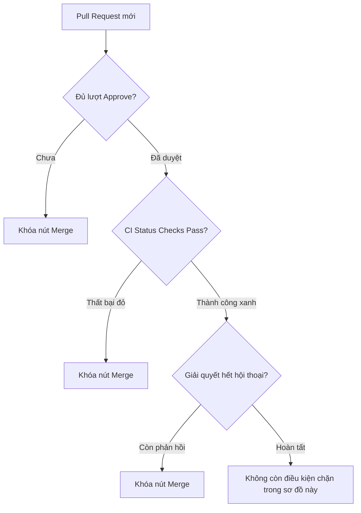

# Branch Protection Rules

## 🎯 Mục tiêu
- Làm chủ toàn diện các tùy chọn chi tiết trong bộ quy tắc Branch Protection Rules trên GitHub.
- Thiết lập yêu cầu bắt buộc kiểm duyệt mã nguồn: số lượng người phê duyệt tối thiểu (Require approvals) và tự động vô hiệu hóa duyệt khi có commit mới.
- Cấu hình cổng kiểm tra trạng thái bắt buộc (Require status checks to pass) tích hợp chặt chẽ với CI/CD.
- Hiểu điều kiện lịch sử tuyến tính và chữ ký commit; bật chúng khi repo đã thống nhất cách tạo/xác minh commit.

## 🧩 Từ khóa hôm nay
### Branch Protection Rules
- **Nói dễ hiểu**: Các điều kiện có thể áp dụng cho nhánh quan trọng, chẳng hạn yêu cầu PR, lượt duyệt hoặc status check trước khi merge.
- **Ví dụ**: Khóa nhánh `main`, chỉ cho phép merge khi đã có ít nhất một đồng nghiệp bấm Approve và test CI chạy qua.
- **Đừng nhầm**: Không phải quyền truy cập tài khoản, mà là điều kiện bắt buộc áp dụng riêng cho từng nhánh Git.

### Status Checks
- **Nói dễ hiểu**: Kết quả kiểm tra được gửi lên GitHub bởi CI hoặc ứng dụng tích hợp; quy tắc có thể yêu cầu một số kết quả cụ thể phải đạt trước khi merge.
- **Ví dụ**: Bài kiểm tra `npm test` và `lint` phải báo màu xanh thì nút Merge mới sáng lên.
- **Đừng nhầm**: Không phải mọi status check đều do GitHub Actions tạo ra, và CI không thay thế review của con người.

### Linear History
- **Nói dễ hiểu**: Quy tắc từ chối merge commit trên nhánh được bảo vệ để giữ lịch sử tuyến tính.
- **Ví dụ**: Yêu cầu nhóm sử dụng Squash and Merge hoặc Rebase thay vì tạo các merge commit thông thường.
- **Đừng nhầm**: Quy tắc này giới hạn kiểu merge; nó không tự sắp xếp lại commit hay thay đổi mã nguồn.

## 📖 Định nghĩa
Branch protection rules là các chính sách tùy chọn áp dụng cho nhánh trên GitHub. Quản trị viên chọn riêng điều kiện cần dùng, chẳng hạn yêu cầu PR, số lượt duyệt, status checks, giải quyết hội thoại hoặc lịch sử tuyến tính. Nếu không bật một điều kiện thì không thể giả định điều kiện đó đang được yêu cầu; quyền bypass cũng ảnh hưởng việc thực thi.

## 🤔 Tại sao cần?
Nhóm có thể dùng quy tắc để biến một số bước đã thống nhất thành điều kiện kỹ thuật trước khi merge. Chọn vừa đủ để kiểm soát rủi ro; yêu cầu quá nhiều hoặc status check không ổn định có thể làm chậm cả nhóm.

## 🧠 Mental Model (Mô hình tư duy)
Hãy tưởng tượng quy trình an ninh sân bay đa tầng trước khi hành khách lên máy bay. Bạn phải xuất trình vé hợp lệ do nhân viên xác nhận (`Require approvals`), hành lý qua máy quét tự động không có vật cấm (`Status checks pass`), và giải quyết xong mọi thắc mắc ở cổng soi chiếu (`Conversations resolved`).

## 🖼 Sơ đồ


## 🌎 Ví dụ thực tế
Trong môi trường phát triển dự án thực tế: một nhóm bật yêu cầu hai lượt duyệt và chọn status check bảo mật cho `main`. PR sẽ còn điều kiện chặn khi thiếu một trong hai kết quả. Điều này chỉ xác nhận các điều kiện đã cấu hình đạt, không tự bảo đảm phần mềm không có lỗi hay tự triển khai ra production.

## 💻 Command
```bash
# Các lệnh gh cần GitHub CLI đã cài, đăng nhập và repository phù hợp
gh pr checks

# Xem tổng quan trạng thái phê duyệt của Pull Request
gh pr status

# Xem chữ ký của commit (nếu có; GitHub chấp nhận GPG, SSH hoặc S/MIME khi đã cấu hình)
git log --oneline --show-signature
```

## 🔍 Giải thích command
- `gh pr checks`: Hiển thị các check GitHub ghi nhận cho PR; cần cài và đăng nhập GitHub CLI trong repo liên quan.
- `gh pr status`: Tóm tắt PR liên quan đến tài khoản hiện tại; lệnh này không thay thế trang Settings hay cấu hình rule.
- `git log --show-signature`: Hiển thị kết quả kiểm tra chữ ký nếu commit có chữ ký và Git có thể xác minh khóa; chữ ký không tự chứng minh nội dung code an toàn.

## ⚠️ Sai lầm phổ biến
- Đặt số lượng reviewer bắt buộc quá cao trong nhóm ít người gây tắc nghẽn tiến độ dự án.
- Quên tích chọn tự động hủy phê duyệt cũ khi có commit mới khiến code sửa đổi không được kiểm tra lại.
- Thiết lập status checks với những bài test không ổn định khiến Pull Request bị chặn vô lý.

## 🧪 Lab
Hãy cùng tôi truy cập giao diện cấu hình GitHub để kích hoạt các luật bảo vệ nhánh cốt lõi:

1. Dùng repository thử nghiệm mà bạn có quyền quản trị; vào **Settings → Branches** (tên nút có thể thay đổi theo giao diện).
2. Tạo quy tắc chỉ khớp `main`; bật **Require a pull request before merging** và đặt một lượt duyệt nếu giao diện cho phép.
3. Quan sát các tùy chọn khác, nhưng chỉ bật chúng nếu repo có quy trình đáp ứng được (ví dụ status check phải tồn tại trước khi chọn).
4. Lưu quy tắc rồi tạo PR thử nghiệm; ghi lại điều kiện còn thiếu. Một số tùy chọn có thể phụ thuộc quyền, loại repository hoặc cấu hình CI.

## 💡 Hint
- Cân nhắc hủy lượt duyệt cũ khi có commit mới; quyết định này phụ thuộc mức rủi ro và cách nhóm review.
- Xem mục bypass/exemptions trong rule để biết chính xác tài khoản nào được phép bỏ qua điều kiện.

## ✅ Validation
- Nêu được các điều kiện thực tế đã bật cho nhánh thử nghiệm.
- Tạo PR minh họa được ít nhất một điều kiện chưa đạt và quan sát trạng thái mà GitHub hiển thị.

## ❓ Quiz
Hãy làm bài trắc nghiệm bên dưới để kiểm tra mức độ thấu hiểu của bạn về các quy tắc Branch Protection Rules chuyên sâu.

## 🔥 Challenge
Hãy tìm hiểu thêm về tính năng Rulesets mới trên GitHub và so sánh ưu điểm của Rulesets so với Branch Protection Rules truyền thống khi quản lý nhiều nhánh cùng lúc.

## 📚 Tổng kết
- Mỗi branch protection rule chỉ thực thi các điều kiện đã bật và áp dụng cho pattern khớp.
- Status checks có thể đến từ các dịch vụ tích hợp khác nhau; cấu hình nhầm check có thể chặn PR.
- Linear history chặn merge commit; chữ ký giúp xác minh nguồn gốc commit khi cấu hình xác minh phù hợp.
