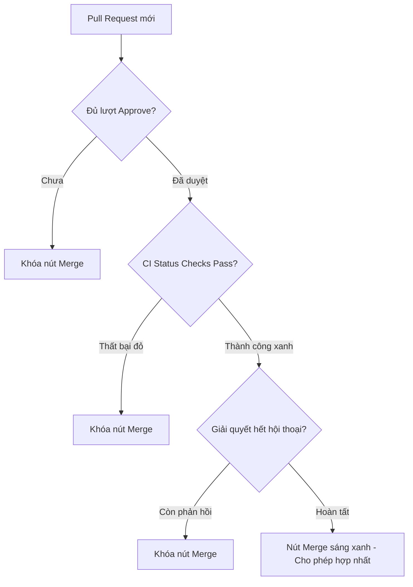

# Branch Protection Rules

## 🎯 Mục tiêu
- Làm chủ toàn diện các tùy chọn chi tiết trong bộ quy tắc Branch Protection Rules trên GitHub.
- Thiết lập yêu cầu bắt buộc kiểm duyệt mã nguồn: số lượng người phê duyệt tối thiểu (Require approvals) và tự động vô hiệu hóa duyệt khi có commit mới.
- Cấu hình cổng kiểm tra trạng thái bắt buộc (Require status checks to pass) tích hợp chặt chẽ với CI/CD.
- Áp dụng quy tắc lịch sử tuyến tính (Require linear history) và chữ ký bảo mật (Require signed commits).

## 🧩 Từ khóa hôm nay
### Branch Protection Rules
- **Nói dễ hiểu**: Bộ quy tắc tự động ngăn chặn việc đẩy code trực tiếp hoặc merge bừa bãi vào nhánh quan trọng.
- **Ví dụ**: Khóa nhánh `main`, chỉ cho phép merge khi đã có ít nhất một đồng nghiệp bấm Approve và test CI chạy qua.
- **Đừng nhầm**: Không phải quyền truy cập tài khoản, mà là điều kiện bắt buộc áp dụng riêng cho từng nhánh Git.

### Status Checks
- **Nói dễ hiểu**: Các bài kiểm tra tự động chạy trên GitHub Actions trước khi cấp phép hợp nhất mã nguồn.
- **Ví dụ**: Bài kiểm tra `npm test` và `lint` phải báo màu xanh thì nút Merge mới sáng lên.
- **Đừng nhầm**: Không thay thế việc con người review code; con người kiểm tra nghiệp vụ còn máy kiểm tra cú pháp và logic.

### Linear History
- **Nói dễ hiểu**: Quy tắc giữ cho lịch sử commit trên nhánh chính luôn là một đường thẳng tắp, không có nhánh rẽ chằng chịt.
- **Ví dụ**: Yêu cầu nhóm sử dụng Squash and Merge hoặc Rebase thay vì tạo các merge commit thông thường.
- **Đừng nhầm**: Không làm mất nội dung code, chỉ gộp hoặc sắp xếp lại thứ tự commit cho gọn gàng.

## 📖 Định nghĩa
Branch Protection Rules là bộ chính sách kỹ thuật trên GitHub nhằm bảo vệ các nhánh trọng yếu. Hệ thống buộc mọi thay đổi phải đi qua Pull Request, đáp ứng đủ số lượt duyệt của đồng nghiệp, vượt qua kiểm thử tự động và giải quyết hết các bình luận trước khi được merge.

## 💡 Tại sao cần
Tin tưởng ý thức tự giác là chưa đủ khi làm việc nhóm quy mô lớn. Lập trình viên có thể vô tình quên test hoặc vội vã đưa code lỗi lên máy chủ sản xuất. Quy tắc bảo vệ nhánh đóng vai trò như chốt chặn kỹ thuật tự động, bảo đảm chất lượng đồng đều cho mọi dòng mã.

## 🧠 Mental Model
Hãy tưởng tượng quy trình an ninh sân bay đa tầng trước khi hành khách lên máy bay. Bạn phải xuất trình vé hợp lệ do nhân viên xác nhận (`Require approvals`), hành lý qua máy quét tự động không có vật cấm (`Status checks pass`), và giải quyết xong mọi thắc mắc ở cổng soi chiếu (`Conversations resolved`).

## 📊 Sơ đồ minh họa


## 🏢 Ví dụ thực tế
Một công ty tài chính cấu hình nhánh `main` yêu cầu tối thiểu hai lượt Approve từ kỹ sư cao cấp và bài test kiểm tra bảo mật phải đạt. Khi một lập trình viên gửi PR bổ sung cổng nạp thẻ, dù đồng nghiệp đã duyệt một lượt nhưng nút Merge vẫn xám. Sau khi có thêm lượt duyệt thứ hai và bài test tự động báo xanh, mã nguồn mới được đưa vào sản xuất an toàn.

## 💻 Command & Cú pháp
```bash
# Kiểm tra danh sách status checks của Pull Request hiện tại
gh pr checks

# Xem tổng quan trạng thái phê duyệt của Pull Request
gh pr status

# Kiểm tra tính hợp lệ của chữ ký số GPG trên các commit
git log --oneline --show-signature
```

## 🔍 Giải thích command
- `gh pr checks`: Hiển thị danh sách các bài test tự động và trạng thái thành công hay thất bại của từng bài kiểm tra.
- `gh pr status`: Xem nhanh tiến độ phê duyệt, trạng thái bình luận và kết quả kiểm thử của các nhánh đang làm việc.
- `git log --show-signature`: Xác thực tính toàn vẹn và danh tính tác giả qua chữ ký điện tử GPG đính kèm từng commit.

## ⚠️ Sai lầm phổ biến
- Đặt số lượng reviewer bắt buộc quá cao trong nhóm ít người gây tắc nghẽn tiến độ dự án.
- Quên tích chọn tự động hủy phê duyệt cũ khi có commit mới khiến code sửa đổi không được kiểm tra lại.
- Thiết lập status checks với những bài test không ổn định khiến Pull Request bị chặn vô lý.

## 🧪 Lab thực hành
Bài học này là bài tự kiểm tra: bạn thao tác cấu hình trực tiếp trên giao diện GitHub Repository Settings và đối chiếu theo hướng dẫn bên dưới.

1. Truy cập Repository trên GitHub, vào mục **Settings** rồi chọn **Branches**.
2. Nhấn **Add branch protection rule**, nhập pattern là `main`.
3. Tích chọn **Require a pull request before merging** và đặt **Require approvals** là 1.
4. Tích chọn **Dismiss stale pull request approvals when new commits are pushed**.
5. Nhấn **Create** để lưu quy tắc, sau đó thử tạo một Pull Request để quan sát các điều kiện khóa tự động.

## 💡 Hint & mẹo
- Luôn bật tính năng hủy phê duyệt cũ khi có commit mới để tránh sơ hở lọt mã nguồn chưa qua kiểm duyệt.
- Bạn có thể bật thêm tùy chọn Do not allow bypassing the above settings để ngay cả Admin repo cũng phải tuân thủ đúng quy trình.

## ✅ Validation & Kết quả mong đợi
- Nút Merge trên giao diện GitHub hiển thị trạng thái Merging is blocked màu xám khi chưa đủ điều kiện.
- Nút Merge chỉ chuyển sang màu xanh khi toàn bộ các bài kiểm tra tự động đạt yêu cầu và có đủ số lượt phê duyệt từ đồng nghiệp.

## ❓ Quiz nhanh
Hãy làm bài trắc nghiệm bên dưới để kiểm tra mức độ thấu hiểu của bạn về các quy tắc Branch Protection Rules chuyên sâu.

## 🚀 Thử thách nâng cao
Hãy tìm hiểu thêm về tính năng Rulesets mới trên GitHub và so sánh ưu điểm của Rulesets so với Branch Protection Rules truyền thống khi quản lý nhiều nhánh cùng lúc.

## 📝 Tổng kết
- Branch Protection Rules là chốt chặn kỹ thuật tự động giúp bảo vệ nhánh chính khỏi mã nguồn lỗi.
- Kết hợp duyệt mã bắt buộc và status checks từ CI/CD tạo nên hàng rào bảo mật nhiều lớp đáng tin cậy.
- Duy trì lịch sử tuyến tính và chữ ký commit giúp cây mã nguồn rõ ràng, minh bạch và dễ dàng truy vết sự cố.
