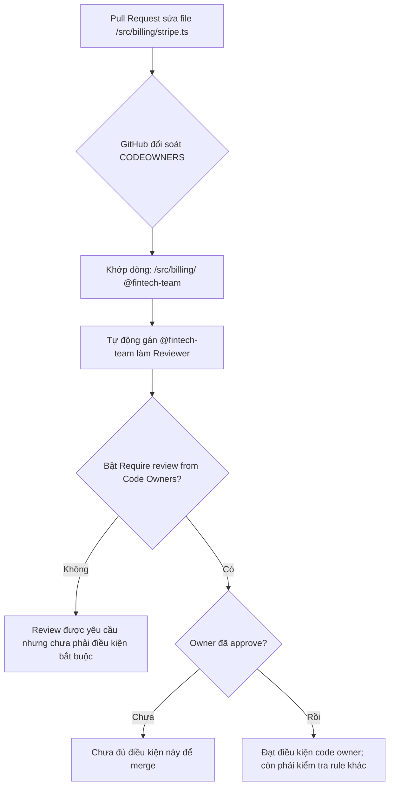

# CODEOWNERS

## 🎯 Mục tiêu
- Hiểu rõ khái niệm và lợi ích của tệp tin đặc biệt CODEOWNERS trong việc xác định quyền sở hữu từng module mã nguồn.
- Nắm vững cú pháp khai báo đường dẫn tệp tin và chỉ định người phụ trách cá nhân (@username) hoặc nhóm (@org/team-name).
- Kích hoạt tính năng bắt buộc chủ sở hữu mã nguồn phê duyệt (Require review from Code Owners) trong Branch Protection.
- Tổ chức cấu trúc tệp CODEOWNERS theo thứ tự ưu tiên từ trên xuống dưới một cách chuẩn xác.

## 🧩 Từ khóa hôm nay
### CODEOWNERS
- **Nói dễ hiểu**: Tệp tin cấu hình định nghĩa ai là người chịu trách nhiệm chính cho từng phần thư mục mã nguồn.
- **Ví dụ**: Đặt tệp `.github/CODEOWNERS` quy định thư mục `/src/payment/` do nhóm `@org/finance-team` quản lý.
- **Đừng nhầm**: Không phải file giới hạn quyền đọc mã nguồn; ai có quyền truy cập repo vẫn xem được code bình thường.

### Review Assignment
- **Nói dễ hiểu**: Tính năng GitHub tự động gửi lời mời review cho đúng chuyên gia phụ trách khi có Pull Request đụng vào file của họ.
- **Ví dụ**: Khi sửa file `schema.prisma`, GitHub tự động gán kỹ sư dữ liệu `@db-admin` vào danh sách reviewers.
- **Đừng nhầm**: GitHub có thể gửi yêu cầu review khi điều kiện phù hợp, nhưng điều đó không có nghĩa owner đã duyệt hoặc việc merge bị chặn.

### Path Pattern Matching
- **Nói dễ hiểu**: Quy tắc so khớp đường dẫn tương tự `.gitignore` để gán quyền sở hữu theo thư mục hoặc định dạng tệp.
- **Ví dụ**: Dòng `*.md @tech-writers` gán mọi tệp tài liệu markdown cho đội ngũ viết tài liệu.
- **Đừng nhầm**: Với một đường dẫn khớp nhiều mẫu, mẫu khớp cuối cùng quyết định owner; cú pháp gần `.gitignore` nhưng không giống hoàn toàn.

## 📖 Định nghĩa
CODEOWNERS là tệp cấu hình có thể đặt tại `.github/CODEOWNERS`, `/CODEOWNERS` hoặc `docs/CODEOWNERS`. GitHub dùng mẫu đường dẫn trong tệp để yêu cầu review từ owner khi PR sửa các file tương ứng. Để review của code owner thành điều kiện bắt buộc, nhánh đích còn phải bật **Require review from Code Owners**. Tệp cần có trên nhánh đích của PR, và owner phải có quyền ghi vào repository để GitHub nhận diện họ.

## 💡 Tại sao cần
Trong repository có nhiều khu vực chuyên môn, CODEOWNERS giúp PR đến đúng nhóm phụ trách. Tệp chỉ đề xuất/yêu cầu reviewer theo cấu hình; tự nó không giới hạn quyền truy cập file và cũng không bắt buộc phê duyệt nếu branch rule chưa yêu cầu.

## 🧠 Mental Model
Hãy hình dung bệnh viện đa khoa lớn với các khoa chuyên biệt. Khi bệnh nhân cần khám tim, hồ sơ tự động chuyển về khoa Tim mạch; khi có ca gãy xương, hồ sơ chuyển đến khoa Chấn thương. Tệp CODEOWNERS là bảng phân khoa tự động: file thanh toán gửi đến kỹ sư tài chính, file hạ tầng gửi đến nhóm DevOps.

## 📊 Sơ đồ minh họa


## 🏢 Ví dụ thực tế
Ví dụ giả định: một nhóm cấu hình `/src/payment/ @org/finance-devs` và `/deploy/ @org/devops-engineers`. Tệp này cần nằm trên nhánh đích và các nhóm cần quyền ghi. GitHub yêu cầu review từ owner khi PR ở trạng thái sẵn sàng review; merge chỉ bị chặn vì thiếu approval của owner nếu branch protection bật **Require review from Code Owners** và không có ngoại lệ bypass.

## 💻 Command & Cú pháp
```bash
# Xem nội dung cấu hình phân quyền hiện tại
cat .github/CODEOWNERS

# Đưa tệp cấu hình mới vào danh sách theo dõi
git add .github/CODEOWNERS

# Ghi lại commit thiết lập quyền sở hữu mã nguồn
git commit -m "chore: setup CODEOWNERS for security and billing modules"
```

## 🔍 Giải thích command
- `cat .github/CODEOWNERS`: Đọc và kiểm tra các dòng quy tắc phân quyền chủ sở hữu mã nguồn trong kho.
- `git add .github/CODEOWNERS`: Đưa tệp phân quyền vào khu vực chờ commit để chuẩn bị lưu trữ lên Git.
- `git commit -m`: Tạo commit ghi nhận việc thiết lập quyền sở hữu với thông điệp rõ ràng theo chuẩn.

## ⚠️ Sai lầm phổ biến
- Đặt tệp CODEOWNERS sai vị trí khiến GitHub không nhận diện (chỉ chấp nhận trong `.github/`, thư mục gốc hoặc `docs/`).
- Nhầm lẫn thứ tự ưu tiên: quy tắc khớp cuối cùng nằm ở phía dưới tệp sẽ ghi đè lên quy tắc rộng ở phía trên.
- Khai báo tài khoản hoặc nhóm GitHub chưa được cấp quyền truy cập repository khiến quy tắc bị vô hiệu hóa.

## 🧪 Lab thực hành
Bài học này là bài tự kiểm tra: bạn thao tác tạo tệp CODEOWNERS và đối chiếu theo hướng dẫn bên dưới.

1. Tạo thư mục `.github` và tạo tệp `.github/CODEOWNERS`.
2. Ghi `* @owner-account`, rồi khai báo một nhóm/cộng tác viên khác có quyền ghi cho tài liệu: `/docs/ @org/docs-team`.
3. Commit và đẩy tệp lên nhánh mặc định; từ tài khoản khác tạo PR sửa một file trong `docs/`.
4. Chuyển PR từ Draft sang Ready for review nếu cần và quan sát review request. Nếu chưa có cộng tác viên thứ hai, hãy kiểm tra mẫu và dự đoán owner thay vì tự gán tác giả làm reviewer.

## 💡 Hint & mẹo
- Bạn có thể khai báo một tài khoản cá nhân `@username` hoặc một nhóm trong tổ chức `@org/team-name`.
- Đặt quy tắc rộng trước, quy tắc cụ thể sau; với một file khớp nhiều mẫu, owner của mẫu khớp cuối cùng được dùng.

## ✅ Validation & Kết quả mong đợi
- Tệp CODEOWNERS hợp lệ có trên nhánh đích của PR và owner có quyền ghi.
- Xác định được review request nào GitHub gửi và liệu nó có bắt buộc để merge hay không.

## ❓ Quiz nhanh
Hãy hoàn thành bài trắc nghiệm bên dưới để kiểm tra mức độ nắm vững cú pháp và cơ chế phân quyền tự động của CODEOWNERS.

## 🚀 Thử thách nâng cao
Thiết kế cấu trúc tệp CODEOWNERS cho hệ thống Monorepo gồm ba dịch vụ độc lập: frontend (React), backend (Go) và infrastructure (Terraform), bảo đảm mỗi đội chỉ duyệt code của dịch vụ mình.

## 📝 Tổng kết
- CODEOWNERS ánh xạ mẫu đường dẫn tới owner và có thể tạo review request.
- Quy tắc khớp cuối cùng cho một đường dẫn quyết định owner; pattern gần `.gitignore` nhưng có khác biệt.
- Chỉ khi nhánh yêu cầu review từ Code Owners thì approval mới là điều kiện bắt buộc.
