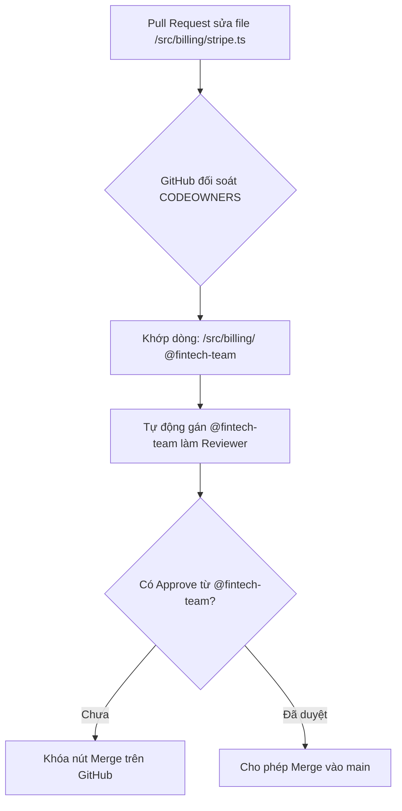

# CODEOWNERS

## 🎯 Mục tiêu
- Hiểu rõ khái niệm và lợi ích của tệp tin đặc biệt CODEOWNERS trong việc xác định quyền sở hữu từng module mã nguồn.
- Nắm vững cú pháp khai báo đường dẫn tệp tin và chỉ định người phụ trách cá nhân (@username) hoặc nhóm (@org/team-name).
- Kích hoạt tính năng bắt buộc chủ sở hữu mã nguồn phê duyệt (Require review from Code Owners) trong Branch Protection.
- Tổ chức cấu trúc tệp CODEOWNERS theo thứ tự ưu tiên từ trên xuống dưới một cách chuẩn xác.

## 🧩 Từ khóa hôm nay
### CODEOWNERS
- **Nói dễ hiểu**: Tệp tin cấu hình định nghĩa ai là người chịu trách nhiệm chính cho từng phần thư mục mã nguồn.
- **Ví dụ**: Đặt tệp `.github/CODEOWNERS` quy định thư mục `/src/payment/` do nhóm `@org/finance-team` quản lý.
- **Đừng nhầm**: Không phải file giới hạn quyền đọc mã nguồn; ai có quyền truy cập repo vẫn xem được code bình thường.

### Review Assignment
- **Nói dễ hiểu**: Tính năng GitHub tự động gửi lời mời review cho đúng chuyên gia phụ trách khi có Pull Request đụng vào file của họ.
- **Ví dụ**: Khi sửa file `schema.prisma`, GitHub tự động gán kỹ sư dữ liệu `@db-admin` vào danh sách reviewers.
- **Đừng nhầm**: Không cần tự gán tay reviewer mỗi khi mở Pull Request; hệ thống hoàn toàn tự động đối soát.

### Path Pattern Matching
- **Nói dễ hiểu**: Quy tắc so khớp đường dẫn tương tự `.gitignore` để gán quyền sở hữu theo thư mục hoặc định dạng tệp.
- **Ví dụ**: Dòng `*.md @tech-writers` gán mọi tệp tài liệu markdown cho đội ngũ viết tài liệu.
- **Đừng nhầm**: Dòng bên dưới sẽ ghi đè dòng bên trên nếu có tệp tin khớp với cả hai quy tắc.

## 📖 Định nghĩa
CODEOWNERS là tệp tin cấu hình được đặt tại `.github/CODEOWNERS`, thư mục gốc hoặc `docs/`. Tệp này ánh xạ các mẫu đường dẫn tệp tin tới những cá nhân hoặc nhóm kỹ thuật chịu trách nhiệm, giúp GitHub tự động chỉ định reviewer thích hợp và bắt buộc họ phê duyệt trước khi mã nguồn được hợp nhất.

## 💡 Tại sao cần
Trong kho lưu trữ quy mô lớn với nhiều nhóm cùng làm việc, không cá nhân nào có thể nắm vững toàn bộ codebase. Thiếu CODEOWNERS khiến lập trình viên lúng túng khi chọn người kiểm duyệt, hoặc chọn người không đúng chuyên môn khiến lỗi nghiêm trọng lọt vào các module thanh toán hay bảo mật cốt lõi.

## 🧠 Mental Model
Hãy hình dung bệnh viện đa khoa lớn với các khoa chuyên biệt. Khi bệnh nhân cần khám tim, hồ sơ tự động chuyển về khoa Tim mạch; khi có ca gãy xương, hồ sơ chuyển đến khoa Chấn thương. Tệp CODEOWNERS là bảng phân khoa tự động: file thanh toán gửi đến kỹ sư tài chính, file hạ tầng gửi đến nhóm DevOps.

## 📊 Sơ đồ minh họa


## 🏢 Ví dụ thực tế
Một ứng dụng đặt vé du lịch có hàng trăm nghìn dòng mã. Họ cấu hình CODEOWNERS để thư mục `/src/payment/` thuộc về nhóm `@finance-devs` và `/deploy/` thuộc về `@devops-engineers`. Khi một kỹ sư tạo Pull Request tích hợp cổng ví điện tử, GitHub lập tức gắn nhãn yêu cầu phê duyệt gửi tới `@finance-devs`. Nút Merge chỉ mở khóa sau khi đại diện nhóm tài chính bấm Approve.

## 💻 Command & Cú pháp
```bash
# Xem nội dung cấu hình phân quyền hiện tại
cat .github/CODEOWNERS

# Đưa tệp cấu hình mới vào danh sách theo dõi
git add .github/CODEOWNERS

# Ghi lại commit thiết lập quyền sở hữu mã nguồn
git commit -m "chore: setup CODEOWNERS for security and billing modules"
```

## 🔍 Giải thích command
- `cat .github/CODEOWNERS`: Đọc và kiểm tra các dòng quy tắc phân quyền chủ sở hữu mã nguồn trong kho.
- `git add .github/CODEOWNERS`: Đưa tệp phân quyền vào khu vực chờ commit để chuẩn bị lưu trữ lên Git.
- `git commit -m`: Tạo commit ghi nhận việc thiết lập quyền sở hữu với thông điệp rõ ràng theo chuẩn.

## ⚠️ Sai lầm phổ biến
- Đặt tệp CODEOWNERS sai vị trí khiến GitHub không nhận diện (chỉ chấp nhận trong `.github/`, thư mục gốc hoặc `docs/`).
- Nhầm lẫn thứ tự ưu tiên: quy tắc khớp cuối cùng nằm ở phía dưới tệp sẽ ghi đè lên quy tắc rộng ở phía trên.
- Khai báo tài khoản hoặc nhóm GitHub chưa được cấp quyền truy cập repository khiến quy tắc bị vô hiệu hóa.

## 🧪 Lab thực hành
Bài học này là bài tự kiểm tra: bạn thao tác tạo tệp CODEOWNERS và đối chiếu theo hướng dẫn bên dưới.

1. Tạo thư mục `.github` và tạo tệp `.github/CODEOWNERS`.
2. Khai báo quy tắc toàn cục ở dòng đầu: `* @your-username`.
3. Khai báo quy tắc cụ thể cho tài liệu: `/docs/ @your-username`.
4. Đẩy commit lên GitHub và tạo một Pull Request mẫu chỉnh sửa tệp trong thư mục `docs/`.
5. Quan sát danh sách Reviewers bên phải của PR xem GitHub có tự động gán tên tài khoản của bạn hay không.

## 💡 Hint & mẹo
- Bạn có thể khai báo một tài khoản cá nhân `@username` hoặc một nhóm trong tổ chức `@org/team-name`.
- Dòng bên dưới luôn có độ ưu tiên cao hơn dòng bên trên, nên hãy đặt quy tắc chung toàn repo ở trên cùng và quy tắc thư mục hẹp ở dưới.

## ✅ Validation & Kết quả mong đợi
- Tệp `.github/CODEOWNERS` được Git theo dõi và lưu trữ trên nhánh chính.
- Khi mở Pull Request thay đổi bất kỳ tệp nào, hệ thống tự động gán đúng reviewer tương ứng trong danh sách Reviewers.

## ❓ Quiz nhanh
Hãy hoàn thành bài trắc nghiệm bên dưới để kiểm tra mức độ nắm vững cú pháp và cơ chế phân quyền tự động của CODEOWNERS.

## 🚀 Thử thách nâng cao
Thiết kế cấu trúc tệp CODEOWNERS cho hệ thống Monorepo gồm ba dịch vụ độc lập: frontend (React), backend (Go) và infrastructure (Terraform), bảo đảm mỗi đội chỉ duyệt code của dịch vụ mình.

## 📝 Tổng kết
- CODEOWNERS giúp tự động hóa việc gán reviewer có chuyên môn chính xác nhất cho từng tệp tin.
- Cú pháp đơn giản tương tự `.gitignore` với nguyên tắc dòng bên dưới ghi đè dòng bên trên.
- Kết hợp với Branch Protection tạo nên chốt chặn an toàn vững chắc cho các hệ thống phần mềm lớn.
