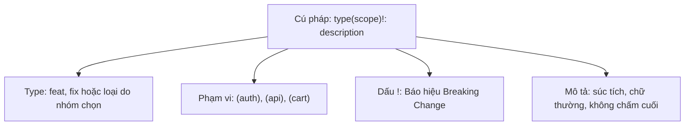

# Conventional Commits

## 🎯 Mục tiêu
- Hiểu rõ đặc tả chuẩn Conventional Commits phiên bản 1.0.0 và giá trị to lớn của nó đối với tự động hóa phần mềm.
- Làm chủ cấu trúc chuẩn: `<type>[optional scope]: <description>` cùng các phần tùy chọn Body và Footer.
- Nhận diện `feat`, `fix` và các type thường dùng; hiểu type ngoài hai loại này không tự mang ý nghĩa SemVer.
- Biểu diễn các thay đổi phá vỡ tính tương thích ngược (BREAKING CHANGE) bằng dấu chấm than `!` hoặc footer chuyên dụng.

## 🧩 Từ khóa hôm nay
### Conventional Commits
- **Nói dễ hiểu**: Quy ước viết thông điệp commit theo cấu trúc chuẩn để cả người và máy đều đọc hiểu dễ dàng.
- **Ví dụ**: Viết `feat(auth): add google login button` thay vì chỉ ghi chung chung `update code`.
- **Đừng nhầm**: Không phải câu lệnh Git riêng biệt, mà là chuẩn mực thỏa thuận chung của cộng đồng lập trình.

### Commit Type
- **Nói dễ hiểu**: Từ khóa phân loại mục đích chính của commit như tính năng mới (`feat`) hay sửa lỗi (`fix`).
- **Ví dụ**: Dùng `docs: update readme` khi chỉ bổ sung hướng dẫn cài đặt mà không đụng vào mã nguồn.
- **Đừng nhầm**: `feat` và `fix` mang giá trị cho người dùng cuối; công việc nội bộ như dọn dẹp thư viện dùng `chore`.

### Breaking Change
- **Nói dễ hiểu**: Thay đổi làm thay đổi cách thức hoạt động cũ, buộc người dùng hoặc hệ thống khác phải cập nhật theo.
- **Ví dụ**: Đổi tên trường API từ `user_id` sang `account_id` khiến ứng dụng cũ không gọi được nữa.
- **Đừng nhầm**: Không chỉ là lỗi làm crash app, mà là sự thay đổi giao diện hoặc hợp đồng dữ liệu phá vỡ tính tương thích ngược.

## 📖 Định nghĩa
Conventional Commits là đặc tả cho thông điệp commit: `<type>[scope tùy chọn][!]: <mô tả>`, có thể kèm body và footer. Đặc tả định nghĩa ý nghĩa SemVer cho `fix` (PATCH), `feat` (MINOR) và thay đổi phá vỡ tương thích (MAJOR); các type khác do nhóm tự quy ước. Việc tính phiên bản hay tạo changelog chỉ xảy ra khi dự án cấu hình công cụ tương ứng.

## 🤔 Tại sao cần?
Thông điệp có cấu trúc giúp người đọc lọc và hiểu lịch sử thay đổi dễ hơn. Nếu dự án cấu hình parser và quy trình phát hành tương thích, các commit cũng có thể làm đầu vào cho changelog hoặc gợi ý mức tăng phiên bản; định dạng commit một mình không tự chạy release.

## 🧠 Mental Model (Mô hình tư duy)
Hãy hình dung hệ thống phân loại bưu kiện tự động. Mỗi kiện hàng được dán nhãn chuẩn hóa: Thư hỏa tốc (`feat`), Bảo hành (`fix`), Bảo trì định kỳ (`chore`), kèm địa chỉ cụ thể `(checkout)`. Máy quét mã vạch đọc nhãn và tự động phân luồng bưu kiện chính xác vào từng toa tàu mà không cần bóc gói hàng.

## 🖼 Sơ đồ


## 🌎 Ví dụ thực tế
Một kỹ sư ghi `feat(payment): add PayPal button` cho tính năng mới và `fix(cart): correct currency rounding` cho một lỗi. Nếu repository cấu hình công cụ phát hành để hiểu Conventional Commits, công cụ có thể dùng các thông điệp này khi tạo changelog hoặc tính mức phiên bản.

## 💻 Command
```bash
# Thêm tính năng mới cho module xác thực
git commit -m "feat(auth): add endpoint for user registration"

# Sửa lỗi tính toán trong giỏ hàng
git commit -m "fix(cart): prevent session timeout during checkout"

# Thay đổi phá vỡ tương thích ngược với dấu chấm than
git commit -m "feat(core)!: drop support for Node 16"
```

## 🔍 Giải thích command
- `feat(auth)`: Đặc tả gán ý nghĩa MINOR cho tính năng mới; công cụ chỉ tăng phiên bản nếu được cấu hình để làm việc đó.
- `fix(cart)`: Đặc tả gán ý nghĩa PATCH cho sửa lỗi; cách phát hành cụ thể tùy cấu hình dự án.
- `!` sau type/scope: Báo hiệu breaking change; có thể dùng footer `BREAKING CHANGE: <mô tả thay đổi>` thay thế hoặc bổ sung.

## ⚠️ Sai lầm phổ biến
- Dùng type không phản ánh nội dung thay đổi, khiến người đọc hoặc tool đã cấu hình phân loại sai.
- Quên mô tả breaking change bằng `!` hoặc footer `BREAKING CHANGE:`.
- Cho rằng `chore`, `docs` hay `refactor` tự động làm tăng một mức SemVer; đặc tả không quy định mức tăng cho các type đó.

## 🧪 Lab
Hãy mở terminal và cùng tôi rèn luyện thói quen viết Conventional Commits chuẩn mực:

1. Khởi tạo kho thử nghiệm và tạo tệp `home.html`.
2. Commit với chuẩn tính năng mới: `git commit -m "feat(home): add hero banner section"`.
3. Sửa một lỗi hiển thị và commit: `git commit -m "fix(home): correct button alignment on mobile"`.
4. Viết tài liệu và commit: `git commit -m "docs: add getting started guide in readme"`.
5. Dùng `git log --oneline` để kiểm tra danh sách commit xem có ngay ngắn và dễ đọc hay không.

## 💡 Hint
- Đặc tả không bắt buộc độ dài 72 ký tự, thể mệnh lệnh hay dấu câu; hãy theo giới hạn và cách viết mà repository/team đã chọn.
- Nếu có nội dung giải thích dài hơn, hãy để một dòng trống sau dòng tiêu đề rồi mới viết phần Body chi tiết.

## ✅ Validation
- Lịch sử Git hiển thị rõ ràng từng loại công việc qua tiền tố `feat`, `fix`, `docs`.
- Giải thích được cấu trúc type/scope/description và nhận diện breaking change.
- Biết kiểm tra cấu hình dự án trước khi kỳ vọng commit tự tạo changelog hay đổi phiên bản.

## ❓ Quiz
Hãy hoàn thành bài trắc nghiệm bên dưới để kiểm tra mức độ hiểu biết của bạn về đặc tả Conventional Commits.

## 🔥 Challenge
Tìm hiểu cách cài đặt công cụ commitlint kết hợp với Husky để tự động từ chối bất kỳ commit nào không tuân thủ chuẩn Conventional Commits ngay từ máy lập trình viên.

## 📚 Tổng kết
- Conventional Commits chuẩn hóa thông điệp commit; scope tùy chọn.
- `feat`, `fix` và breaking change có ý nghĩa SemVer xác định; các type khác là quy ước của dự án.
- Changelog và phát hành tự động cần công cụ cùng cấu hình phù hợp.
