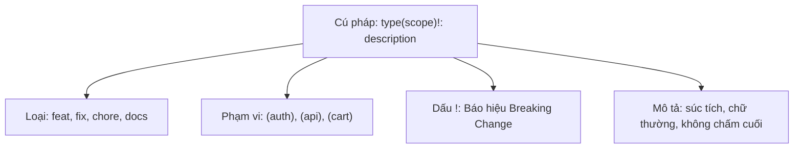

# Conventional Commits

## 🎯 Mục tiêu
- Hiểu rõ đặc tả chuẩn Conventional Commits phiên bản 1.0.0 và giá trị to lớn của nó đối với tự động hóa phần mềm.
- Làm chủ cấu trúc chuẩn: `<type>[optional scope]: <description>` cùng các phần tùy chọn Body và Footer.
- Sử dụng chính xác các tiền tố định danh phổ biến: feat, fix, docs, style, refactor, perf, test, build, ci, chore.
- Biểu diễn các thay đổi phá vỡ tính tương thích ngược (BREAKING CHANGE) bằng dấu chấm than `!` hoặc footer chuyên dụng.

## 🧩 Từ khóa hôm nay
### Conventional Commits
- **Nói dễ hiểu**: Quy ước viết thông điệp commit theo cấu trúc chuẩn để cả người và máy đều đọc hiểu dễ dàng.
- **Ví dụ**: Viết `feat(auth): add google login button` thay vì chỉ ghi chung chung `update code`.
- **Đừng nhầm**: Không phải câu lệnh Git riêng biệt, mà là chuẩn mực thỏa thuận chung của cộng đồng lập trình.

### Commit Type
- **Nói dễ hiểu**: Từ khóa phân loại mục đích chính của commit như tính năng mới (`feat`) hay sửa lỗi (`fix`).
- **Ví dụ**: Dùng `docs: update readme` khi chỉ bổ sung hướng dẫn cài đặt mà không đụng vào mã nguồn.
- **Đừng nhầm**: `feat` và `fix` mang giá trị cho người dùng cuối; công việc nội bộ như dọn dẹp thư viện dùng `chore`.

### Breaking Change
- **Nói dễ hiểu**: Thay đổi làm thay đổi cách thức hoạt động cũ, buộc người dùng hoặc hệ thống khác phải cập nhật theo.
- **Ví dụ**: Đổi tên trường API từ `user_id` sang `account_id` khiến ứng dụng cũ không gọi được nữa.
- **Đừng nhầm**: Không chỉ là lỗi làm crash app, mà là sự thay đổi giao diện hoặc hợp đồng dữ liệu phá vỡ tính tương thích ngược.

## 📖 Định nghĩa
Conventional Commits là đặc tả định dạng thông điệp commit có cấu trúc nhẹ nhàng nhưng chặt chẽ. Cú pháp cơ bản gồm tiền tố loại commit, phạm vi tác động tùy chọn và mô tả súc tích, cho phép công cụ CI/CD tự động phân tích cú pháp để tính toán số phiên bản Semantic Versioning và tạo nhật ký thay đổi.

## 💡 Tại sao cần
Lịch sử commit với những thông điệp mơ hồ như "update", "fix bug" gây khó khăn lớn khi điều tra lỗi hoặc phát hành sản phẩm. Conventional Commits biến lịch sử dự án thành tài liệu có trật tự cao, giúp mọi thành viên nắm bắt ngay bức tranh phát triển và hỗ trợ tự động hóa hoàn toàn quy trình release.

## 🧠 Mental Model
Hãy hình dung hệ thống phân loại bưu kiện tự động. Mỗi kiện hàng được dán nhãn chuẩn hóa: Thư hỏa tốc (`feat`), Bảo hành (`fix`), Bảo trì định kỳ (`chore`), kèm địa chỉ cụ thể `(checkout)`. Máy quét mã vạch đọc nhãn và tự động phân luồng bưu kiện chính xác vào từng toa tàu mà không cần bóc gói hàng.

## 📊 Sơ đồ minh họa


## 🏢 Ví dụ thực tế
Một kỹ sư phần mềm tuân thủ nghiêm ngặt chuẩn Conventional Commits. Khi tích hợp cổng thanh toán PayPal, kỹ sư commit: `feat(payment): add PayPal smart button integration`. Khi sửa lỗi làm tròn tiền tệ, kỹ sư ghi: `fix(cart): correct currency rounding for Japanese Yen`. Đến ngày phát hành, công cụ tự động quét lịch sử và tự tạo file changelog chi tiết cùng số phiên bản mới trong vài giây.

## 💻 Command & Cú pháp
```bash
# Thêm tính năng mới cho module xác thực
git commit -m "feat(auth): add endpoint for user registration"

# Sửa lỗi tính toán trong giỏ hàng
git commit -m "fix(cart): prevent session timeout during checkout"

# Thay đổi phá vỡ tương thích ngược với dấu chấm than
git commit -m "feat(core)!: drop support for Node 16"
```

## 🔍 Giải thích command
- `feat(auth)`: Định danh thêm tính năng mới cho module đăng nhập, giúp công cụ tự động tăng Minor version.
- `fix(cart)`: Định danh việc sửa lỗi trong giỏ hàng, giúp công cụ tự động tăng Patch version khi phát hành.
- `!` sau scope: Đánh dấu có thay đổi phá vỡ tương thích ngược để công cụ tự động tăng Major version.

## ⚠️ Sai lầm phổ biến
- Viết chữ in hoa cho type hoặc viết sai chính tả như `Feat: ` hoặc `FEATURE: `.
- Đặt dấu chấm câu ở cuối dòng tiêu đề mô tả đầu tiên.
- Lạm dụng `feat` cho các công việc bảo trì nội bộ thay vì dùng đúng `chore` hoặc `build`.

## 🧪 Lab thực hành
Bài học này là bài tự kiểm tra: bạn thao tác tạo các commit tuân thủ quy chuẩn trên máy và đối chiếu theo hướng dẫn bên dưới.

1. Khởi tạo kho thử nghiệm và tạo tệp `home.html`.
2. Commit với chuẩn tính năng mới: `git commit -m "feat(home): add hero banner section"`.
3. Sửa một lỗi hiển thị và commit: `git commit -m "fix(home): correct button alignment on mobile"`.
4. Viết tài liệu và commit: `git commit -m "docs: add getting started guide in readme"`.
5. Dùng `git log --oneline` để kiểm tra danh sách commit xem có ngay ngắn và dễ đọc hay không.

## 💡 Hint & mẹo
- Giữ dòng tiêu đề đầu tiên ngắn gọn dưới 72 ký tự và luôn viết ở thể mệnh lệnh hiện tại.
- Nếu có nội dung giải thích dài hơn, hãy để một dòng trống sau dòng tiêu đề rồi mới viết phần Body chi tiết.

## ✅ Validation & Kết quả mong đợi
- Lịch sử Git hiển thị rõ ràng từng loại công việc qua tiền tố `feat`, `fix`, `docs`.
- Các công cụ tự động hóa như standard-version hay semantic-release có thể đọc và phân tích cú pháp toàn bộ commit.

## ❓ Quiz nhanh
Hãy hoàn thành bài trắc nghiệm bên dưới để kiểm tra mức độ hiểu biết của bạn về đặc tả Conventional Commits.

## 🚀 Thử thách nâng cao
Tìm hiểu cách cài đặt công cụ commitlint kết hợp với Husky để tự động từ chối bất kỳ commit nào không tuân thủ chuẩn Conventional Commits ngay từ máy lập trình viên.

## 📝 Tổng kết
- Conventional Commits mang lại cấu trúc nhất quán và ý nghĩa rõ ràng cho lịch sử dự án.
- Các tiền tố `feat`, `fix`, `chore` phản ánh chính xác bản chất thay đổi của từng commit.
- Chuẩn hóa thông điệp là nền tảng để tự động hóa phát hành phần mềm và tạo changelog chuyên nghiệp.
