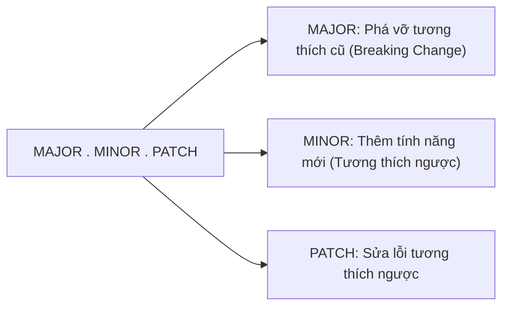

# Semantic Versioning

## 🎯 Mục tiêu
- Nắm vững đặc tả Semantic Versioning 2.0.0 (SemVer) với định dạng chuẩn 3 con số: MAJOR.MINOR.PATCH.
- Áp dụng quy tắc tăng số cho phần mềm đã công bố public API và đang ở phiên bản `1.0.0` trở lên.
- Hiểu rõ ý nghĩa của các hậu tố tiền phát hành (Pre-release) như `-alpha`, `-beta`, `-rc.1` và thông tin bản dựng.
- Tích hợp tư duy SemVer vào quy trình quản lý thẻ Git Tag và phát hành thư viện phần mềm chuyên nghiệp.

## 🧩 Từ khóa hôm nay
### Semantic Versioning
- **Nói dễ hiểu**: Quy chuẩn đánh số phiên bản gồm ba phần MAJOR.MINOR.PATCH giúp người dùng hiểu ngay mức độ thay đổi của mã nguồn.
- **Ví dụ**: Bản cập nhật từ `1.2.0` lên `1.2.1` là sửa lỗi nhỏ, còn lên `2.0.0` là có thay đổi lớn phá vỡ tính tương thích cũ.
- **Đừng nhầm**: SemVer chỉ có ý nghĩa khi dự án xác định public API và tuân theo đặc tả; `0.y.z` dành cho giai đoạn phát triển ban đầu.

### Breaking Change
- **Nói dễ hiểu**: Thay đổi không còn tương thích với public API đã công bố, nên một số chương trình đang dùng API đó có thể phải sửa.
- **Ví dụ**: Xóa bỏ một tham số bắt buộc trong hàm API khiến các phần mềm bên ngoài gọi vào bị vỡ.
- **Đừng nhầm**: Quy tắc MAJOR áp dụng cho thay đổi không tương thích với public API đã công bố khi `MAJOR` lớn hơn 0; dự án `0.y.z` chưa cam kết API ổn định.

### Pre-release
- **Nói dễ hiểu**: Hậu tố đánh dấu bản phát hành thử nghiệm để kiểm thử trước khi tung ra bản chính thức cho công chúng.
- **Ví dụ**: Phiên bản `2.0.0-rc.1` là bản ứng viên phát hành lần một trước khi ra mắt bản `2.0.0` ổn định.
- **Đừng nhầm**: Bản pre-release có thứ tự ưu tiên thấp hơn bản chính thức cùng số phiên bản.

### Build Metadata (Thông tin bản dựng)
- **Nói dễ hiểu**: Phần tùy chọn sau dấu `+` dùng để ghi thông tin build như số pipeline hoặc mã build.
- **Ví dụ**: `1.2.3+build.17` có metadata `build.17`.
- **Đừng nhầm**: Metadata không làm thay đổi thứ tự ưu tiên SemVer; không dùng nó thay cho PATCH/MINOR/MAJOR.

## 📖 Định nghĩa
Semantic Versioning 2.0.0 (SemVer) là đặc tả phiên bản `MAJOR.MINOR.PATCH` cho phần mềm có public API được khai báo. Với bản ổn định `1.0.0` trở lên: PATCH là sửa lỗi tương thích ngược, MINOR là thêm chức năng tương thích ngược, MAJOR là đổi public API không tương thích ngược. Trước `1.0.0`, API được xem là chưa ổn định và có thể thay đổi. Nhãn phiên bản chỉ giúp người dùng dự đoán mức thay đổi nếu nhà phát hành tuân thủ đặc tả.

## 🤔 Tại sao cần?
SemVer giúp người dùng hiểu mức độ tương thích mà nhà phát hành cam kết giữa các phiên bản. Nó không bảo đảm bản cập nhật không có lỗi; người dùng vẫn cần kiểm thử, xem ghi chú phát hành và chọn dải phiên bản phù hợp.

## 🧠 Mental Model (Mô hình tư duy)
Hãy hình dung ổ cắm là public API mà nhà phát hành cam kết. PATCH sửa lỗi mà không đổi cách cắm; MINOR thêm cổng mới nhưng giữ cổng cũ; MAJOR đổi chuẩn cổng đã công bố nên chương trình dùng chuẩn cũ có thể cần cập nhật.

## 🖼 Sơ đồ


## 🌎 Ví dụ thực tế
Một nhóm phát hành thư viện có public API ở bản `1.0.0`. Sửa lỗi tương thích ngược có thể thành `1.0.1`; thêm API mới tương thích ngược có thể thành `1.1.0`. Nếu nhóm bỏ một API đã công bố hoặc phá vỡ cam kết tương thích, nhóm phát hành MAJOR, ví dụ `2.0.0`. Các tag Git thường thêm tiền tố `v` như `v1.0.1`, nhưng tiền tố đó không thuộc chuỗi SemVer.

## 💻 Command
```bash
# Tạo thẻ tag bản vá lỗi nhỏ tăng PATCH
# Chạy mỗi lệnh tại commit phát hành tương ứng, không gắn tất cả tag vào cùng một commit
git tag -a v1.0.1 -m "Release v1.0.1: fix button safari bug"

# Tạo thẻ tag bổ sung tính năng mới tăng MINOR
git tag -a v1.1.0 -m "Release v1.1.0: add datepicker component"

# Tạo thẻ tag phiên bản lớn có breaking change tăng MAJOR
git tag -a v2.0.0 -m "Release v2.0.0: drop legacy browser support"
```

Tiền tố `v` là quy ước tên Git tag thường gặp; SemVer ở ví dụ trên là `2.0.0`. Metadata build dùng dấu `+`, ví dụ `2.0.0+build.17`.

## 🔍 Giải thích command
- `git tag -a v1.0.1`: Gắn nhãn cho commit phát hành PATCH; lệnh tag không tự kiểm tra nội dung có tương thích hay không.
- `git tag -a v1.1.0`: Gắn nhãn cho commit phát hành MINOR; nhóm chọn số này theo thay đổi public API và chính sách phát hành.
- `git tag -a v2.0.0`: Gắn nhãn cho commit phát hành MAJOR có thay đổi public API không tương thích.

## ⚠️ Sai lầm phổ biến
- Tăng số MAJOR cho những thay đổi nhỏ chỉ để làm thương hiệu hoặc tiếp thị mà không có breaking change thực tế.
- Đưa thay đổi phá vỡ tương thích ngược vào một bản phát hành chỉ tăng PATCH hoặc MINOR.
- Quên reset các chỉ số phía sau về 0 khi tăng con số phía trước (ví dụ tăng từ 1.2.5 lên 2.0.0 thay vì 2.2.5).

## 🧪 Lab
Làm trong repo thử nghiệm đã có commit và danh tính Git được cấu hình. Mỗi tag phải gắn sau khi commit thay đổi tương ứng.

1. Trong repo thử nghiệm đã có ít nhất một commit, gắn tag `v1.0.0` cho commit hiện tại: `git tag -a v1.0.0 -m "Release v1.0.0"`.
2. Sửa một lỗi tương thích ngược trong file thử nghiệm, chạy `git add <tệp>` rồi `git commit -m "fix: correct example"`; sau đó gắn tag `v1.0.1`.
3. Thêm một API/khả năng mới tương thích ngược, stage và commit riêng; sau đó gắn tag `v1.1.0`.
4. So sánh `2.0.0-rc.1` với `2.0.0`, rồi giải thích vì sao `2.0.0+build.17` có cùng thứ tự ưu tiên với `2.0.0`.
5. Xem từng tag và commit đích bằng `git show --no-patch <tag>`; `git tag -n` liệt kê tên tag/thông điệp nhưng không tự xác minh SemVer.

## 💡 Hint
- Trước khi chọn mức tăng, hãy xác định public API, compatibility policy và liệu dự án đã phát hành `1.0.0` hay chưa.
- Nhớ đẩy thẻ lên máy chủ từ xa bằng lệnh `git push origin --tags`.

## ✅ Validation
- Các tag trỏ tới commit phát hành dự định; Git tag không xác thực SemVer hay nội dung commit.
- Giải thích được vì sao dải phiên bản package manager không bảo đảm một bản mới không có lỗi.

## ❓ Quiz
Hãy làm bài trắc nghiệm bên dưới để kiểm tra mức độ thấu hiểu của bạn về các nguyên tắc tăng số trong Semantic Versioning.

## 🔥 Challenge
Tìm hiểu ý nghĩa của các ký tự đại diện `^` (caret) và `~` (tilde) trong tệp `package.json` khi cài đặt thư viện Node.js và giải thích cách chúng bảo vệ dự án khỏi các lỗi tương thích.

## 📚 Tổng kết
- SemVer chuẩn hóa định dạng phiên bản theo cấu trúc ba con số MAJOR.MINOR.PATCH.
- PATCH tăng khi sửa lỗi, MINOR tăng khi thêm tính năng mới, MAJOR tăng khi có thay đổi phá vỡ tương thích.
- SemVer là cam kết tương thích của nhà phát hành đối với public API đã khai báo, không phải bảo đảm phần mềm không lỗi.
- `0.y.z` là giai đoạn phát triển ban đầu; các quy tắc ổn định dành cho phiên bản `1.0.0` trở lên.
- Pre-release có thứ tự thấp hơn bản phát hành thường tương ứng; build metadata bị bỏ qua khi so sánh thứ tự.
