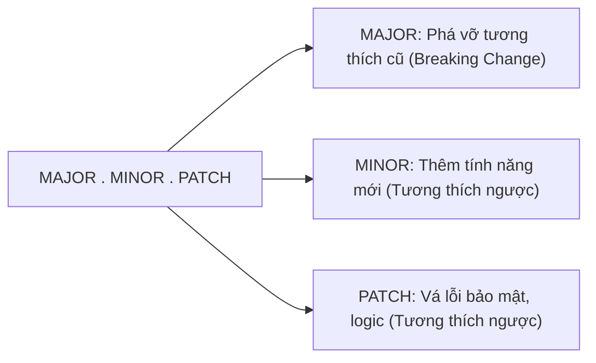

# Semantic Versioning

## 🎯 Mục tiêu
- Nắm vững đặc tả Semantic Versioning 2.0.0 (SemVer) với định dạng chuẩn 3 con số: MAJOR.MINOR.PATCH.
- Áp dụng chính xác quy tắc tăng số: khi nào tăng PATCH (sửa lỗi), khi nào tăng MINOR (tính năng), khi nào tăng MAJOR (phá vỡ tương thích).
- Hiểu rõ ý nghĩa của các hậu tố tiền phát hành (Pre-release) như `-alpha`, `-beta`, `-rc.1` và thông tin bản dựng.
- Tích hợp tư duy SemVer vào quy trình quản lý thẻ Git Tag và phát hành thư viện phần mềm chuyên nghiệp.

## 🧩 Từ khóa hôm nay
### Semantic Versioning
- **Nói dễ hiểu**: Quy chuẩn đánh số phiên bản gồm ba phần MAJOR.MINOR.PATCH giúp người dùng hiểu ngay mức độ thay đổi của mã nguồn.
- **Ví dụ**: Bản cập nhật từ `1.2.0` lên `1.2.1` là sửa lỗi nhỏ, còn lên `2.0.0` là có thay đổi lớn phá vỡ tính tương thích cũ.
- **Đừng nhầm**: Không phải số đếm ngẫu nhiên theo ngày tháng hay sở thích cá nhân, mà tuân thủ quy tắc kỹ thuật nghiêm ngặt.

### Breaking Change
- **Nói dễ hiểu**: Thay đổi làm thay đổi giao diện hàm hoặc cách gọi cũ khiến ứng dụng của người dùng bị lỗi khi cập nhật.
- **Ví dụ**: Xóa bỏ một tham số bắt buộc trong hàm API khiến các phần mềm bên ngoài gọi vào bị vỡ.
- **Đừng nhầm**: Bất kể thay đổi nhỏ hay lớn, chỉ cần làm hỏng code hiện có của người dùng thì bắt buộc phải tăng số MAJOR.

### Pre-release
- **Nói dễ hiểu**: Hậu tố đánh dấu bản phát hành thử nghiệm để kiểm thử trước khi tung ra bản chính thức cho công chúng.
- **Ví dụ**: Phiên bản `2.0.0-rc.1` là bản ứng viên phát hành lần một trước khi ra mắt bản `2.0.0` ổn định.
- **Đừng nhầm**: Bản pre-release có thứ tự ưu tiên thấp hơn bản chính thức cùng số phiên bản.

## 📖 Định nghĩa
Semantic Versioning (SemVer) là đặc tả kỹ thuật định nghĩa quy tắc đánh số phiên bản phần mềm theo định dạng ba cụm số nguyên: `MAJOR.MINOR.PATCH`. Mỗi con số phản ánh rõ ràng tính chất thay đổi của mã nguồn: sửa lỗi, bổ sung tính năng tương thích ngược, hoặc thay đổi phá vỡ tính tương thích cũ.

## 💡 Tại sao cần
Không có SemVer, các lập trình viên rơi vào khủng hoảng quản lý phụ thuộc (Dependency Hell). Người dùng không thể biết việc cập nhật một thư viện có làm sập hệ thống hay không. SemVer đem lại sự an tâm tuyệt đối: chỉ cần tăng PATCH hoặc MINOR là người dùng an tâm cập nhật tự động mà không lo gãy đổ ứng dụng.

## 🧠 Mental Model
Hãy hình dung việc thay thế ổ cắm điện. Sửa lỗi (`PATCH`: 1.0.0 lên 1.0.1) như siết lại ốc vít lỏng: giữ nguyên mọi thứ và phích cắm cũ dùng bình thường. Thêm tính năng (`MINOR`: 1.0.0 lên 1.1.0) như gắn thêm cổng USB bên cạnh ổ cắm: có thêm tiện ích mới mà phích cắm cũ vẫn cắm vừa. Phá vỡ tương thích (`MAJOR`: 1.0.0 lên 2.0.0) như đổi ổ cắm tròn thành ổ cắm ba chấu vuông: toàn bộ phích cắm cũ không dùng được nữa nếu không có đầu chuyển đổi.

## 📊 Sơ đồ minh họa


## 🏢 Ví dụ thực tế
Một nhóm phát triển thư viện giao diện phát hành bản `1.0.0`. Khi sửa lỗi hiển thị nút bấm trên trình duyệt Safari, nhóm phát hành thẻ tag `v1.0.1` (tăng PATCH). Một tháng sau, nhóm bổ sung linh kiện Lịch chọn ngày mà không làm hỏng linh kiện cũ, nhóm phát hành `v1.1.0` (tăng MINOR và reset PATCH về 0). Sau một năm, nhóm bỏ hỗ trợ các trình duyệt cũ và thay đổi toàn bộ API thuộc tính, nhóm phát hành `v2.0.0` (tăng MAJOR).

## 💻 Command & Cú pháp
```bash
# Tạo thẻ tag bản vá lỗi nhỏ tăng PATCH
git tag -a v1.0.1 -m "Release v1.0.1: fix button safari bug"

# Tạo thẻ tag bổ sung tính năng mới tăng MINOR
git tag -a v1.1.0 -m "Release v1.1.0: add datepicker component"

# Tạo thẻ tag phiên bản lớn có breaking change tăng MAJOR
git tag -a v2.0.0 -m "Release v2.0.0: drop legacy browser support"
```

## 🔍 Giải thích command
- `git tag -a v1.0.1`: Đánh dấu bản phát hành sửa lỗi nhỏ, người dùng có thể cập nhật an toàn mà không cần sửa code.
- `git tag -a v1.1.0`: Đánh dấu bản phát hành thêm tính năng mới tương thích ngược, reset chỉ số PATCH về 0.
- `git tag -a v2.0.0`: Đánh dấu bản phát hành lớn có breaking change, cảnh báo người dùng cần đọc tài liệu nâng cấp.

## ⚠️ Sai lầm phổ biến
- Tăng số MAJOR cho những thay đổi nhỏ chỉ để làm thương hiệu hoặc tiếp thị mà không có breaking change thực tế.
- Đưa thay đổi phá vỡ tương thích ngược vào một bản phát hành chỉ tăng PATCH hoặc MINOR.
- Quên reset các chỉ số phía sau về 0 khi tăng con số phía trước (ví dụ tăng từ 1.2.5 lên 2.0.0 thay vì 2.2.5).

## 🧪 Lab thực hành
Bài học này là bài tự kiểm tra: bạn thao tác tạo thẻ Git Tag theo chuẩn SemVer và đối chiếu theo hướng dẫn bên dưới.

1. Khởi tạo kho Git và gắn thẻ phiên bản phát hành đầu tiên: `git tag -a v1.0.0 -m "Release v1.0.0"`.
2. Tạo commit sửa lỗi chính tả và gắn thẻ: `git tag -a v1.0.1 -m "Release v1.0.1: fix typo"`.
3. Tạo commit bổ sung một module mới và gắn thẻ: `git tag -a v1.1.0 -m "Release v1.1.0: add auth service"`.
4. Xem danh sách toàn bộ các thẻ tag bằng lệnh `git tag -n` để kiểm tra thông điệp đi kèm từng phiên bản.

## 💡 Hint & mẹo
- Khi phân vân giữa MINOR và MAJOR, hãy tự hỏi: Mã nguồn hiện tại của người dùng có nguy cơ bị lỗi khi nâng cấp không? Nếu có, bắt buộc phải tăng MAJOR.
- Nhớ đẩy thẻ lên máy chủ từ xa bằng lệnh `git push origin --tags`.

## ✅ Validation & Kết quả mong đợi
- Danh sách tag trong Git tuân thủ đúng thứ tự số học và phản ánh chính xác bản chất thay đổi.
- Các công cụ quản lý gói như npm, yarn hay pip có thể tự động tải bản cập nhật an toàn theo ký hiệu phiên bản quy ước.

## ❓ Quiz nhanh
Hãy làm bài trắc nghiệm bên dưới để kiểm tra mức độ thấu hiểu của bạn về các nguyên tắc tăng số trong Semantic Versioning.

## 🚀 Thử thách nâng cao
Tìm hiểu ý nghĩa của các ký tự đại diện `^` (caret) và `~` (tilde) trong tệp `package.json` khi cài đặt thư viện Node.js và giải thích cách chúng bảo vệ dự án khỏi các lỗi tương thích.

## 📝 Tổng kết
- SemVer chuẩn hóa định dạng phiên bản theo cấu trúc ba con số MAJOR.MINOR.PATCH.
- PATCH tăng khi sửa lỗi, MINOR tăng khi thêm tính năng mới, MAJOR tăng khi có thay đổi phá vỡ tương thích.
- Tuân thủ SemVer đem lại khả năng tương thích dự đoán trước được và sự an tâm cho toàn bộ người dùng phần mềm.
