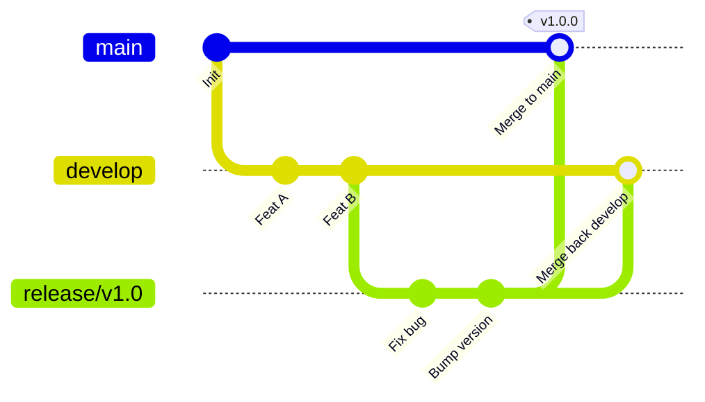

# Release Branch

## 🎯 Mục tiêu
- Nắm vững mục đích và vòng đời chuẩn của nhánh phát hành (Release Branch) trong các quy trình phần mềm chuyên nghiệp.
- Áp dụng quy tắc Đóng băng tính năng (Feature Freeze): nghiêm cấm code tính năng mới, chỉ chấp nhận commit sửa lỗi và tài liệu.
- Thực hiện quy trình hợp nhất kép (Dual-merge): hợp nhất vào main để phát hành và hợp nhất ngược về develop để đồng bộ.
- Sử dụng Git Tag để niêm phong cột mốc phát hành chính thức sau khi nhánh release hoàn thành sứ mệnh.

## 🧩 Từ khóa hôm nay
### Release Branch
- **Nói dễ hiểu**: Nhánh tạm thời tách ra để kiểm thử hồi quy và sửa lỗi dọn dẹp trước khi đưa sản phẩm lên môi trường thực tế.
- **Ví dụ**: Tạo nhánh `release/v2.1.0` từ `develop` để đội QA kiểm tra toàn diện trong 3 ngày trước khi mở bán.
- **Đừng nhầm**: Không dùng để phát triển tính năng mới; mọi tính năng mới phải đợi ở chu kỳ sau trên `develop`.

### Feature Freeze
- **Nói dễ hiểu**: Trạng thái đóng băng tính năng, nghiêm cấm viết thêm code mới mà chỉ tập trung sửa lỗi và hoàn thiện tài liệu.
- **Ví dụ**: Nhóm thông báo đóng băng lúc 17h thứ Sáu, mọi commit sau đó chỉ được phép là bug fix được phê duyệt.
- **Đừng nhầm**: Không có nghĩa là toàn bộ đội ngũ dừng làm việc; các lập trình viên khác vẫn code tính năng mới cho bản sau trên `develop`.

### Dual-merge
- **Nói dễ hiểu**: Thao tác hợp nhất nhánh release vào cả `main` lẫn `develop` để vừa phát hành vừa không làm mất bản vá lỗi.
- **Ví dụ**: Khi sửa xong lỗi video trên `release/v2.1.0`, merge vào `main` để deploy và merge về `develop` để phiên bản tương lai có bản sửa này.
- **Đừng nhầm**: Nếu chỉ merge vào `main`, các bản vá lỗi trên release branch sẽ bị thất lạc ở các phiên bản tiếp theo.

## 📖 Định nghĩa
Release Branch là nhánh làm việc ngắn hạn được tạo ra từ `develop` nhằm mục đích ổn định hóa mã nguồn trước khi xuất bản. Trong suốt vòng đời của nhánh này, dự án kích hoạt trạng thái Feature Freeze để toàn bộ đội ngũ chỉ tập trung kiểm thử hồi quy, sửa lỗi còn tồn đọng và chuẩn bị tài liệu phát hành.

## 💡 Tại sao cần
Khi nhiều kỹ sư cùng làm việc trên `develop`, mã nguồn liên tục thay đổi khiến đội QA không thể kiểm thử ổn định. Release Branch tạo ra một vùng cô lập tĩnh lặng để đánh bóng chất lượng sản phẩm, trong khi các lập trình viên khác vẫn có thể tiếp tục phát triển tính năng cho các phiên bản tiếp theo mà không làm gián đoạn nhau.

## 🧠 Mental Model
Hãy hình dung quy trình in sách giáo khoa. Nhánh `develop` là phòng sáng tác của các tác giả. Khi xong bản thảo, họ gửi bản in thử sang phòng Hiệu đính (`Release Branch`). Tại đây, biên tập viên chỉ sửa lỗi chính tả, căn chỉnh lề in chứ không được viết thêm chương mới. Trong lúc đó, các tác giả vẫn thoải mái viết sách tập hai ở phòng sáng tác.

## 📊 Sơ đồ minh họa


## 🏢 Ví dụ thực tế
Trước đợt ra mắt bản 3.0 của ứng dụng học tập, đội trưởng kỹ thuật tạo nhánh `release/v3.0.0` từ `develop`. Trong 4 ngày sau đó, cả đội tuân thủ nghiêm ngặt Feature Freeze. Khi QA phát hiện lỗi video không tự động chạy trên Firefox, kỹ sư sửa trực tiếp trên nhánh release. Khi mọi bài kiểm tra đều đạt, nhánh được merge vào `main`, gắn thẻ tag `v3.0.0` để triển khai lên máy chủ và merge ngược lại về `develop`.

## 💻 Command & Cú pháp
```bash
# Tách nhánh release từ develop để chuẩn bị phát hành
git switch -c release/v1.2.0 develop

# Sửa lỗi phát hiện trong quá trình kiểm thử
git commit -m "fix(video): resolve autoplay bug on firefox"

# Hợp nhất vào main để phát hành và gắn thẻ tag
git switch main && git merge --no-ff release/v1.2.0
git tag -a v1.2.0 -m "Release v1.2.0 official"

# Hợp nhất ngược về develop và dọn dẹp nhánh
git switch develop && git merge --no-ff release/v1.2.0
git branch -d release/v1.2.0
```

## 🔍 Giải thích command
- `git switch -c release/v1.2.0 develop`: Tách một nhánh phát hành độc lập từ trạng thái tích hợp của develop.
- `git merge --no-ff`: Hợp nhất tạo commit đại diện rõ ràng giúp lưu dấu lịch sử đợt phát hành trên biểu đồ Git.
- `git tag -a`: Đánh dấu cột mốc phiên bản chính thức trên nhánh `main` để kích hoạt dây chuyền triển khai.
- `git branch -d`: Xóa an toàn nhánh release sau khi đã hợp nhất đầy đủ vào cả hai nhánh chính.

## ⚠️ Sai lầm phổ biến
- Cho phép lập trình viên viết thêm tính năng mới vào nhánh release đang trong giai đoạn đóng băng.
- Quên hợp nhất ngược nhánh release về `develop` khiến các lỗi vừa sửa bị tái phát ở phiên bản tiếp theo.
- Xóa nhánh release trước khi bảo đảm toàn bộ mã nguồn đã được đưa trọn vẹn vào cả `main` và `develop`.

## 🧪 Lab thực hành
Bài học này là bài tự kiểm tra: bạn thao tác tách nhánh phát hành trên kho mô phỏng và đối chiếu theo hướng dẫn bên dưới.

1. Khởi tạo một nhánh `develop` và tạo 2 commit tính năng.
2. Tách nhánh `release/v1.0.0` từ `develop` bằng lệnh `git switch -c release/v1.0.0 develop`.
3. Tạo commit sửa lỗi tài liệu trên nhánh release.
4. Chuyển sang `main`, merge nhánh release với cờ `--no-ff` và gắn tag `v1.0.0`.
5. Chuyển sang `develop`, merge nhánh release về để hoàn tất quy trình hợp nhất kép và xóa nhánh release.

## 💡 Hint & mẹo
- Luôn sử dụng cờ `--no-ff` khi merge nhánh release để bảo toàn biểu đồ lịch sử phát hành trên Git.
- Chỉ những commit sửa lỗi nghiêm trọng và cập nhật tài liệu hoặc nâng số phiên bản mới được phép đưa lên nhánh release.

## ✅ Validation & Kết quả mong đợi
- Cả hai nhánh `main` và `develop` đều chứa trọn vẹn commit sửa lỗi từ nhánh release.
- Thẻ tag `v1.0.0` trỏ chính xác vào commit hợp nhất trên nhánh `main`.

## ❓ Quiz nhanh
Hãy làm bài trắc nghiệm bên dưới để kiểm tra mức độ nắm vững quy trình vận hành của nhánh phát hành Release Branch.

## 🚀 Thử thách nâng cao
Thiết kế kịch bản xử lý khi phát sinh xung đột mã nguồn trong bước hợp nhất ngược nhánh release về nhánh `develop` do có tính năng mới vừa được đưa vào `develop`.

## 📝 Tổng kết
- Release Branch tạo ra môi trường tĩnh lặng cho QA kiểm thử hồi quy và ổn định hóa phần mềm.
- Quy tắc Feature Freeze bảo vệ sản phẩm khỏi các lỗi mới phát sinh sát giờ phát hành.
- Quy trình hợp nhất kép (Dual-merge) bảo đảm mọi bản vá lỗi đều được bảo toàn cho các chu kỳ phát triển tiếp theo.
