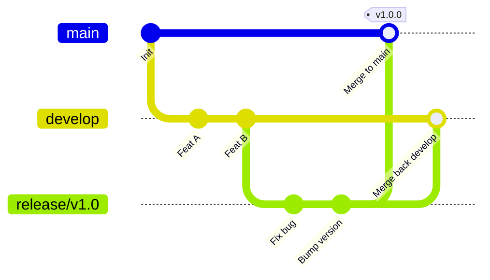

# Release Branch

## 🎯 Mục tiêu
- Giải thích vai trò của nhánh release trong Git Flow và các workflow cần ổn định bản phát hành riêng.
- Hiểu Feature Freeze là chính sách của nhóm để giới hạn thay đổi trong giai đoạn ổn định.
- Thực hiện quy trình của Git Flow: tích hợp release vào `main`, gắn tag và đưa sửa đổi cần giữ về `develop`.
- Sử dụng Git Tag để niêm phong cột mốc phát hành chính thức sau khi nhánh release hoàn thành sứ mệnh.

## 🧩 Từ khóa hôm nay
### Release Branch
- **Nói dễ hiểu**: Nhánh tạm thời để kiểm thử và ổn định một bản phát hành trước khi phát hành.
- **Ví dụ**: Tạo nhánh `release/v2.1.0` từ `develop` để đội QA kiểm tra toàn diện trong 3 ngày trước khi mở bán.
- **Đừng nhầm**: Trong Git Flow, nhóm thường hạn chế tính năng mới trên nhánh này; đó là quy ước nhằm tránh mở rộng phạm vi release.

### Feature Freeze
- **Nói dễ hiểu**: Chính sách tạm ngừng nhận tính năng mới vào một bản phát hành để tập trung kiểm tra và ổn định nó.
- **Ví dụ**: Nhóm thông báo đóng băng lúc 17h thứ Sáu, mọi commit sau đó chỉ được phép là bug fix được phê duyệt.
- **Đừng nhầm**: Mức giới hạn thay đổi do nhóm định nghĩa; code cần thiết cho bản phát hành vẫn có thể được chấp nhận theo review.

### Dual-merge
- **Nói dễ hiểu**: Trong Git Flow, tích hợp bản release vào `main` rồi đưa các sửa đổi cần giữ về `develop`.
- **Ví dụ**: Khi sửa xong lỗi video trên `release/v2.1.0`, merge vào `main` để deploy và merge về `develop` để phiên bản tương lai có bản sửa này.
- **Đừng nhầm**: Cần đồng bộ các commit chỉ có trên release; cách làm có thể là merge, cherry-pick hoặc quy trình khác của nhóm.

## 📖 Định nghĩa
Trong Git Flow, Release Branch thường được tạo từ `develop` khi nhóm bắt đầu ổn định một phiên bản. Nhóm giới hạn thay đổi trên nhánh, kiểm thử, sửa lỗi release và chuẩn bị ghi chú. Khi phát hành, nhánh được tích hợp vào `main` và thường gắn tag; các sửa đổi cần cho công việc sau được đồng bộ về `develop`. Đây là quy trình của mô hình Git Flow, không phải yêu cầu của Git.

## 💡 Tại sao cần
Nhánh release tách phiên bản đang được kiểm tra khỏi thay đổi mới trên `develop`. Nó giúp nhóm kiểm thử phiên bản cụ thể, nhưng cần đồng bộ sửa lỗi và tránh để nhánh này sống lâu hơn mức cần thiết.

## 🧠 Mental Model
Hãy hình dung quy trình in sách giáo khoa. Nhánh `develop` là phòng sáng tác của các tác giả. Khi xong bản thảo, họ gửi bản in thử sang phòng Hiệu đính (`Release Branch`). Tại đây, biên tập viên chỉ sửa lỗi chính tả, căn chỉnh lề in chứ không được viết thêm chương mới. Trong lúc đó, các tác giả vẫn thoải mái viết sách tập hai ở phòng sáng tác.

## 📊 Sơ đồ minh họa


## 🏢 Ví dụ thực tế
Trước đợt ra mắt bản 3.0 của ứng dụng học tập, đội trưởng kỹ thuật tạo nhánh `release/v3.0.0` từ `develop`. Trong 4 ngày sau đó, cả đội tuân thủ nghiêm ngặt Feature Freeze. Khi QA phát hiện lỗi video không tự động chạy trên Firefox, kỹ sư sửa trực tiếp trên nhánh release. Khi mọi bài kiểm tra đều đạt, nhánh được merge vào `main`, gắn thẻ tag `v3.0.0` để triển khai lên máy chủ và merge ngược lại về `develop`.

## 💻 Command & Cú pháp
```bash
# Tách nhánh release từ develop để chuẩn bị phát hành
git switch -c release/v1.2.0 develop

# Sửa lỗi phát hiện trong quá trình kiểm thử
git commit -m "fix(video): resolve autoplay bug on firefox"

# Hợp nhất vào main để phát hành và gắn thẻ tag
git switch main && git merge --no-ff release/v1.2.0
git tag -a v1.2.0 -m "Release v1.2.0 official"

# Hợp nhất ngược về develop và dọn dẹp nhánh
git switch develop && git merge --no-ff release/v1.2.0
git branch -d release/v1.2.0
```

## 🔍 Giải thích command
- `git switch -c release/v1.2.0 develop`: Tách một nhánh phát hành độc lập từ trạng thái tích hợp của develop.
- `git merge --no-ff`: Tạo merge commit kể cả khi fast-forward có thể; dùng nếu nhóm muốn giữ mốc nhánh release trong lịch sử.
- `git tag -a`: Đánh dấu commit phát hành; tag không tự triển khai sản phẩm, trừ khi pipeline của repo được cấu hình để phản ứng với tag.
- `git branch -d`: Xóa nhánh release cục bộ đã tích hợp; chỉ dọn nhánh remote nếu nhóm cho phép và đã xác nhận không còn cần nó.

## ⚠️ Sai lầm phổ biến
- Cho phép lập trình viên viết thêm tính năng mới vào nhánh release đang trong giai đoạn đóng băng.
- Quên hợp nhất ngược nhánh release về `develop` khiến các lỗi vừa sửa bị tái phát ở phiên bản tiếp theo.
- Xóa nhánh release trước khi bảo đảm toàn bộ mã nguồn đã được đưa trọn vẹn vào cả `main` và `develop`.

## 🧪 Lab thực hành
Bài học này là bài tự kiểm tra: bạn thao tác tách nhánh phát hành trên kho mô phỏng và đối chiếu theo hướng dẫn bên dưới.

Điều kiện đầu vào: repo thử nghiệm đã có commit, `main` và `develop` cùng trỏ tới lịch sử có thể merge; các lệnh chỉ thao tác local.
1. Tạo nhánh release từ `develop`: `git switch -c release/v1.0.0 develop`.
2. Sửa một lỗi tài liệu, rồi stage và commit: `git add README.md`; `git commit -m "docs: fix release instructions"`.
3. Tích hợp vào `main`: `git switch main`; `git merge --no-ff release/v1.0.0`.
4. Gắn tag vào commit phát hành dự định: `git tag -a v1.0.0 -m "Release v1.0.0"`.
5. Tích hợp commit release về `develop`, xác minh bằng `git log --oneline --graph --all`; xóa nhánh local sau khi chắc chắn đã tích hợp.

## 💡 Hint & mẹo
- Dùng `--no-ff` nếu nhóm muốn thấy ranh giới nhánh release trong lịch sử; không phải quy tắc bắt buộc của Git Flow.
- Thống nhất trước loại thay đổi được nhận trong giai đoạn ổn định; thường ưu tiên sửa lỗi và tài liệu.

## ✅ Validation & Kết quả mong đợi
- Cả hai nhánh `main` và `develop` đều chứa trọn vẹn commit sửa lỗi từ nhánh release.
- Thẻ tag `v1.0.0` trỏ chính xác vào commit hợp nhất trên nhánh `main`.

## ❓ Quiz nhanh
Hãy làm bài trắc nghiệm bên dưới để kiểm tra mức độ nắm vững quy trình vận hành của nhánh phát hành Release Branch.

## 🚀 Thử thách nâng cao
Thiết kế kịch bản xử lý khi phát sinh xung đột mã nguồn trong bước hợp nhất ngược nhánh release về nhánh `develop` do có tính năng mới vừa được đưa vào `develop`.

## 📝 Tổng kết
- Release Branch tạo ra môi trường tĩnh lặng cho QA kiểm thử hồi quy và ổn định hóa phần mềm.
- Quy tắc Feature Freeze bảo vệ sản phẩm khỏi các lỗi mới phát sinh sát giờ phát hành.
- Quy trình hợp nhất kép (Dual-merge) bảo đảm mọi bản vá lỗi đều được bảo toàn cho các chu kỳ phát triển tiếp theo.
