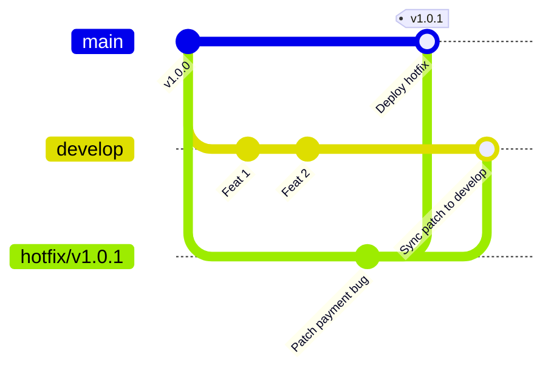

# Hotfix Workflow

## 🎯 Mục tiêu
- Hiểu rõ bản chất khẩn cấp và các tiêu chí phân loại một sự cố sản xuất (Production Incident) cần kích hoạt Hotfix.
- Nắm vững quy trình tách nhánh Hotfix trực tiếp từ commit bị lỗi trên nhánh sản phẩm (`main`).
- Thực hiện quy trình hợp nhất kép (Dual-merge) chuẩn xác cho Hotfix vào cả `main` và `develop` để tránh tái phát lỗi.
- Áp dụng quy tắc gắn thẻ phiên bản tăng PATCH (ví dụ v1.0.1) và cập nhật tài liệu khắc phục sự cố.

## 🧩 Từ khóa hôm nay
### Hotfix Branch
- **Nói dễ hiểu**: Nhánh cứu hộ khẩn cấp được tách trực tiếp từ nhánh sản xuất `main` để sửa lỗi nghiêm trọng đang xảy ra.
- **Ví dụ**: Tạo nhánh `hotfix/v1.0.1` để sửa gấp lỗi không thanh toán được bằng thẻ tín dụng.
- **Đừng nhầm**: Không tách từ `develop` vì `develop` đang chứa nhiều code mới chưa qua kiểm duyệt đầy đủ.

### Production Incident
- **Nói dễ hiểu**: Sự cố lỗi phần mềm phát sinh trực tiếp trên môi trường người dùng thật gây gián đoạn dịch vụ.
- **Ví dụ**: Người dùng nhận thông báo lỗi 500 khi bấm nút đăng nhập vào giờ cao điểm.
- **Đừng nhầm**: Không phải lỗi nhỏ về giao diện có thể chờ đợt phát hành định kỳ vào cuối tuần.

### Dual-merge
- **Nói dễ hiểu**: Việc đưa bản sửa lỗi hotfix vào cả nhánh `main` để sửa lỗi ngay và nhánh `develop` để không tái phát lỗi sau này.
- **Ví dụ**: Khi sửa xong mã thanh toán, merge vào `main` để deploy liền và merge về `develop` để sprint tới vẫn có code sửa này.
- **Đừng nhầm**: Nếu quên merge về `develop`, khi đợt phát hành tiếp theo diễn ra thì lỗi cũ sẽ bị đè lại lên máy chủ.

## 📖 Định nghĩa
Hotfix Workflow là cơ chế phản ứng nhanh nhằm sửa chữa các lỗi khẩn cấp phát sinh đột ngột trên môi trường sản xuất. Nhánh Hotfix được tách trực tiếp từ commit đang chạy thực tế trên `main`, chỉ chứa các thay đổi tối thiểu cần thiết để dập lỗi, và ngay sau đó được hợp nhất kép vào cả `main` lẫn `develop`.

## 💡 Tại sao cần
Khi hệ thống gặp lỗi nghiêm trọng như rò rỉ dữ liệu hoặc hỏng cổng thanh toán, mỗi phút trôi qua đều gây thiệt hại tài chính nặng nề. Bạn không thể chờ đợt phát hành tiếp theo trên `develop` vì nhánh đó đang chứa nhiều tính năng dang dở. Nhánh Hotfix cho phép vá lỗi trực tiếp trên phiên bản đang chạy trong thời gian ngắn nhất.

## 🧠 Mental Model
Hãy hình dung con tàu ngầm đang tuần tra dưới đáy biển (`main`). Đột nhiên một đường ống áp lực bị rò rỉ. Thuyền trưởng không thể kéo tàu về xưởng sửa chữa trên đất liền (`develop`) để chờ lịch bảo trì tháng sau. Một đội thợ lặn cấp cứu (`hotfix branch`) mang dụng cụ vá ngay vết nứt tại chỗ để tàu tiếp tục hoạt động, rồi gửi biên bản về xưởng đóng tàu để các tàu sau không mắc lỗi.

## 📊 Sơ đồ minh họa


## 🏢 Ví dụ thực tế
Vào lúc 2 giờ sáng, hệ thống thanh toán báo lỗi do sai lệch múi giờ với khách hàng Nhật Bản. Kỹ sư trực ca lập tức chuyển sang `main` và tạo nhánh `hotfix/v1.0.1`. Kỹ sư sửa 3 dòng lệnh chuyển đổi giờ UTC trong tệp `payment.ts` và chạy test thành công. Sau khi PR được duyệt khẩn cấp, code được gộp vào `main`, gắn thẻ tag `v1.0.1` để tự động deploy sau 15 phút, rồi gộp tiếp vào `develop` để giữ lại bản sửa lỗi.

## 💻 Command & Cú pháp
```bash
# Tách nhánh hotfix trực tiếp từ nhánh sản xuất main
git switch -c hotfix/v1.0.1 main

# Commit sửa lỗi tối thiểu cần thiết
git commit -m "fix(security): patch payment validation bypass"

# Hợp nhất vào main để phát hành khẩn cấp và gắn thẻ tag
git switch main && git merge --no-ff hotfix/v1.0.1
git tag -a v1.0.1 -m "Hotfix v1.0.1: patch payment validation"

# Hợp nhất ngược về develop để đồng bộ mã nguồn
git switch develop && git merge --no-ff hotfix/v1.0.1
git branch -d hotfix/v1.0.1
```

## 🔍 Giải thích command
- `git switch -c hotfix/v1.0.1 main`: Tạo và chuyển sang nhánh hotfix bắt nguồn từ commit mới nhất của nhánh chính `main`.
- `git commit -m`: Ghi nhận thay đổi vá lỗi với mô tả súc tích và chính xác theo chuẩn `fix`.
- `git tag -a v1.0.1`: Tăng chỉ số PATCH để đánh dấu phiên bản vá lỗi khẩn cấp tương thích ngược.
- `git merge --no-ff`: Hợp nhất kép vào cả `main` và `develop` để ngăn ngừa tình trạng lỗi tái xuất hiện trong tương lai.

## ⚠️ Sai lầm phổ biến
- Tách nhánh hotfix từ `develop` thay vì `main`, kéo theo toàn bộ các tính năng chưa kiểm thử lên môi trường thực tế.
- Tiện tay thêm các tính năng không liên quan vào nhánh hotfix làm tăng nguy cơ phát sinh lỗi phụ.
- Quên hợp nhất ngược hotfix về `develop`, khiến phiên bản sau lại đem lỗi cũ đè lên môi trường sản xuất.

## 🧪 Lab thực hành
Bài học này là bài tự kiểm tra: bạn thao tác mô phỏng quy trình Hotfix trên máy và đối chiếu theo hướng dẫn bên dưới.

1. Khởi tạo một kho Git với nhánh `main` và nhánh `develop`.
2. Tạo nhánh hotfix khẩn cấp từ `main`: `git switch -c hotfix/v1.0.1 main`.
3. Sửa một dòng lỗi trong tệp cấu hình và commit theo chuẩn `fix(config): update db timeout`.
4. Chuyển sang `main`, merge nhánh hotfix và gắn tag `v1.0.1`.
5. Chuyển sang `develop`, merge nhánh hotfix về và xóa nhánh `hotfix/v1.0.1`.

## 💡 Hint & mẹo
- Bản vá Hotfix phải là bản sửa đổi nhỏ nhất và an toàn nhất có thể để triệt tiêu sự cố mà không tạo tác dụng phụ.
- Luôn viết tài liệu tóm tắt sự cố (Post-mortem) sau khi dập xong lỗi để cải tiến quy trình kiểm thử.

## ✅ Validation & Kết quả mong đợi
- Nhánh `main` sở hữu bản vá và thẻ tag phiên bản mới phản ánh đúng trạng thái deploy lên máy chủ.
- Nhánh `develop` được đồng bộ bản sửa lỗi mà không làm mất các commit tính năng đang phát triển.

## ❓ Quiz nhanh
Hãy làm bài trắc nghiệm bên dưới để kiểm tra mức độ nắm vững quy trình xử lý lỗi khẩn cấp với Hotfix Workflow.

## 🚀 Thử thách nâng cao
Thiết kế kịch bản xử lý khi nhánh hotfix khi merge ngược vào `develop` phát sinh xung đột do nhánh `develop` đã tái cấu trúc hoàn toàn file mã nguồn đó.

## 📝 Tổng kết
- Hotfix Workflow là quy trình cứu hộ khẩn cấp cho các sự cố nghiêm trọng trên môi trường sản xuất.
- Luôn tách nhánh trực tiếp từ phiên bản đang chạy lỗi trên nhánh `main`.
- Bắt buộc thực hiện hợp nhất kép vào cả `main` và `develop` để tránh tái phát lỗi trong tương lai.
