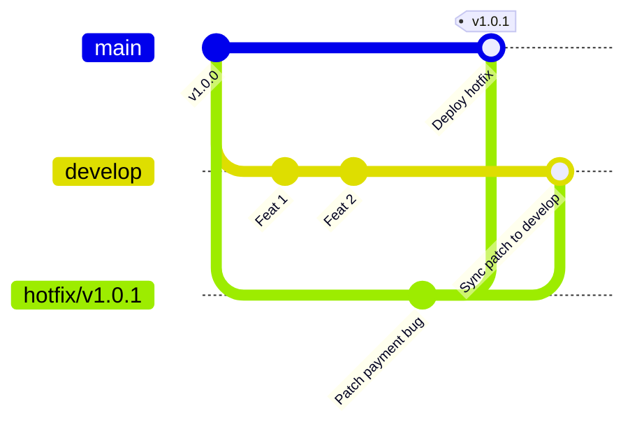

# Hotfix Workflow

## 🎯 Mục tiêu
- Hiểu rõ bản chất khẩn cấp và các tiêu chí phân loại một sự cố sản xuất (Production Incident) cần kích hoạt Hotfix.
- Biết tách nhánh hotfix từ commit/nhánh đang đại diện cho phiên bản production bị lỗi.
- Thực hiện quy trình của Git Flow để đưa bản vá vào nhánh phát hành và đồng bộ về `develop` nếu nhóm duy trì nhánh đó.
- Chọn tag phiên bản theo chính sách release; bản sửa chỉ là PATCH khi tương thích ngược và dự án dùng SemVer.

## 🧩 Từ khóa hôm nay
### Hotfix Branch
- **Nói dễ hiểu**: Nhánh tạm để sửa lỗi cần phát hành khẩn cấp, bắt đầu từ mã nguồn đang đại diện cho phiên bản production bị lỗi.
- **Ví dụ**: Tạo nhánh `hotfix/v1.0.1` để sửa gấp lỗi không thanh toán được bằng thẻ tín dụng.
- **Đừng nhầm**: Trong Git Flow thường tách từ `main`; nếu production đang chạy tag/nhánh khác, hãy xác định chính xác commit đang triển khai.

### Production Incident
- **Nói dễ hiểu**: Sự cố lỗi phần mềm phát sinh trực tiếp trên môi trường người dùng thật gây gián đoạn dịch vụ.
- **Ví dụ**: Người dùng nhận thông báo lỗi 500 khi bấm nút đăng nhập vào giờ cao điểm.
- **Đừng nhầm**: Nhóm xác định mức độ khẩn cấp theo tác động và khả năng giảm thiểu; không phải mọi lỗi production đều cần hotfix.

### Dual-merge
- **Nói dễ hiểu**: Trong Git Flow, tích hợp bản sửa vào `main` để phát hành rồi đồng bộ vào `develop` nếu nhánh này còn được dùng.
- **Ví dụ**: Khi sửa xong mã thanh toán, merge vào `main` để deploy liền và merge về `develop` để sprint tới vẫn có code sửa này.
- **Đừng nhầm**: Nếu `develop` tồn tại, hãy bảo đảm bản sửa được đưa vào đó; merge không phải cách duy nhất, có thể dùng cherry-pick theo chính sách nhóm.

## 📖 Định nghĩa
Trong Git Flow, Hotfix Branch là nhánh sửa một vấn đề khẩn cấp trên bản phát hành production, thường được tách từ `main`. Nếu production đang chạy commit được đánh dấu bằng tag hoặc nhánh khác, nhóm cần bắt đầu từ commit đó. Sau khi kiểm tra và phát hành bản sửa, nhóm đưa thay đổi về `develop` hoặc nhánh phát triển tương ứng. Đây là quy trình nhóm lựa chọn, không phải tính năng tự động của Git.

## 💡 Tại sao cần
Khi lỗi đang ảnh hưởng người dùng, nhóm có thể cần một đường phát hành riêng để sửa đúng phiên bản đang chạy mà không đưa theo thay đổi chưa phát hành. Hotfix cần review và kiểm thử tương xứng với mức rủi ro; gắn nhãn khẩn cấp không làm bản sửa an toàn hơn.

## 🧠 Mental Model
Hãy hình dung con tàu ngầm đang tuần tra dưới đáy biển (`main`). Đột nhiên một đường ống áp lực bị rò rỉ. Thuyền trưởng không thể kéo tàu về xưởng sửa chữa trên đất liền (`develop`) để chờ lịch bảo trì tháng sau. Một đội thợ lặn cấp cứu (`hotfix branch`) mang dụng cụ vá ngay vết nứt tại chỗ để tàu tiếp tục hoạt động, rồi gửi biên bản về xưởng đóng tàu để các tàu sau không mắc lỗi.

## 📊 Sơ đồ minh họa


## 🏢 Ví dụ thực tế
Ví dụ giả định theo Git Flow: nhóm xác nhận production đang chạy commit của `main`, tạo `hotfix/v1.0.1` từ đó, sửa lỗi, chạy kiểm tra và mở PR khẩn cấp. Sau khi merge vào `main`, nhóm gắn tag nếu chính sách SemVer phù hợp và phát hành theo pipeline/quy trình đã cấu hình; bản sửa sau đó được tích hợp vào `develop`.

## 💻 Command & Cú pháp
```bash
# Trong Git Flow, giả sử main trỏ tới phiên bản production cần sửa
git switch -c hotfix/v1.0.1 main

# Sau khi sửa file, stage và commit bản vá
git add src/payment.ts
git commit -m "fix(security): patch payment validation bypass"

# Hợp nhất vào main để phát hành khẩn cấp và gắn thẻ tag
git switch main && git merge --no-ff hotfix/v1.0.1
git tag -a v1.0.1 -m "Hotfix v1.0.1: patch payment validation"

# Hợp nhất về develop nếu dự án duy trì nhánh này
git switch develop && git merge --no-ff hotfix/v1.0.1
git branch -d hotfix/v1.0.1
```

## 🔍 Giải thích command
- `git switch -c hotfix/v1.0.1 main`: Trong ví dụ Git Flow này, tạo nhánh từ commit `main`; xác nhận nhánh này khớp với mã đang chạy trước khi sửa.
- `git commit -m`: Ghi nhận thay đổi vá lỗi với mô tả súc tích và chính xác theo chuẩn `fix`.
- `git tag -a v1.0.1`: Gắn tag theo chính sách phiên bản sau khi xác định commit phát hành; hotfix không tự động đồng nghĩa PATCH.
- `git merge --no-ff`: Tạo merge commit nếu nhóm muốn giữ dấu nhánh; tích hợp về `develop` khi dự án có nhánh này.

## ⚠️ Sai lầm phổ biến
- Tách nhánh hotfix từ `develop` thay vì `main`, kéo theo toàn bộ các tính năng chưa kiểm thử lên môi trường thực tế.
- Tiện tay thêm các tính năng không liên quan vào nhánh hotfix làm tăng nguy cơ phát sinh lỗi phụ.
- Quên tích hợp bản sửa về nhánh phát triển còn được duy trì; chọn merge/cherry-pick theo lịch sử và chính sách nhóm.

## 🧪 Lab thực hành
Bài học này là bài tự kiểm tra: bạn thao tác mô phỏng quy trình Hotfix trên máy và đối chiếu theo hướng dẫn bên dưới.

Điều kiện đầu vào: repo thử nghiệm có commit trên `main` và `develop`; trong bài này giả định `main` là mã nguồn production.
1. Tạo nhánh: `git switch -c hotfix/v1.0.1 main`.
2. Sửa một file thử nghiệm, stage và commit: `git add config.yml`; `git commit -m "fix(config): update db timeout"`.
3. Tích hợp vào `main`: `git switch main`; `git merge --no-ff hotfix/v1.0.1`.
4. Gắn tag vào commit phát hành đã kiểm tra: `git tag -a v1.0.1 -m "Hotfix v1.0.1"`.
5. Nếu repo duy trì `develop`, tích hợp thay đổi về đó rồi kiểm tra lịch sử bằng `git log --oneline --graph --all`.

## 💡 Hint & mẹo
- Giữ phạm vi bản vá hẹp, nhưng vẫn kiểm tra nguyên nhân và tác động liên quan trước khi phát hành.
- Sau sự cố, ghi nhận nguyên nhân, cách phát hiện và hành động phòng ngừa theo quy trình của nhóm.

## ✅ Validation & Kết quả mong đợi
- Nhánh `main` sở hữu bản vá và thẻ tag phiên bản mới phản ánh đúng trạng thái deploy lên máy chủ.
- Nhánh `develop` được đồng bộ bản sửa lỗi mà không làm mất các commit tính năng đang phát triển.

## ❓ Quiz nhanh
Hãy làm bài trắc nghiệm bên dưới để kiểm tra mức độ nắm vững quy trình xử lý lỗi khẩn cấp với Hotfix Workflow.

## 🚀 Thử thách nâng cao
Thiết kế kịch bản xử lý khi nhánh hotfix khi merge ngược vào `develop` phát sinh xung đột do nhánh `develop` đã tái cấu trúc hoàn toàn file mã nguồn đó.

## 📝 Tổng kết
- Hotfix Workflow là quy trình cứu hộ khẩn cấp cho các sự cố nghiêm trọng trên môi trường sản xuất.
- Luôn tách nhánh trực tiếp từ phiên bản đang chạy lỗi trên nhánh `main`.
- Bắt buộc thực hiện hợp nhất kép vào cả `main` và `develop` để tránh tái phát lỗi trong tương lai.
