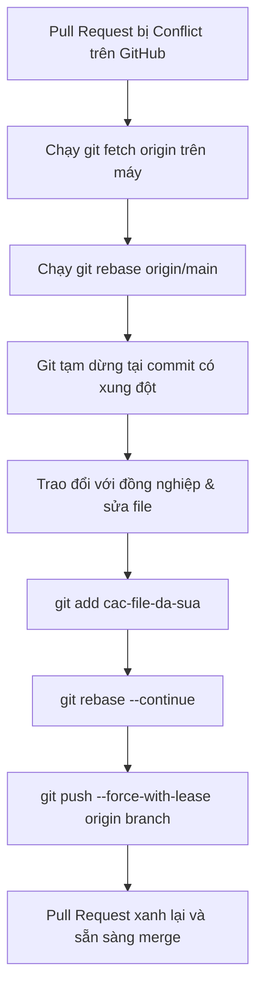

# Team Conflict Scenario

## 🎯 Mục tiêu
- Phân tích nguyên nhân gốc rễ gây ra xung đột hợp nhất (Merge Conflict) trong môi trường làm việc nhóm thực tế.
- Làm chủ quy trình xử lý xung đột an toàn tại máy cục bộ (Local Resolution) trước khi cập nhật lại Pull Request.
- Sử dụng kỹ thuật `git fetch` và `git rebase origin/main` để đưa nhánh tính năng lên đầu lịch sử mới nhất.
- Giao tiếp hiệu quả và phối hợp nhịp nhàng với đồng nghiệp khi gặp xung đột logic kinh doanh phức tạp.

## 🧩 Từ khóa hôm nay
### Merge Conflict
- **Nói dễ hiểu**: Tình huống Git dừng lại vì hai người cùng sửa đổi một vùng mã nguồn và không biết nên giữ đoạn nào.
- **Ví dụ**: Đồng nghiệp vừa merge nhánh đổi màu nút sang xanh, còn bạn gửi PR đổi màu nút sang đỏ trên cùng một dòng CSS.
- **Đừng nhầm**: Không phải lỗi hệ thống bị hỏng, mà là cơ chế bảo vệ an toàn để lập trình viên tự quyết định logic đúng.

### Local Resolution
- **Nói dễ hiểu**: Quy trình kéo code mới về máy tính cá nhân để chạy thử, giải quyết xung đột và kiểm thử kỹ càng trước khi đẩy lên.
- **Ví dụ**: Dùng VS Code trên máy để chọn Accept Incoming Change, chạy test xong mới push lên GitHub.
- **Đừng nhầm**: Tránh sửa conflict trực tiếp trên web GitHub với các file phức tạp vì không thể biên dịch hay chạy test.

### Force With Lease
- **Nói dễ hiểu**: Cờ đẩy code có kiểm tra an toàn, chỉ cho phép ghi đè lịch sử nếu chưa có ai khác đẩy thêm commit mới lên nhánh.
- **Ví dụ**: Chạy `git push --force-with-lease` sau khi rebase xong để cập nhật lại Pull Request của chính mình.
- **Đừng nhầm**: Khác với `git push --force` mù quáng sẽ ghi đè bất chấp mọi công sức của đồng nghiệp làm chung nhánh.

## 📖 Định nghĩa
Team Conflict Scenario là tình huống thực chiến xảy ra khi nhiều lập trình viên cùng thay đổi các phần mã nguồn liên quan trên các nhánh độc lập, và một nhánh đã được hợp nhất vào nhánh chính trước. Khi nhánh còn lại được merge, Git sẽ thông báo xung đột, đòi hỏi lập trình viên phải tải mã mới về máy cục bộ để đối soát và xử lý an toàn.

## 💡 Tại sao cần
Xung đột mã nguồn là hiện tượng bình thường trong quá trình cộng tác phần mềm. Một kỹ sư chuyên nghiệp không bao giờ hoảng sợ hay đổ lỗi cho đồng nghiệp khi gặp conflict. Thay vào đó, họ bình tĩnh áp dụng quy trình xử lý bài bản: trao đổi trực tiếp với người viết đoạn code liên quan, làm rõ ngữ cảnh và giải quyết dứt điểm trên môi trường máy cá nhân.

## 🧠 Mental Model
Hãy hình dung hai kiến trúc sư cùng thiết kế một phòng khách. Người A đề xuất đặt đàn piano ở góc phòng và đã được duyệt bản vẽ trước (`merged into main`). Người B vừa nộp bản vẽ đặt giá sách lớn đúng vào góc đó (`PR conflict`). Người B không thể tự ý ném cây đàn đi, mà phải mang bản vẽ mới về bàn, trao đổi với người A để thống nhất dời giá sách hoặc kết hợp cả hai.

## 📊 Sơ đồ minh họa


## 🏢 Ví dụ thực tế
Kỹ sư Tuấn đang làm nhánh `feat/cart-discount` thì thấy Pull Request báo xung đột. Tuấn kiểm tra thấy đồng nghiệp vừa merge nhánh sửa đổi cách tính thuế trong tệp `pricing.ts`. Thay vì sửa vội trên web GitHub, Tuấn chạy `git fetch origin` và `git rebase origin/main` trên máy. Terminal dừng lại ở hàm tính tiền. Tuấn trao đổi nhanh 2 phút với đồng nghiệp để thống nhất thứ tự trừ giảm giá trước hay tính thuế trước. Sau đó Tuấn lưu code, chạy test thành công và push lên an toàn.

## 💻 Command & Cú pháp
```bash
# Tải các commit mới nhất từ máy chủ về máy
git fetch origin

# Đưa các commit của nhánh hiện tại lên trên đầu nhánh chính mới nhất
git rebase origin/main

# Đánh dấu các tệp tin đã được giải quyết xung đột xong
git add src/pricing.ts

# Tiếp tục hành trình rebase sau khi giải quyết xong xung đột
git rebase --continue

# Đẩy lịch sử đã được rebase lên nhánh từ xa một cách an toàn
git push --force-with-lease origin feat/cart-discount
```

## 🔍 Giải thích command
- `git fetch origin`: Cập nhật dữ liệu từ xa mà không làm thay đổi thư mục làm việc hiện tại của bạn.
- `git rebase origin/main`: Đặt lại gốc nhánh của bạn lên commit mới nhất của `main`, tái hiện các commit trên nền mới.
- `git add <tệp>`: Báo cho Git biết bạn đã hoàn tất việc chỉnh sửa thủ công các đoạn mâu thuẫn trong tệp.
- `git push --force-with-lease`: Cập nhật nhánh remote có kiểm tra điều kiện an toàn, chống ghi đè công sức của người khác.

## ⚠️ Sai lầm phổ biến
- Tự ý xóa code của đồng nghiệp khi giải quyết xung đột mà không trao đổi để hiểu rõ mục đích của đoạn code đó.
- Sửa các xung đột logic nghiệp vụ phức tạp trực tiếp trên trình soạn thảo web của GitHub mà không chạy test.
- Sử dụng `git push --force` mù quáng thay vì dùng `--force-with-lease`, có nguy cơ làm mất code của đồng nghiệp.

## 🧪 Lab thực hành
Bài học này là bài tự kiểm tra: bạn thao tác mô phỏng kịch bản xung đột trên máy và đối chiếu theo hướng dẫn bên dưới.

1. Tạo hai nhánh cùng sửa một dòng trong tệp `calculator.ts`.
2. Hợp nhất nhánh thứ nhất vào `main`.
3. Chuyển sang nhánh thứ hai, chạy `git rebase main` và quan sát các dấu mốc conflict `<<<<<<<` và `>>>>>>>`.
4. Mở trình soạn thảo, chọn giữ lại logic phù hợp và xóa bỏ các ký hiệu đánh dấu.
5. Chạy `git add calculator.ts`, sau đó gõ `git rebase --continue` để hoàn tất quy trình xử lý.

## 💡 Hint & mẹo
- Trao đổi trực tiếp giữa người với người luôn là phương pháp giải quyết xung đột nhanh và chính xác nhất.
- Bạn có thể gõ `git rebase --abort` bất cứ lúc nào nếu muốn dừng lại và quay về trạng thái ban đầu an toàn.

## ✅ Validation & Kết quả mong đợi
- Lệnh `git status` báo `nothing to commit, working tree clean`.
- Nhánh của bạn sở hữu lịch sử commit thẳng thớm và Pull Request trên GitHub chuyển sang trạng thái sẵn sàng hợp nhất.

## ❓ Quiz nhanh
Hãy hoàn thành bài trắc nghiệm bên dưới để kiểm tra kỹ năng phân tích và xử lý xung đột nhóm trong Git.

## 🚀 Thử thách nâng cao
So sánh sự khác biệt về lịch sử commit giữa việc giải quyết xung đột bằng `git merge main` so với `git rebase origin/main` trong môi trường nhóm đông thành viên.

## 📝 Tổng kết
- Xung đột là một phần tất yếu của quá trình cộng tác nhóm trong mọi dự án phần mềm.
- Luôn giải quyết xung đột tại máy cá nhân để bảo đảm kiểm thử và biên dịch thành công trước khi đẩy lên.
- Phối hợp và giao tiếp cởi mở với đồng nghiệp là chìa khóa để xử lý mọi xung đột logic an toàn.
