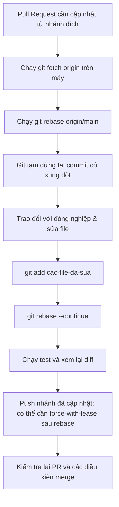

# Team Conflict Scenario

## 🎯 Mục tiêu
- Phân tích nguyên nhân gốc rễ gây ra xung đột hợp nhất (Merge Conflict) trong môi trường làm việc nhóm thực tế.
- Làm chủ quy trình xử lý xung đột an toàn tại máy cục bộ (Local Resolution) trước khi cập nhật lại Pull Request.
- Sử dụng kỹ thuật `git fetch` và `git rebase origin/main` để đưa nhánh tính năng lên đầu lịch sử mới nhất.
- Giao tiếp hiệu quả và phối hợp nhịp nhàng với đồng nghiệp khi gặp xung đột logic kinh doanh phức tạp.

## 🧩 Từ khóa hôm nay
### Merge Conflict
- **Nói dễ hiểu**: Tình huống Git không thể tự kết hợp hai thay đổi; thường do cùng sửa một vùng, nhưng còn có dạng xung đột khác.
- **Ví dụ**: Đồng nghiệp vừa merge nhánh đổi màu nút sang xanh, còn bạn gửi PR đổi màu nút sang đỏ trên cùng một dòng CSS.
- **Đừng nhầm**: Git chỉ báo xung đột văn bản/cấu trúc mà nó phát hiện được; hai thay đổi có thể ghép sạch nhưng vẫn sai logic nghiệp vụ.

### Local Resolution
- **Nói dễ hiểu**: Quy trình đưa thay đổi của nhánh đích vào môi trường làm việc, xử lý conflict rồi kiểm tra kết quả trước khi cập nhật PR.
- **Ví dụ**: Dùng VS Code trên máy để chọn Accept Incoming Change, chạy test xong mới push lên GitHub.
- **Đừng nhầm**: GitHub có thể giải quyết một số conflict đơn giản trên web; xử lý local hữu ích khi cần hiểu ngữ cảnh hoặc chạy test.

### Force With Lease
- **Nói dễ hiểu**: Cờ cập nhật nhánh remote sau khi lịch sử local bị viết lại, từ chối nếu remote đã đổi so với thông tin mà Git đang dùng.
- **Ví dụ**: Chạy `git push --force-with-lease` sau khi rebase xong để cập nhật lại Pull Request của chính mình.
- **Đừng nhầm**: Đây không phải bảo đảm tuyệt đối và không nên dùng để viết lại nhánh dùng chung nếu chưa phối hợp với người khác.

## 📖 Định nghĩa
Conflict có thể xuất hiện khi merge hoặc rebase hai lịch sử có thay đổi Git không thể tự kết hợp. Git đánh dấu các xung đột mà nó phát hiện, nhưng không phát hiện hết xung đột về ý nghĩa chương trình. Bài này dùng một ví dụ sửa cùng dòng để luyện quy trình fetch, rebase, giải quyết và kiểm tra.

## 💡 Tại sao cần
Conflict có thể xảy ra khi tích hợp nhánh. Đọc cả hai thay đổi, tìm hiểu mục đích và trao đổi với người liên quan khi cần; sau khi sửa, chạy các kiểm tra phù hợp. Rebase hữu ích với nhánh cá nhân chưa chia sẻ rộng, còn merge là lựa chọn khi không muốn viết lại lịch sử đã chia sẻ.

## 🧠 Mental Model
Hãy hình dung hai kiến trúc sư cùng thiết kế một phòng khách. Người A đề xuất đặt đàn piano ở góc phòng và đã được duyệt bản vẽ trước (`merged into main`). Người B vừa nộp bản vẽ đặt giá sách lớn đúng vào góc đó (`PR conflict`). Người B không thể tự ý ném cây đàn đi, mà phải mang bản vẽ mới về bàn, trao đổi với người A để thống nhất dời giá sách hoặc kết hợp cả hai.

## 📊 Sơ đồ minh họa


## 🏢 Ví dụ thực tế
Kỹ sư Tuấn đang làm nhánh `feat/cart-discount` thì thấy Pull Request báo xung đột. Tuấn kiểm tra thấy đồng nghiệp vừa merge nhánh sửa đổi cách tính thuế trong tệp `pricing.ts`. Thay vì sửa vội trên web GitHub, Tuấn chạy `git fetch origin` và `git rebase origin/main` trên máy. Terminal dừng lại ở hàm tính tiền. Tuấn trao đổi nhanh 2 phút với đồng nghiệp để thống nhất thứ tự trừ giảm giá trước hay tính thuế trước. Sau đó Tuấn lưu code, chạy test thành công và push lên an toàn.

## 💻 Command & Cú pháp
```bash
# Tải các commit mới nhất từ máy chủ về máy
git fetch origin

# Đưa các commit của nhánh hiện tại lên trên đầu nhánh chính mới nhất
git rebase origin/main

# Đánh dấu các tệp tin đã được giải quyết xung đột xong
git add src/pricing.ts

# Tiếp tục hành trình rebase sau khi giải quyết xong xung đột
git rebase --continue

# Đẩy lịch sử đã được rebase lên nhánh từ xa một cách an toàn
git push --force-with-lease origin feat/cart-discount
```

## 🔍 Giải thích command
- `git fetch origin`: Tải thông tin mới từ remote; không tự thay đổi nhánh hiện tại hay file đang sửa.
- `git rebase origin/main`: Đặt lại gốc nhánh của bạn lên commit mới nhất của `main`, tái hiện các commit trên nền mới.
- `git add <tệp>`: Báo cho Git biết bạn đã hoàn tất việc chỉnh sửa thủ công các đoạn mâu thuẫn trong tệp.
- `git push --force-with-lease`: Dùng khi rebase đã viết lại commit trên nhánh remote của chính bạn; kiểm tra trạng thái remote trước và phối hợp nếu có người cùng dùng nhánh.

## ⚠️ Sai lầm phổ biến
- Tự ý xóa code của đồng nghiệp khi giải quyết xung đột mà không trao đổi để hiểu rõ mục đích của đoạn code đó.
- Sửa các xung đột logic nghiệp vụ phức tạp trực tiếp trên trình soạn thảo web của GitHub mà không chạy test.
- Sử dụng `git push --force` mù quáng thay vì dùng `--force-with-lease`, có nguy cơ làm mất code của đồng nghiệp.

## 🧪 Lab thực hành
Bài học này là bài tự kiểm tra: bạn thao tác mô phỏng kịch bản xung đột trên máy và đối chiếu theo hướng dẫn bên dưới.

1. Trong repo thử nghiệm, tạo `main` và hai nhánh từ cùng một commit; sửa cùng một dòng trong `calculator.ts` trên mỗi nhánh rồi commit.
2. Merge nhánh thứ nhất vào `main`.
3. Chuyển sang nhánh thứ hai, chạy `git rebase main`; Git sẽ dừng nếu không tự kết hợp được hai sửa đổi.
4. Mở file, đọc cả hai phiên bản, chọn kết quả đúng và xóa các dấu conflict. Chạy test hoặc kiểm tra kết quả.
5. Chạy `git add calculator.ts`, rồi `git rebase --continue`; nếu muốn hủy, chạy `git rebase --abort`.

## 💡 Hint & mẹo
- Trao đổi với người hiểu ngữ cảnh nghiệp vụ khi không rõ mục đích của một thay đổi.
- Bạn có thể gõ `git rebase --abort` bất cứ lúc nào nếu muốn dừng lại và quay về trạng thái ban đầu an toàn.

## ✅ Validation & Kết quả mong đợi
- Rebase hoàn tất, `git status` không còn báo conflict và bài kiểm tra phù hợp chạy đạt.
- Nếu bài tập dùng GitHub, kiểm tra lại PR; nếu chỉ dùng local thì xem lịch sử bằng `git log --oneline --graph --all`.

## ❓ Quiz nhanh
Hãy hoàn thành bài trắc nghiệm bên dưới để kiểm tra kỹ năng phân tích và xử lý xung đột nhóm trong Git.

## 🚀 Thử thách nâng cao
So sánh sự khác biệt về lịch sử commit giữa việc giải quyết xung đột bằng `git merge main` so với `git rebase origin/main` trong môi trường nhóm đông thành viên.

## 📝 Tổng kết
- Git sẽ báo những xung đột mà nó không thể tự kết hợp; xung đột logic có thể không hiện thành marker.
- Chọn merge hoặc rebase theo việc nhánh đã được chia sẻ hay chưa, rồi kiểm tra kết quả.
- Trao đổi khi cần làm rõ yêu cầu và chạy test phù hợp trước khi tích hợp.
