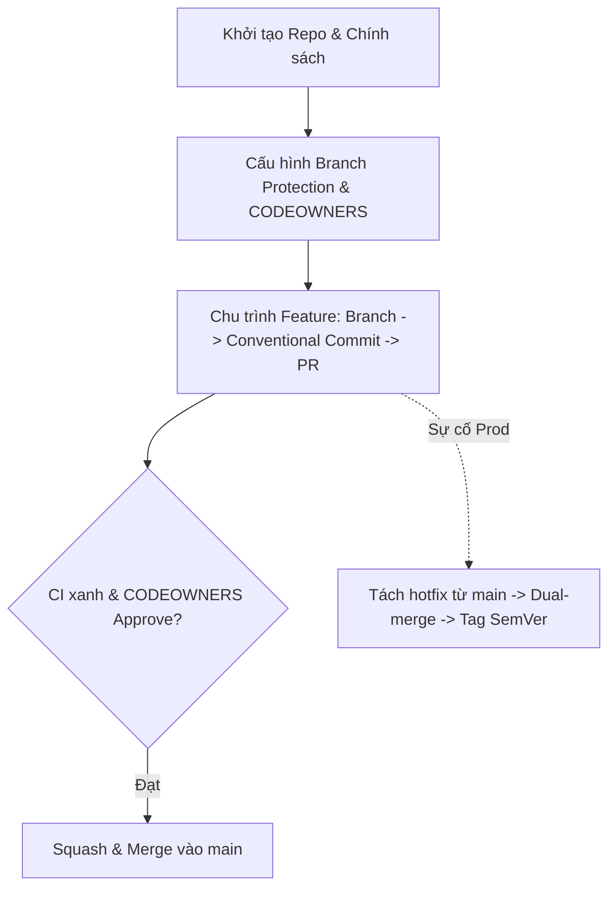

# Professional Team Project

## 🎯 Mục tiêu
- Kết hợp workflow nhánh, commit có cấu trúc, tag và kiểm tra thay đổi trong một repo thử nghiệm.
- Phân biệt việc ghi tài liệu/chạy lệnh Git local với cấu hình PR, CODEOWNERS và branch protection cần GitHub.
- Thực hiện một nhánh feature và một bản sửa khẩn cấp theo quy trình mà bài tập đã chọn.
- Nêu rõ phần nào phụ thuộc nhánh `develop`, SemVer hoặc quyền trên GitHub.

## 🧩 Từ khóa hôm nay
### Governance Framework
- **Nói dễ hiểu**: Khung chính sách kỹ thuật và quy tắc quản trị giúp cả đội ngũ lập trình phối hợp nhịp nhàng mà không sợ giẫm chân lên nhau.
- **Ví dụ**: Nhóm có thể yêu cầu PR, một lượt review, check CI và approval từ code owner trước khi merge.
- **Đừng nhầm**: Một số chính sách cần cấu hình máy chủ; tài liệu quy trình, quyền bypass và ngoại lệ vẫn cần con người quản lý.

### Pull Request Template
- **Nói dễ hiểu**: Tệp mẫu gợi ý nội dung để tác giả điền khi tạo PR trên GitHub.
- **Ví dụ**: Tệp `.github/pull_request_template.md` chứa các mục: Mô tả thay đổi, Ảnh chụp màn hình, và Các bài test đã chạy.
- **Đừng nhầm**: Mẫu chỉ nhắc người viết; nó không kiểm chứng câu trả lời hay ép người dùng hoàn thành checklist.

### Release Cadence
- **Nói dễ hiểu**: Nhịp điệu và lịch trình phát hành phần mềm định kỳ của đội ngũ kỹ thuật ra môi trường thực tế.
- **Ví dụ**: Một nhóm chọn phát hành vào thứ Sáu; đây là lịch riêng của nhóm, không phải quy tắc Git.
- **Đừng nhầm**: Không áp dụng cho các bản vá khẩn cấp Hotfix; hotfix được triển khai ngay lập tức khi hoàn thành kiểm thử.

## 📖 Định nghĩa
Professional Team Project là bài thực hành tổng hợp tích hợp toàn bộ các trụ cột quy trình làm việc nhóm chuyên nghiệp. Trong kịch bản này, bạn đóng vai trò Kỹ sư trưởng thiết lập hạ tầng quản trị kho mã nguồn từ con số không: ban hành quy chuẩn phân nhánh, thiết lập hàng rào bảo vệ nhánh, cấu hình phân quyền tệp CODEOWNERS, chỉ đạo giải quyết xung đột và điều phối phát hành theo chuẩn SemVer.

## 💡 Tại sao cần
Lý thuyết quy trình chỉ có giá trị thực sự khi bạn trực tiếp điều phối một luồng công việc đa tầng dưới áp lực thực tế. Dự án tổng hợp này giúp củng cố phản xạ nghề nghiệp vững vàng, giúp bạn tự tin làm việc trong các tập đoàn công nghệ lớn với quy chuẩn quốc tế khắt khe.

## 🧠 Mental Model
Hãy hình dung bạn là tổng công trình sư điều hành thi công tòa nhà chọc trời. Bạn không trực tiếp xây từng viên gạch mà thiết kế bản vẽ phân khu (`Branching Strategy`), dựng giàn giáo bảo hiểm (`Branch Protection`), chỉ định kỹ sư phụ trách từng tầng (`CODEOWNERS`), ban hành quy chuẩn nghiệm thu vật tư (`Conventional Commits`) và sẵn sàng phương án chữa cháy khẩn cấp (`Hotfix Workflow`).

## 📊 Sơ đồ minh họa


## 🏢 Ví dụ thực tế
Ví dụ giả định theo Git Flow: repo có `main` và `develop`; nhóm cấu hình CODEOWNERS trên nhánh đích, bật các điều kiện review/CI họ cần và có pipeline phát hành riêng. Khi sửa cổng thanh toán, GitHub có thể yêu cầu review từ owner; approval chỉ là điều kiện merge nếu rule tương ứng bật. Với hotfix, nhóm bắt đầu từ commit production thực tế, kiểm thử, phát hành theo chính sách rồi đồng bộ về `develop` nếu còn dùng nhánh này.

## 💻 Command & Cú pháp
```bash
# Tạo cột mốc phiên bản gốc ổn định ban đầu
git tag -a v1.0.0 -m "Release v1.0.0 baseline"

# Tách nhánh tính năng mới và commit chuẩn mực
# Trước commit, phải sửa hoặc tạo file rồi stage thay đổi
git switch -c feat/order-service
git commit -m "feat(order): implement order placement logic"

# Tạo hotfix từ main trong ví dụ Git Flow; xác nhận main đúng với production
git switch -c hotfix/v1.0.1 main
git commit -m "fix(order): prevent duplicate checkout charges"
```

## 🔍 Giải thích command
- `git tag -a v1.0.0`: Gắn tag vào commit hiện tại; chỉ dùng số này nếu đó thực sự là mốc phát hành dự án.
- `git commit -m "feat(order): <mo-ta>"`: Tạo commit sau khi đã sửa file và stage; format chỉ tự động hóa nếu repo có cấu hình tool phù hợp.
- `git switch -c hotfix/v1.0.1 main`: Trong ví dụ này, tạo nhánh từ `main`; cần xác minh nhánh trỏ đúng commit đang chạy production.

## ⚠️ Sai lầm phổ biến
- Cho rằng có tệp CODEOWNERS là approval đã bắt buộc; cần bật review-from-code-owners trong branch rule.
- Mong đợi Conventional Commits tự tạo changelog/phiên bản khi repo chưa cấu hình công cụ.
- Quên đồng bộ bản vá về nhánh phát triển đang được duy trì; chọn merge/cherry-pick theo chính sách nhóm.

## 🧪 Lab thực hành
Làm phần A trong repo local. Phần B cần repository GitHub thử nghiệm và quyền quản trị; nếu chưa có, đọc cấu hình mẫu và ghi kết quả dự kiến, không cần tạo tài khoản.

1. Bắt đầu từ repo thử nghiệm có commit trên `main`; tạo một file README, stage và commit `docs: start team demo`, sau đó kiểm tra bằng `git status`.
2. Tạo `develop` từ `main`, rồi tạo `feat/auth` từ `develop`. Sửa một file, stage, commit `feat(auth): add sign-in instructions` và merge nhánh feature về `develop`.
3. Tạo `release/v1.0.0` từ `develop`, sửa một lỗi nhỏ, commit, merge vào `main` rồi gắn tag `v1.0.0` lên commit phát hành; nếu theo Git Flow, tích hợp sửa đổi cần giữ lại về `develop`.
4. Tạo `hotfix/v1.0.1` từ `main`, sửa một lỗi khác, stage/commit, merge vào `main`, gắn tag sau khi xác minh commit; tích hợp bản sửa về `develop` nếu nhánh còn được dùng.
5. Chạy `git status` và `git log --oneline --graph --decorate --all`; chỉ xóa nhánh thử nghiệm sau khi xác nhận các commit cần giữ đã được tích hợp.
6. **Phần B tùy chọn**: trên repo GitHub thử nghiệm, thêm CODEOWNERS/PR template và cấu hình branch rule. CODEOWNERS phải có trên nhánh đích; chọn reviewer có quyền ghi và bật điều kiện approval riêng nếu muốn nó chặn merge.

## 💡 Hint & mẹo
- `git status` giúp xác nhận file nào đang sửa/stage trước khi đổi nhánh hoặc commit.
- Chọn workflow theo các nhánh nhóm thực sự duy trì; không cần tạo `develop`, release branch hay CODEOWNERS nếu dự án không dùng.

## ✅ Validation & Kết quả mong đợi
- Có thể chỉ ra feature commit, release/hotfix commit và commit mà mỗi tag đang trỏ tới.
- Giải thích được các bước GitHub chỉ hoạt động khi có remote, quyền và quy tắc tương ứng.

## ❓ Quiz nhanh
Hãy hoàn thành bài trắc nghiệm bên dưới để tổng kết toàn diện các kiến thức và kỹ năng then chốt của Level 6: Team Workflows.

## 🚀 Thử thách nâng cao
Thiết kế tệp cấu hình GitHub Actions hoàn chỉnh để tự động kiểm tra định dạng commit message và tự động đóng gói ứng dụng mỗi khi có thẻ tag phiên bản mới được đẩy lên kho lưu trữ.

## 📝 Tổng kết
- Branch protection, CODEOWNERS và commit conventions là các lựa chọn có cấu hình riêng, không tự xuất hiện khi dùng Git.
- Feature/release/hotfix branches cần gắn với workflow cụ thể của nhóm; hotfix phải bắt đầu từ commit production đúng.
- Đánh giá dựa trên việc giải thích được lựa chọn, thực hiện được thao tác và kiểm tra được kết quả.
