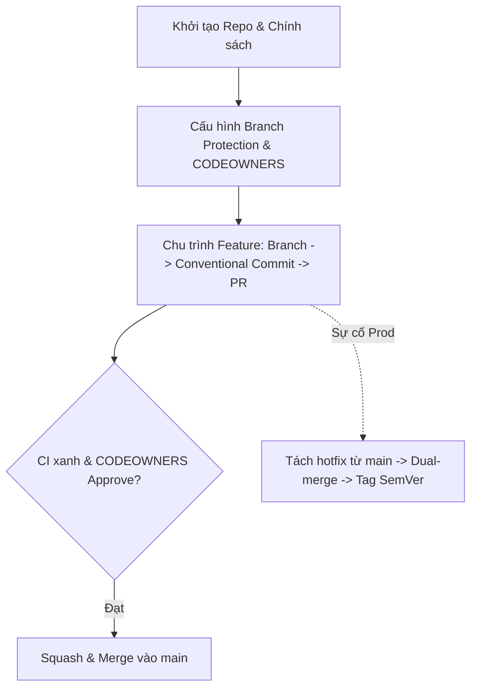

# Professional Team Project

## 🎯 Mục tiêu
- Tổng hợp toàn bộ các kỹ năng và kiến thức đã học trong Level 6 vào một dự án mô phỏng thực chiến quy mô doanh nghiệp.
- Thiết lập hoàn chỉnh cấu trúc dự án chuẩn mực: Protected Branch, Branch Protection Rules, tệp CODEOWNERS và mẫu PR Template.
- Vận hành trơn tru quy trình Feature Branch kết hợp Conventional Commits và Semantic Versioning.
- Xử lý thành công tình huống khẩn cấp Hotfix trên môi trường sản xuất song song với việc phát triển tính năng mới.

## 🧩 Từ khóa hôm nay
### Governance Framework
- **Nói dễ hiểu**: Khung chính sách kỹ thuật và quy tắc quản trị giúp cả đội ngũ lập trình phối hợp nhịp nhàng mà không sợ giẫm chân lên nhau.
- **Ví dụ**: Kết hợp khóa nhánh chính, bắt buộc 1 lượt review từ CODEOWNERS và test CI phải xanh mới cho phép merge.
- **Đừng nhầm**: Không phải quy định hành chính trên giấy, mà là các chốt chặn tự động hóa 100% bằng công cụ.

### Pull Request Template
- **Nói dễ hiểu**: Mẫu nội dung định sẵn tự động xuất hiện khi mở PR để nhắc nhở người tạo cung cấp đủ ngữ cảnh và checklist an toàn.
- **Ví dụ**: Tệp `.github/pull_request_template.md` chứa các mục: Mô tả thay đổi, Ảnh chụp màn hình, và Các bài test đã chạy.
- **Đừng nhầm**: Không bắt buộc phải viết dài dòng, mục đích chính là bảo đảm không bỏ sót các bước kiểm tra then chốt.

### Release Cadence
- **Nói dễ hiểu**: Nhịp điệu và lịch trình phát hành phần mềm định kỳ của đội ngũ kỹ thuật ra môi trường thực tế.
- **Ví dụ**: Nhóm cố định cắt nhánh release vào thứ Tư hàng tuần và triển khai lên máy chủ sản xuất vào sáng thứ Sáu.
- **Đừng nhầm**: Không áp dụng cho các bản vá khẩn cấp Hotfix; hotfix được triển khai ngay lập tức khi hoàn thành kiểm thử.

## 📖 Định nghĩa
Professional Team Project là bài thực hành tổng hợp tích hợp toàn bộ các trụ cột quy trình làm việc nhóm chuyên nghiệp. Trong kịch bản này, bạn đóng vai trò Kỹ sư trưởng thiết lập hạ tầng quản trị kho mã nguồn từ con số không: ban hành quy chuẩn phân nhánh, thiết lập hàng rào bảo vệ nhánh, cấu hình phân quyền tệp CODEOWNERS, chỉ đạo giải quyết xung đột và điều phối phát hành theo chuẩn SemVer.

## 💡 Tại sao cần
Lý thuyết quy trình chỉ có giá trị thực sự khi bạn trực tiếp điều phối một luồng công việc đa tầng dưới áp lực thực tế. Dự án tổng hợp này giúp củng cố phản xạ nghề nghiệp vững vàng, giúp bạn tự tin làm việc trong các tập đoàn công nghệ lớn với quy chuẩn quốc tế khắt khe.

## 🧠 Mental Model
Hãy hình dung bạn là tổng công trình sư điều hành thi công tòa nhà chọc trời. Bạn không trực tiếp xây từng viên gạch mà thiết kế bản vẽ phân khu (`Branching Strategy`), dựng giàn giáo bảo hiểm (`Branch Protection`), chỉ định kỹ sư phụ trách từng tầng (`CODEOWNERS`), ban hành quy chuẩn nghiệm thu vật tư (`Conventional Commits`) và sẵn sàng phương án chữa cháy khẩn cấp (`Hotfix Workflow`).

## 📊 Sơ đồ minh họa


## 🏢 Ví dụ thực tế
Trong dự án thương mại điện tử, nhóm thiết lập `.github/CODEOWNERS` phân chia quyền sở hữu cho thư mục `api/` và `web/`. Tiếp theo, nhóm cấu hình nhánh `main` cấm push trực tiếp và bắt buộc vượt qua kiểm thử CI. Khi một kỹ sư mở PR thêm cổng thanh toán, hệ thống tự động gán đúng reviewer tài chính. Đồng thời khi có sự cố giao dịch, nhóm kích hoạt nhánh `hotfix/v1.0.1`, vá lỗi, thực hiện hợp nhất kép vào cả `main` lẫn `develop` và gắn tag SemVer để triển khai tức thì.

## 💻 Command & Cú pháp
```bash
# Tạo cột mốc phiên bản gốc ổn định ban đầu
git tag -a v1.0.0 -m "Release v1.0.0 baseline"

# Tách nhánh tính năng mới và commit chuẩn mực
git switch -c feat/order-service
git commit -m "feat(order): implement order placement logic"

# Tách nhánh cứu hộ khẩn cấp từ main khi có sự cố
git switch -c hotfix/v1.0.1 main
git commit -m "fix(order): prevent duplicate checkout charges"
```

## 🔍 Giải thích command
- `git tag -a v1.0.0`: Đánh dấu cột mốc phiên bản ổn định ban đầu làm điểm mốc đối chiếu cho dự án.
- `git commit -m "feat(order): <mo-ta>"`: Áp dụng cú pháp Conventional Commits để chuẩn hóa lịch sử và phục vụ tự động hóa changelog.
- `git switch -c hotfix/v1.0.1 main`: Rẽ nhánh giải cứu sản xuất trực tiếp từ `main` để dập lỗi khẩn cấp mà không vướng tính năng dở dang.

## ⚠️ Sai lầm phổ biến
- Bỏ qua bước thiết lập CODEOWNERS và Branch Protection trước khi mở quyền cho các thành viên đóng góp code.
- Viết commit message tự do không tuân thủ quy chuẩn khiến công cụ tự động hóa không thể sinh nhật ký phát hành.
- Quên đồng bộ bản vá hotfix về nhánh phát triển khiến nhánh `develop` bị lỗi thời mã nguồn.

## 🧪 Lab thực hành
Bài học này là bài tự kiểm tra: bạn thao tác thực hành bài tập lớn mô phỏng trên máy và đối chiếu theo hướng dẫn bên dưới.

1. Khởi tạo kho lưu trữ với tệp `.github/CODEOWNERS` và tệp `.github/pull_request_template.md`.
2. Tạo nhánh `feat/auth` và thực hiện các commit chuẩn Conventional Commits.
3. Mở Pull Request mô phỏng, kiểm tra danh sách review và checklist an toàn.
4. Giả lập một sự cố sản xuất, tạo nhánh `hotfix/v1.0.1`, vá lỗi và thực hiện hợp nhất kép vào cả `main` lẫn `develop`.
5. Gắn thẻ tag SemVer `v1.0.1` và dùng `git log --graph --oneline` để chiêm ngưỡng cây lịch sử sạch đẹp của toàn bộ dự án.

## 💡 Hint & mẹo
- Tính kỷ luật và sự rõ ràng trong quy trình phân nhánh là yếu tố quyết định giúp các đội ngũ kỹ sư lớn vận hành hiệu quả mà không bị hỗn loạn.
- Luôn kiểm tra trạng thái cây Git bằng `git status` trước khi chuyển đổi qua lại giữa nhánh tính năng và nhánh cứu hộ.

## ✅ Validation & Kết quả mong đợi
- Lịch sử Git sạch đẹp, phân định rõ ràng giữa các commit tính năng và các bản vá khẩn cấp.
- Toàn bộ các thẻ tag SemVer trỏ chính xác vào các mốc phát hành trên nhánh chính.

## ❓ Quiz nhanh
Hãy hoàn thành bài trắc nghiệm bên dưới để tổng kết toàn diện các kiến thức và kỹ năng then chốt của Level 6: Team Workflows.

## 🚀 Thử thách nâng cao
Thiết kế tệp cấu hình GitHub Actions hoàn chỉnh để tự động kiểm tra định dạng commit message và tự động đóng gói ứng dụng mỗi khi có thẻ tag phiên bản mới được đẩy lên kho lưu trữ.

## 📝 Tổng kết
- Kết hợp Protected Branch, CODEOWNERS và Conventional Commits tạo nên nền tảng quản trị mã nguồn vững chắc.
- Khả năng xử lý linh hoạt giữa Feature Branch, Release Branch và Hotfix Workflow là thước đo của một kỹ sư Git chuyên nghiệp.
- Bạn đã sẵn sàng tự tin bước vào môi trường phát triển phần mềm cộng tác quy mô doanh nghiệp!
