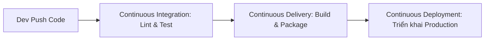

# CI/CD là gì? Tự động hóa tích hợp & chuyển giao liên tục

## 🎯 Mục tiêu
- Nắm vững bản chất cốt lõi của Continuous Integration (CI) và Continuous Delivery/Deployment (CD).
- Hiểu rõ sự khác biệt giữa quy trình kiểm thử thủ công rủi ro và đường ống tự động hóa.
- Nhận thức các lợi ích then chốt: giảm thiểu lỗi hồi quy, phát hành phiên bản nhanh và phản hồi sớm.

## 🧩 Từ khóa hôm nay
### Continuous Integration
- **Nói dễ hiểu**: Quy trình tự động kiểm tra cú pháp, biên dịch và chạy test ngay khi lập trình viên vừa đẩy code lên.
- **Ví dụ**: Hệ thống tự động chạy `npm test` mỗi khi bạn tạo Pull Request vào nhánh `main`.
- **Đừng nhầm**: Không chỉ là gộp code vào chung một nhánh, mà bắt buộc phải có bước kiểm thử tự động xác nhận code không bị lỗi.

### Continuous Delivery
- **Nói dễ hiểu**: Tự động đóng gói phần mềm sẵn sàng phát hành lên máy chủ, chỉ đợi một nút bấm phê duyệt từ con người.
- **Ví dụ**: Sau khi qua bài test, mã nguồn được build thành file Docker image sẵn sàng đưa lên môi trường staging.
- **Đừng nhầm**: Khác với Continuous Deployment (triển khai tự động 100% thẳng lên production mà không cần con người bấm nút).

### Integration Hell
- **Nói dễ hiểu**: Cơn ác mộng xung đột khi các lập trình viên làm việc riêng lẻ quá lâu rồi mới dồn code vào gộp một lần.
- **Ví dụ**: Hai tháng không merge code khiến khi gộp nhánh phát sinh hàng trăm xung đột mã nguồn không thể gỡ nổi.
- **Đừng nhầm**: Không phải lỗi do Git hay máy chủ hỏng, mà là hệ quả của thói quen trì hoãn tích hợp thường xuyên.

## 📖 Định nghĩa
CI/CD là phương pháp luận kỹ thuật phần mềm tự động hóa toàn bộ hành trình từ khi viết mã đến khi đưa ứng dụng lên máy chủ. Continuous Integration tự động kiểm thử và tích hợp mã nguồn liên tục, trong khi Continuous Delivery và Deployment tự động hóa việc đóng gói và chuyển giao phần mềm tới tay người dùng.

## 💡 Tại sao cần
Trước đây, việc tích hợp mã nguồn thủ công sau nhiều tuần làm việc độc lập thường gây ra thảm họa Integration Hell với hàng tá xung đột và lỗi tiềm ẩn. CI/CD loại bỏ rủi ro này bằng cách kiểm tra tự động từng thay đổi nhỏ ngay tức thì, giúp đội ngũ phát hiện và sửa lỗi chỉ trong vài phút thay vì vài tuần.

## 🧠 Mental Model
Hãy hình dung dây chuyền lắp ráp ô tô tự động. Thay vì chờ lắp xong toàn bộ chiếc xe mới thử phanh, mỗi linh kiện khi vừa được lắp vào khung gầm đều đi qua cảm biến quang học quét kiểm tra chất lượng tự động ngay tại chỗ. Nếu phát hiện một ốc vít chưa siết chặt, đèn đỏ cảnh báo bật sáng và băng chuyền dừng lại ngay.

## 📊 Sơ đồ minh họa


## 🏢 Ví dụ thực tế
Một trang thương mại điện tử lớn áp dụng CI/CD cho toàn bộ dự án. Khi kỹ sư mở Pull Request bổ sung mã giảm giá, hệ thống đám mây tự động tạo môi trường tạm thời và chạy hơn một nghìn bài unit test. Khi có một bài test tính tiền bị sai lệch, hệ thống báo đỏ và khóa nút merge. Nhờ đó, công ty tự tin cập nhật phần mềm 20 lần mỗi ngày mà không lo sập dịch vụ thanh toán.

## 💻 Command & Cú pháp
```bash
# Chạy kiểm thử tự động tại máy cá nhân
npm test

# Biên dịch mã nguồn và kiểm tra lỗi kiểu dữ liệu
npm run build

# Đẩy mã nguồn lên kho lưu trữ để kích hoạt đường ống CI
git push origin main
```

## 🔍 Giải thích command
- `npm test`: Thực thi toàn bộ bộ bài kiểm thử đơn vị để bảo đảm tính đúng đắn của logic nghiệp vụ trước khi chia sẻ code.
- `npm run build`: Kiểm tra tính hợp lệ của cú pháp và cấu trúc mã nguồn thông qua quá trình biên dịch thử nghiệm.
- `git push origin main`: Đưa các commit đã được xác thực lên máy chủ trung tâm để kích hoạt luồng CI/CD tự động trên GitHub.

## ⚠️ Sai lầm phổ biến
- Coi CI/CD chỉ là việc cài đặt công cụ mà bỏ qua việc xây dựng các bài kiểm thử tự động chất lượng cao.
- Viết các bài kiểm thử chạy quá chậm kéo dài hàng giờ khiến thời gian phản hồi bị kéo dài.
- Bỏ qua các bài kiểm thử chập chờn (flaky test) khiến các lập trình viên mất niềm tin vào kết quả của đường ống CI.

## 🧪 Lab thực hành
Bài học này là bài tự kiểm tra: bạn thao tác cấu hình theo hướng dẫn và đối chiếu theo các bước bên dưới.

1. Mở terminal trong thư mục dự án và chạy lệnh kiểm thử cục bộ `npm test`.
2. Quan sát kết quả hiển thị của các bài test xem toàn bộ có báo trạng thái Passed màu xanh hay không.
3. Thử sửa một hàm nhỏ để kiểm thử trả về kết quả sai, sau đó chạy lại lệnh để nhận biết cách hệ thống phát hiện lỗi.
4. Sửa lại code cho đúng và chạy lệnh `npm run build` để kiểm tra quá trình biên dịch hoàn tất sạch sẽ.

## 💡 Hint & mẹo
- Tinh thần cốt lõi của CI là phản hồi siêu nhanh, hãy thiết kế các bài kiểm thử cơ bản chạy dưới 5 phút.
- Luôn chạy test và build thử trên máy cá nhân trước khi thực hiện commit và đẩy code lên máy chủ.

## ✅ Validation & Kết quả mong đợi
- Toàn bộ các bài kiểm thử tự động báo Passed và mã nguồn biên dịch thành công không có cảnh báo nghiêm trọng.
- Hiểu rõ sự khác biệt giữa Continuous Delivery (cần duyệt thủ công) và Continuous Deployment (tự động hóa 100%).

## ❓ Quiz nhanh
Hãy làm bài trắc nghiệm bên dưới để kiểm tra mức độ nắm vững các khái niệm và nguyên lý hoạt động của CI/CD.

## 🚀 Thử thách nâng cao
Phân tích những rủi ro an ninh và điều kiện tiên quyết cần có trong dự án trước khi một công ty dám áp dụng Continuous Deployment thẳng lên máy chủ sản xuất.

## 📝 Tổng kết
- Continuous Integration tự động hóa việc kiểm tra, biên dịch và kiểm thử mã nguồn liên tục mỗi khi có thay đổi.
- Continuous Delivery và Deployment tự động hóa việc đóng gói và chuyển giao phần mềm tới các môi trường triển khai.
- CI/CD rút ngắn chu kỳ phản hồi, giảm thiểu xung đột và bảo đảm chất lượng ổn định cho sản phẩm phần mềm.
