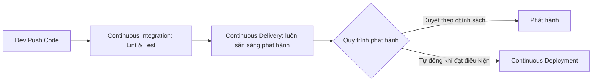

# CI/CD là gì? Tự động hóa tích hợp & chuyển giao liên tục

## 🎯 Mục tiêu
- Nắm vững bản chất cốt lõi của Continuous Integration (CI) và Continuous Delivery/Deployment (CD).
- Hiểu rõ sự khác biệt giữa quy trình kiểm thử thủ công rủi ro và đường ống tự động hóa.
- Nhận thức các lợi ích then chốt: giảm thiểu lỗi hồi quy, phát hành phiên bản nhanh và phản hồi sớm.

## 🧩 Từ khóa hôm nay
### Continuous Integration
- **Nói dễ hiểu**: Thói quen tích hợp thay đổi nhỏ, thường xuyên vào nhánh chung và dùng build/test tự động để nhận phản hồi sớm.
- **Ví dụ**: Hệ thống tự động chạy `npm test` mỗi khi bạn tạo Pull Request vào nhánh `main`.
- **Đừng nhầm**: CI không tự gộp code và cũng không chứng minh code chắc chắn đúng; nhóm chọn các bước kiểm tra phù hợp.

### Continuous Delivery
- **Nói dễ hiểu**: Duy trì phần mềm ở trạng thái có thể phát hành; quyết định phát hành có thể được thực hiện thủ công theo quy trình của nhóm.
- **Ví dụ**: Sau khi qua bài test, mã nguồn được build thành file Docker image sẵn sàng đưa lên môi trường staging.
- **Đừng nhầm**: Continuous Delivery không bắt buộc mọi nhóm phải có nút duyệt giống nhau; Continuous Deployment tự động phát hành các thay đổi đạt điều kiện đã đặt ra.

### Integration Hell
- **Nói dễ hiểu**: Cơn ác mộng xung đột khi các lập trình viên làm việc riêng lẻ quá lâu rồi mới dồn code vào gộp một lần.
- **Ví dụ**: Hai tháng không merge code khiến khi gộp nhánh phát sinh hàng trăm xung đột mã nguồn không thể gỡ nổi.
- **Đừng nhầm**: Không phải lỗi do Git hay máy chủ hỏng, mà là hệ quả của thói quen trì hoãn tích hợp thường xuyên.

## 📖 Định nghĩa
CI/CD là nhóm thực hành giúp tích hợp thay đổi thường xuyên, kiểm tra và chuẩn bị phần mềm để phát hành. CI nhấn mạnh việc tích hợp sớm kèm phản hồi tự động; Continuous Delivery giữ phiên bản ở trạng thái sẵn sàng phát hành; Continuous Deployment tự động phát hành thay đổi đạt các điều kiện của nhóm.

## 💡 Tại sao cần
Khi các nhánh làm việc riêng quá lâu, việc tích hợp có thể phát sinh nhiều xung đột và lỗi khó tìm. CI/CD giúp phát hiện một số vấn đề sớm hơn nhờ tích hợp thường xuyên và kiểm tra tự động; nó không loại bỏ mọi lỗi hay rủi ro phát hành.

## 🧠 Mental Model
Hãy hình dung dây chuyền lắp ráp ô tô tự động. Thay vì chờ lắp xong toàn bộ chiếc xe mới thử phanh, mỗi linh kiện khi vừa được lắp vào khung gầm đều đi qua cảm biến quang học quét kiểm tra chất lượng tự động ngay tại chỗ. Nếu phát hiện một ốc vít chưa siết chặt, đèn đỏ cảnh báo bật sáng và băng chuyền dừng lại ngay.

## 📊 Sơ đồ minh họa


## 🏢 Ví dụ thực tế
Ví dụ giả định: một nhóm bán hàng trực tuyến chạy test tính tiền trên mỗi Pull Request. Nếu quản trị viên đã đặt test đó thành required status check, kết quả thất bại sẽ chặn merge theo chính sách repo. CI giúp nhóm phát hiện lỗi trước phát hành nhưng vẫn cần review, giám sát và phương án khôi phục.

## 💻 Command & Cú pháp
```bash
# Các lệnh dưới đây chỉ dùng nếu package.json của dự án có khai báo scripts tương ứng
npm test

# Biên dịch mã nguồn và kiểm tra lỗi kiểu dữ liệu
npm run build

# Đẩy mã nguồn lên kho lưu trữ để kích hoạt đường ống CI
git push origin main
```

## 🔍 Giải thích command
- `npm test`: Chạy script `test` được khai báo trong `package.json`; script có thể chạy một loại test hoặc nhiều bước.
- `npm run build`: Chạy script `build` nếu dự án có khai báo; build thành công không thay thế cho kiểm thử.
- `git push origin main`: Đẩy commit lên remote; workflow chỉ chạy nếu repo có workflow phù hợp và bộ lọc sự kiện khớp.

## ⚠️ Sai lầm phổ biến
- Coi CI/CD chỉ là việc cài đặt công cụ mà bỏ qua việc xây dựng các bài kiểm thử tự động chất lượng cao.
- Viết các bài kiểm thử chạy quá chậm kéo dài hàng giờ khiến thời gian phản hồi bị kéo dài.
- Bỏ qua các bài kiểm thử chập chờn (flaky test) khiến các lập trình viên mất niềm tin vào kết quả của đường ống CI.

## 🧪 Lab thực hành
Bài học này là bài tự kiểm tra: bạn thao tác cấu hình theo hướng dẫn và đối chiếu theo các bước bên dưới.

1. Mở `package.json`, kiểm tra dự án có scripts `test` và `build` không; nếu không có, hãy dùng một dự án mẫu có sẵn các scripts đó.
2. Chạy `npm test` và ghi lại số test thành công/thất bại; kết quả xanh chỉ nói các test hiện có đã qua.
3. Nếu dự án có test mẫu, tạo một thay đổi nhỏ có thể hoàn tác để làm một test thất bại; không sửa chức năng thật khi chưa hiểu tác động.
4. Hoàn tác thay đổi thử nghiệm, chạy lại test và chạy `npm run build` nếu dự án có script này.

## 💡 Hint & mẹo
- Nhóm nên đặt mục tiêu thời gian phản hồi dựa trên dự án; không có ngưỡng chung bắt buộc cho mọi bộ test.
- Luôn chạy test và build thử trên máy cá nhân trước khi thực hiện commit và đẩy code lên máy chủ.

## ✅ Validation & Kết quả mong đợi
- Toàn bộ các bài kiểm thử tự động báo Passed và mã nguồn biên dịch thành công không có cảnh báo nghiêm trọng.
- Phân biệt Delivery (giữ phần mềm sẵn sàng phát hành) với Deployment (tự động phát hành theo điều kiện đã cấu hình).

## ❓ Quiz nhanh
Hãy làm bài trắc nghiệm bên dưới để kiểm tra mức độ nắm vững các khái niệm và nguyên lý hoạt động của CI/CD.

## 🚀 Thử thách nâng cao
Phân tích những rủi ro an ninh và điều kiện tiên quyết cần có trong dự án trước khi một công ty dám áp dụng Continuous Deployment thẳng lên máy chủ sản xuất.

## 📝 Tổng kết
- Continuous Integration tự động hóa việc kiểm tra, biên dịch và kiểm thử mã nguồn liên tục mỗi khi có thay đổi.
- Continuous Delivery và Deployment tự động hóa việc đóng gói và chuyển giao phần mềm tới các môi trường triển khai.
- CI/CD rút ngắn chu kỳ phản hồi, giảm thiểu xung đột và bảo đảm chất lượng ổn định cho sản phẩm phần mềm.
