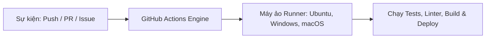

# GitHub Actions là gì? Nền tảng tự động hóa của GitHub

## 🎯 Mục tiêu
- Hiểu rõ GitHub Actions là gì và vị thế của nó trong hệ sinh thái GitHub.
- Nắm bắt các tính năng chính: tích hợp sâu với Git events, kho ứng dụng Actions Marketplace phong phú.
- Phân biệt mô hình SaaS tích hợp sẵn so với việc tự dựng và vận hành máy chủ Jenkins truyền thống.

## 🧩 Từ khóa hôm nay
### GitHub Actions
- **Nói dễ hiểu**: Nền tảng tự động hóa tích hợp sẵn trong GitHub giúp chạy kiểm thử, đóng gói và triển khai ứng dụng.
- **Ví dụ**: Mỗi khi push code lên GitHub, một máy ảo đám mây tự động bật lên chạy test và báo kết quả.
- **Đừng nhầm**: Không phải công cụ chỉ dành riêng cho việc test code, mà có thể tự động hóa mọi tác vụ quản lý dự án.

### Workflow
- **Nói dễ hiểu**: Một kịch bản tự động hóa hoàn chỉnh được định nghĩa trong tệp YAML nằm trong thư mục `.github/workflows/`.
- **Ví dụ**: Tệp `ci.yml` quy định khi có Pull Request thì tự động cài thư viện và chạy `npm test`.
- **Đừng nhầm**: Không phải câu lệnh đơn lẻ, mà là một quy trình gồm nhiều công việc (jobs) và bước (steps) kết hợp.

### Actions Marketplace
- **Nói dễ hiểu**: Chợ ứng dụng chứa hàng ngàn action làm sẵn do cộng đồng và các công ty lớn đóng gói để dùng lại.
- **Ví dụ**: Dùng `actions/checkout@v4` để tải code về máy ảo mà không cần tự viết lệnh clone thủ công.
- **Đừng nhầm**: Không phải ứng dụng mua bán tốn phí thông thường; đại đa số action cốt lõi đều mở và miễn phí.

## 📖 Định nghĩa
GitHub Actions là nền tảng tự động hóa quy trình làm việc (Workflow Automation) và dịch vụ CI/CD được tích hợp nguyên bản vào GitHub. Nền tảng cho phép lập trình viên tạo ra các kịch bản tự động phản hồi lại mọi sự kiện diễn ra trên kho lưu trữ: từ đẩy mã nguồn, mở Pull Request đến khi có một issue mới.

## 💡 Tại sao cần
Trước khi có GitHub Actions, các đội ngũ phải tự thiết lập và bảo trì các máy chủ CI riêng biệt như Jenkins, xử lý chứng chỉ bảo mật và cấu hình webhook phức tạp. GitHub Actions loại bỏ hoàn toàn gánh nặng này bằng cách quản lý kịch bản ngay trong mã nguồn dự án theo mô hình Configuration as Code.

## 🧠 Mental Model
Hãy tưởng tượng GitHub như một tòa nhà văn phòng thông minh. GitHub Actions chính là hệ thống cảm biến tự động: khi có người quẹt thẻ vào sảnh (sự kiện `push`), hệ thống tự động bật đèn, kích hoạt điều hòa nhiệt độ và in lịch họp trong ngày (`workflow`) mà không cần bạn phải thuê nhân sự vận hành riêng.

## 📊 Sơ đồ minh họa


## 🏢 Ví dụ thực tế
Nhóm phát triển thư viện giao diện mã nguồn mở nhận hàng chục Pull Request mỗi ngày. Nhờ GitHub Actions, mỗi khi có người gửi PR, hệ thống tự động khởi tạo máy ảo Ubuntu sạch, kéo mã nguồn về kiểm tra chuẩn cú pháp, chạy bài test và dựng bản xem trước giao diện. Nhờ đó người quản trị duyệt code rất nhanh mà không tốn công kiểm tra thủ công.

## 💻 Command & Cú pháp
```bash
# Xem danh sách các workflow đã đăng ký trong kho
gh workflow list

# Xem lịch sử các lần chạy workflow gần nhất
gh run list

# Kiểm tra trạng thái đăng nhập công cụ dòng lệnh GitHub CLI
gh auth status
```

## 🔍 Giải thích command
- `gh workflow list`: Liệt kê tất cả các tệp quy trình tự động hóa đang hoạt động trong repository hiện tại.
- `gh run list`: Hiển thị nhật ký thực thi của các lần chạy kiểm thử tự động kèm trạng thái thành công hay thất bại.
- `gh auth status`: Xác minh quyền hạn truy cập của công cụ dòng lệnh GitHub CLI với tài khoản lập trình viên.

## ⚠️ Sai lầm phổ biến
- Nghĩ rằng GitHub Actions chỉ dùng để chạy CI/CD; thực tế nó có thể tự động đóng issue cũ, gắn nhãn PR và gửi thông báo.
- Dùng các Action của bên thứ ba từ Marketplace mà không kiểm tra độ tin cậy và nguồn gốc tác giả.
- Lưu trữ trực tiếp mật khẩu hoặc API token trong tệp kịch bản YAML thay vì dùng GitHub Secrets.

## 🧪 Lab thực hành
Bài học này là bài tự kiểm tra: bạn thao tác cấu hình theo hướng dẫn và đối chiếu theo các bước bên dưới.

1. Cài đặt hoặc mở terminal đã có GitHub CLI (`gh`).
2. Chạy lệnh `gh auth status` để kiểm tra kết nối với tài khoản GitHub của bạn.
3. Kiểm tra các workflow hiện có trong kho bằng lệnh `gh workflow list`.
4. Xem lịch sử thực thi gần nhất bằng lệnh `gh run list`.
5. Truy cập giao diện web của repository, bấm vào thẻ **Actions** để làm quen với bảng điều khiển trực quan.

## 💡 Hint & mẹo
- GitHub Actions được cấu hình hoàn toàn bằng các tệp YAML đặt trong thư mục `.github/workflows/`.
- Hãy ưu tiên sử dụng các action chính thức do tổ chức `@actions` của GitHub phát hành trên Marketplace.

## ✅ Validation & Kết quả mong đợi
- Lệnh `gh auth status` phản hồi trạng thái đăng nhập hợp lệ với máy chủ GitHub.
- Nắm rõ cách theo dõi tiến độ các tác vụ tự động hóa cả trên dòng lệnh lẫn giao diện web của GitHub.

## ❓ Quiz nhanh
Hãy làm bài trắc nghiệm bên dưới để kiểm tra mức độ hiểu biết của bạn về nền tảng tự động hóa GitHub Actions.

## 🚀 Thử thách nâng cao
Tìm hiểu cách GitHub Actions phân bổ số phút tính toán miễn phí (free minutes) hàng tháng cho các tài khoản cá nhân và các kho lưu trữ mã nguồn mở công khai.

## 📝 Tổng kết
- GitHub Actions là nền tảng CI/CD và tự động hóa native được tích hợp sẵn bên trong GitHub.
- Phản hồi đa dạng các sự kiện diễn ra trên kho lưu trữ chứ không chỉ riêng hành động push mã nguồn.
- Hệ sinh thái Actions Marketplace cung cấp hàng ngàn khối xây dựng sẵn giúp tiết kiệm thời gian phát triển.
