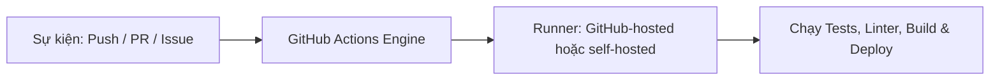

# GitHub Actions là gì? Nền tảng tự động hóa của GitHub

## 🎯 Mục tiêu
- Hiểu rõ GitHub Actions là gì và vị thế của nó trong hệ sinh thái GitHub.
- Nắm bắt các tính năng chính: tích hợp sâu với Git events, kho ứng dụng Actions Marketplace phong phú.
- Phân biệt mô hình SaaS tích hợp sẵn so với việc tự dựng và vận hành máy chủ Jenkins truyền thống.

## 🧩 Từ khóa hôm nay
### GitHub Actions
- **Nói dễ hiểu**: Nền tảng tự động hóa tích hợp sẵn trong GitHub giúp chạy kiểm thử, đóng gói và triển khai ứng dụng.
- **Ví dụ**: Mỗi khi push code lên GitHub, một máy ảo đám mây tự động bật lên chạy test và báo kết quả.
- **Đừng nhầm**: Không phải công cụ chỉ dành riêng cho việc test code, mà có thể tự động hóa mọi tác vụ quản lý dự án.

### Workflow
- **Nói dễ hiểu**: Một kịch bản tự động hóa hoàn chỉnh được định nghĩa trong tệp YAML nằm trong thư mục `.github/workflows/`.
- **Ví dụ**: Tệp `ci.yml` quy định khi có Pull Request thì tự động cài thư viện và chạy `npm test`.
- **Đừng nhầm**: Không phải câu lệnh đơn lẻ, mà là một quy trình gồm nhiều công việc (jobs) và bước (steps) kết hợp.

### Actions Marketplace
- **Nói dễ hiểu**: Danh mục để tìm Action do GitHub, tổ chức hoặc cộng đồng phát hành và dùng lại trong workflow.
- **Ví dụ**: Dùng `actions/checkout@v7` để checkout mã nguồn vào runner.
- **Đừng nhầm**: Có Action miễn phí, có Action tính phí hoặc điều khoản riêng; runner, lưu trữ và mức sử dụng Actions cũng tùy repo/gói dịch vụ.

## 📖 Định nghĩa
GitHub Actions là nền tảng tự động hóa quy trình làm việc và CI/CD tích hợp với GitHub. Bạn định nghĩa workflow dưới dạng YAML để phản hồi các sự kiện repo như push, Pull Request hoặc issue; khả năng chạy và chi phí phụ thuộc cấu hình, loại runner, gói dịch vụ và chính sách repo.

## 🤔 Tại sao cần?
GitHub Actions giảm phần việc tự vận hành máy chủ CI khi dùng runner do GitHub quản lý và giữ cấu hình cùng mã nguồn. Nó không loại bỏ mọi công việc hạ tầng: nhóm vẫn cần quản lý quyền, workflow, bí mật, chi phí và có thể chọn runner tự quản lý. Jenkins cũng có thể được dùng qua dịch vụ quản lý hoặc hạ tầng riêng.

## 🧠 Mental Model (Mô hình tư duy)
Hãy tưởng tượng GitHub như một tòa nhà văn phòng thông minh. GitHub Actions chính là hệ thống cảm biến tự động: khi có người quẹt thẻ vào sảnh (sự kiện `push`), hệ thống tự động bật đèn, kích hoạt điều hòa nhiệt độ và in lịch họp trong ngày (`workflow`) mà không cần bạn phải thuê nhân sự vận hành riêng.

## 🖼 Sơ đồ


## 🌎 Ví dụ thực tế
Nhóm phát triển thư viện giao diện mã nguồn mở nhận hàng chục Pull Request mỗi ngày. Nhờ GitHub Actions, mỗi khi có người gửi PR, hệ thống tự động khởi tạo máy ảo Ubuntu sạch, kéo mã nguồn về kiểm tra chuẩn cú pháp, chạy bài test và dựng bản xem trước giao diện. Nhờ đó người quản trị duyệt code rất nhanh mà không tốn công kiểm tra thủ công.

## 💻 Command
```bash
# Xem danh sách các workflow đã đăng ký trong kho
gh workflow list

# Xem lịch sử các lần chạy workflow gần nhất
gh run list

# Kiểm tra trạng thái đăng nhập công cụ dòng lệnh GitHub CLI
gh auth status
```

## 🔍 Giải thích command
- Các lệnh `gh` cần cài GitHub CLI; xem workflow/run trên repo riêng thường cần đăng nhập và quyền truy cập phù hợp.
- `gh workflow list`: Liệt kê workflow mà GitHub CLI nhìn thấy trong repository hiện tại.
- `gh run list`: Liệt kê các lần chạy gần đây; mở log chi tiết bằng `gh run view`.
- `gh auth status`: Kiểm tra trạng thái xác thực hiện tại của GitHub CLI.

## ⚠️ Sai lầm phổ biến
- Nghĩ rằng GitHub Actions chỉ dùng để chạy CI/CD; thực tế nó có thể tự động đóng issue cũ, gắn nhãn PR và gửi thông báo.
- Dùng các Action của bên thứ ba từ Marketplace mà không kiểm tra độ tin cậy và nguồn gốc tác giả.
- Lưu trữ trực tiếp mật khẩu hoặc API token trong tệp kịch bản YAML thay vì dùng GitHub Secrets.

## 🧪 Lab
Hãy mở terminal và cùng tôi thực hành từng bước dưới đây để làm chủ kỹ năng:

1. Nếu máy đã có `gh`, chạy `gh --version`; nếu chưa có, có thể đọc tệp `.github/workflows/*.yml` thay cho việc cài thêm công cụ.
2. Chỉ khi dùng repo GitHub mà bạn có quyền truy cập, chạy `gh auth status` rồi `gh workflow list`.
3. Nếu repo chưa có workflow hoặc bạn chưa đăng nhập, mở tệp YAML mẫu và nhận diện `on`, `jobs`, `steps`; có thể xem tab Actions khi có quyền truy cập.

## 💡 Hint
- GitHub Actions được cấu hình hoàn toàn bằng các tệp YAML đặt trong thư mục `.github/workflows/`.
- Hãy ưu tiên sử dụng các action chính thức do tổ chức `@actions` của GitHub phát hành trên Marketplace.

## ✅ Validation
- Nhận diện được nơi khai báo workflow và vai trò của `on`, `jobs`, `steps`.
- Khi có GitHub CLI và quyền repo, biết dùng `gh workflow list`/`gh run list`; nếu không, có thể hoàn thành phần học bằng cách đọc YAML mẫu.

## ❓ Quiz
Hãy làm bài trắc nghiệm bên dưới để kiểm tra mức độ hiểu biết của bạn về nền tảng tự động hóa GitHub Actions.

## 🔥 Challenge
Tra cứu chính sách sử dụng Actions hiện hành của một repo mẫu: loại runner nào được dùng, giới hạn nào áp dụng và nơi xem mức tiêu thụ. Hạn mức và chi phí có thể thay đổi theo gói dịch vụ.

## 📚 Tổng kết
- GitHub Actions là nền tảng CI/CD và tự động hóa native được tích hợp sẵn bên trong GitHub.
- Phản hồi đa dạng các sự kiện diễn ra trên kho lưu trữ chứ không chỉ riêng hành động push mã nguồn.
- Hệ sinh thái Actions Marketplace cung cấp hàng ngàn khối xây dựng sẵn giúp tiết kiệm thời gian phát triển.
