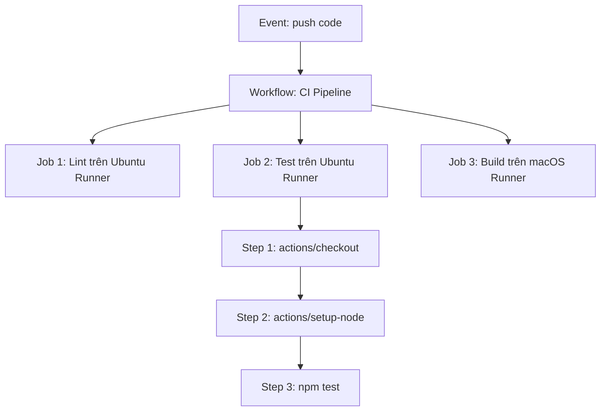

# Kiến trúc Workflow: Events, Jobs, Steps và Runners

## 🎯 Mục tiêu
- Nắm rõ cấu trúc phân tầng 4 cấp bậc của một Workflow: Event -> Jobs -> Steps -> Actions/Commands.
- Hiểu bản chất chạy song song (Parallel) mặc định của các Job và chạy tuần tự (Sequential) của các Step.
- Nắm vững vai trò của Runner như một môi trường máy ảo cách ly độc lập chứa toàn bộ phiên làm việc.

## 🧩 Từ khóa hôm nay
### Event
- **Nói dễ hiểu**: Sự kiện kích hoạt khiến GitHub Actions khởi động luồng công việc tự động.
- **Ví dụ**: Hành động đẩy commit lên nhánh `main` hoặc tạo một Pull Request mới.
- **Đừng nhầm**: Không chỉ giới hạn trong thao tác Git; sự kiện có thể là tạo nhãn, mở issue hay chạy định kỳ theo giờ.

### Job
- **Nói dễ hiểu**: Một khối công việc lớn trong workflow, mặc định chạy độc lập và song song trên một máy ảo riêng.
- **Ví dụ**: Job `build` và Job `lint` chạy cùng lúc trên hai máy ảo Ubuntu khác nhau.
- **Đừng nhầm**: Các Job không dùng chung ổ cứng; file tạo ra ở Job này không tự xuất hiện ở Job khác trừ khi dùng Artifact.

### Runner
- **Nói dễ hiểu**: Máy chủ hoặc máy ảo do GitHub cấp phát để trực tiếp thực thi các câu lệnh trong Job.
- **Ví dụ**: Máy ảo chạy hệ điều hành Ubuntu mới nhất (`runs-on: ubuntu-latest`).
- **Đừng nhầm**: Không phải một tiến trình chạy nền vĩnh viễn; mỗi Job được cấp một máy ảo sạch và bị hủy sau khi hoàn thành.

## 📖 Định nghĩa
Kiến trúc GitHub Actions được xây dựng theo mô hình phân tầng chặt chẽ: Sự kiện (Event) kích hoạt Luồng công việc (Workflow); mỗi Workflow bao gồm một hoặc nhiều Tác vụ (Job) chạy song song trên các Máy chạy (Runner) ảo hóa độc lập; bên trong mỗi Job là danh sách các Bước (Step) thực thi tuần tự từ trên xuống dưới.

## 💡 Tại sao cần
Hiểu sai kiến trúc phân tầng sẽ dẫn đến những lỗi cơ bản: cố gắng đọc file của Job khác từ ổ cứng mà không qua Artifact, hoặc tưởng nhầm các Step chạy song song. Phân biệt rõ ranh giới giữa Job (chạy song song cách ly) và Step (chạy tuần tự chung máy) là nền tảng để thiết kế pipeline tối ưu và tin cậy.

## 🧠 Mental Model
Hãy tưởng tượng một nhà hàng tiệc cưới. Event là tiếng chuông báo khách đã vào sảnh. Workflow là toàn bộ thực đơn tiệc. Các Job là các quầy bếp riêng: Quầy khai vị, Quầy món chính và Quầy tráng miệng hoạt động song song ở các góc bếp riêng (`Runners`). Bên trong mỗi quầy, đầu bếp làm từng thao tác tuần tự (`Steps`): rửa rau, thái thịt, nấu sốt.

## 📊 Sơ đồ minh họa


## 🏢 Ví dụ thực tế
Trong dự án ứng dụng di động Flutter, khi có Pull Request, Workflow kích hoạt hai Job cùng lúc: Job thứ nhất chạy trên Runner Linux để kiểm tra định dạng code và chạy linter; Job thứ hai chạy trên Runner macOS để biên dịch gói iOS. Mỗi Job được cấp máy ảo riêng sạch sẽ, thực thi lần lượt các Step cài Flutter SDK, tải thư viện và biên dịch mà không làm ảnh hưởng lẫn nhau.

## 💻 Command & Cú pháp
```bash
# Kiểm tra cấu trúc thư mục chứa các workflow
ls -la .github/workflows/

# Xem nội dung chi tiết của tệp workflow
cat .github/workflows/ci.yml
```

## 🔍 Giải thích command
- `ls -la .github/workflows/`: Liệt kê tất cả các tệp YAML định nghĩa quy trình tự động hóa trong repository.
- `cat .github/workflows/ci.yml`: Đọc nội dung khai báo các khối kiến trúc `on`, `jobs` và `steps` để kiểm tra cú pháp kịch bản.

## ⚠️ Sai lầm phổ biến
- Cho rằng tệp tin tạo ra ở Job 1 sẽ tự động có mặt ở Job 2 trên ổ đĩa cục bộ.
- Tạo quá nhiều Job nhỏ chỉ chứa một dòng lệnh đơn giản gây lãng phí thời gian khởi động máy ảo Runner.
- Nhầm lẫn thứ tự thực thi của các Step bên trong một Job (các Step luôn chạy tuần tự từ trên xuống).

## 🧪 Lab thực hành
Bài học này là bài tự kiểm tra: bạn thao tác cấu hình theo hướng dẫn và đối chiếu theo các bước bên dưới.

1. Xem xét sơ đồ phân cấp giữa Event, Job, Step và Runner để nắm chắc quy luật chia sẻ dữ liệu.
2. Xác định xem hai tác vụ Lint và Unit Test nên đặt trong cùng một Job hay chia làm hai Job chạy song song.
3. Tạo thư mục quy chuẩn `.github/workflows` trong dự án thực hành nếu chưa có.
4. Mở tệp `.github/workflows/ci.yml` và phân biệt rõ các cấp bậc thụt đầu dòng giữa `jobs` và `steps`.

## 💡 Hint & mẹo
- Ghi nhớ quy tắc vàng: Các Step trong một Job dùng chung hệ thống tệp tin, các Job khác nhau hoàn toàn cách ly về bộ nhớ và ổ đĩa.
- Hãy dùng `needs` khi bạn muốn một Job phải chờ một Job khác hoàn thành trước khi bắt đầu.

## ✅ Validation & Kết quả mong đợi
- Phân biệt chính xác phạm vi chia sẻ dữ liệu giữa cấp độ Job và cấp độ Step.
- Cấu trúc thư mục `.github/workflows/` được đặt chính xác ở thư mục gốc của repository.

## ❓ Quiz nhanh
Hãy hoàn thành bài trắc nghiệm bên dưới để kiểm tra khả năng phân tích kiến trúc phân tầng trong GitHub Actions.

## 🚀 Thử thách nâng cao
Nếu bạn có 100 bài kiểm thử mất 20 phút để chạy trên một máy ảo, bạn sẽ tái cấu trúc các Job như thế nào để giảm thời gian hoàn thành xuống còn 5 phút?

## 📝 Tổng kết
- Workflow được kích hoạt bởi Event và chứa một tập hợp các Jobs.
- Jobs mặc định thực thi song song trên các máy ảo Runner hoàn toàn độc lập.
- Steps bên trong một Job luôn thực thi tuần tự và chia sẻ chung hệ thống tệp tin của Runner đó.
