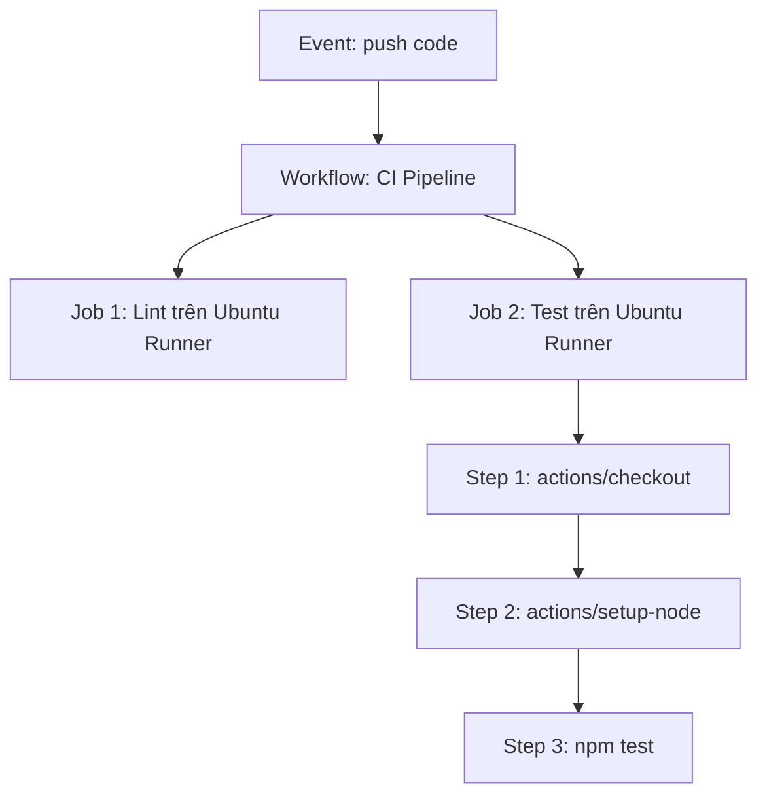

# Kiến trúc Workflow: Events, Jobs, Steps và Runners

## 🎯 Mục tiêu
- Hiểu luồng từ Event kích hoạt Workflow; Workflow chứa Jobs, mỗi Job chạy trên Runner và gồm các Steps.
- Hiểu các Job độc lập có thể chạy song song mặc định và các Step trong một Job chạy tuần tự.
- Phân biệt runner do GitHub quản lý với runner tự quản lý; không phải runner nào cũng là máy ảo sạch.

## 🧩 Từ khóa hôm nay
### Event
- **Nói dễ hiểu**: Sự kiện kích hoạt khiến GitHub Actions khởi động luồng công việc tự động.
- **Ví dụ**: Hành động đẩy commit lên nhánh `main` hoặc tạo một Pull Request mới.
- **Đừng nhầm**: Không chỉ giới hạn trong thao tác Git; sự kiện có thể là tạo nhãn, mở issue hay chạy định kỳ theo giờ.

### Job
- **Nói dễ hiểu**: Một khối công việc trong workflow, có thể chạy song song với Job khác nếu không khai báo phụ thuộc.
- **Ví dụ**: Job `build` và Job `lint` chạy cùng lúc trên hai máy ảo Ubuntu khác nhau.
- **Đừng nhầm**: Các Job không dùng chung ổ cứng; file tạo ra ở Job này không tự xuất hiện ở Job khác trừ khi dùng Artifact.

### Runner
- **Nói dễ hiểu**: Máy hoặc môi trường chạy GitHub Actions Runner để thực thi một Job.
- **Ví dụ**: Máy ảo chạy hệ điều hành Ubuntu mới nhất (`runs-on: ubuntu-latest`).
- **Đừng nhầm**: Runner GitHub-hosted thường được làm mới sau Job; self-hosted có thể là máy lâu dài và giữ lại trạng thái.

## 📖 Định nghĩa
Event có thể kích hoạt một Workflow. Workflow khai báo một hay nhiều Job; mỗi Job chọn Runner bằng `runs-on` và chứa các Step. Step có thể gọi Action bằng `uses` hoặc chạy lệnh shell bằng `run`. Các Job không phụ thuộc có thể chạy song song; `needs` tạo thứ tự phụ thuộc. Các Step trong Job chạy theo thứ tự khai báo và dùng chung workspace của Job đó.

## 🤔 Tại sao cần?
Hiểu ranh giới giữa Job và Step giúp bạn biết file nào có thể dùng lại. Workspace được chia sẻ giữa các Step trong Job; Job khác thường có runner riêng, nên cần Artifact, cache hoặc truyền dữ liệu qua outputs phù hợp.

## 🧠 Mental Model (Mô hình tư duy)
Hãy tưởng tượng một nhà hàng tiệc cưới. Event là tiếng chuông báo khách đã vào sảnh. Workflow là toàn bộ thực đơn tiệc. Các Job là các quầy bếp riêng: Quầy khai vị, Quầy món chính và Quầy tráng miệng hoạt động song song ở các góc bếp riêng (`Runners`). Bên trong mỗi quầy, đầu bếp làm từng thao tác tuần tự (`Steps`): rửa rau, thái thịt, nấu sốt.

## 🖼 Sơ đồ


## 🌎 Ví dụ thực tế
Trong dự án ứng dụng di động Flutter, khi có Pull Request, Workflow có thể kích hoạt hai Job: một Job chạy linter trên Linux, Job kia biên dịch iOS trên macOS. Mỗi Job chọn một Runner riêng theo cấu hình. Runner GitHub-hosted thường là môi trường mới cho mỗi Job; self-hosted có thể giữ trạng thái từ lần chạy trước.

## 💻 Command
```bash
# Kiểm tra cấu trúc thư mục chứa các workflow
ls -la .github/workflows/

# Xem nội dung chi tiết của tệp workflow
cat .github/workflows/ci.yml
```

## 🔍 Giải thích command
- `ls -la .github/workflows/`: Liệt kê tất cả các tệp YAML định nghĩa quy trình tự động hóa trong repository.
- `cat .github/workflows/ci.yml`: Đọc nội dung khai báo các khối kiến trúc `on`, `jobs` và `steps` để kiểm tra cú pháp kịch bản.

## ⚠️ Sai lầm phổ biến
- Cho rằng tệp tin tạo ra ở Job 1 sẽ tự động có mặt ở Job 2 trên ổ đĩa cục bộ.
- Tạo quá nhiều Job nhỏ chỉ chứa một dòng lệnh đơn giản gây lãng phí thời gian khởi động máy ảo Runner.
- Nhầm lẫn thứ tự thực thi của các Step bên trong một Job (các Step luôn chạy tuần tự từ trên xuống).

## 🧪 Lab
Hãy mở terminal và cùng tôi thực hành từng bước dưới đây để làm chủ kỹ năng:

1. Xem xét sơ đồ phân cấp giữa Event, Job, Step và Runner để nắm chắc quy luật chia sẻ dữ liệu.
2. Xác định xem hai tác vụ Lint và Unit Test nên đặt trong cùng một Job hay chia làm hai Job chạy song song.
3. Tạo thư mục quy chuẩn `.github/workflows` trong dự án thực hành nếu chưa có.
4. Mở tệp `.github/workflows/ci.yml` và phân biệt rõ các cấp bậc thụt đầu dòng giữa `jobs` và `steps`.

## 💡 Hint
- Ghi nhớ quy tắc vàng: Các Step trong một Job dùng chung hệ thống tệp tin, các Job khác nhau hoàn toàn cách ly về bộ nhớ và ổ đĩa.
- Hãy dùng `needs` khi bạn muốn một Job phải chờ một Job khác hoàn thành trước khi bắt đầu.

## ✅ Validation
- Phân biệt chính xác phạm vi chia sẻ dữ liệu giữa cấp độ Job và cấp độ Step.
- Cấu trúc thư mục `.github/workflows/` được đặt chính xác ở thư mục gốc của repository.

## ❓ Quiz
Hãy hoàn thành bài trắc nghiệm bên dưới để kiểm tra khả năng phân tích kiến trúc phân tầng trong GitHub Actions.

## 🔥 Challenge
Nếu bạn có 100 bài kiểm thử mất 20 phút để chạy trên một máy ảo, bạn sẽ tái cấu trúc các Job như thế nào để giảm thời gian hoàn thành xuống còn 5 phút?

## 📚 Tổng kết
- Workflow được kích hoạt bởi Event và chứa một tập hợp các Jobs.
- Các Job không phụ thuộc có thể chạy song song; `needs` tạo thứ tự phụ thuộc.
- Các Step trong một Job chạy theo thứ tự và dùng chung workspace của Job đó.
