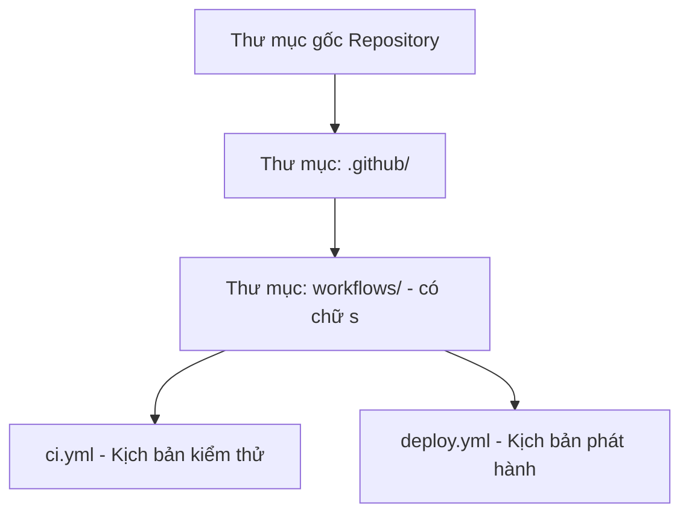

# .github/workflows và cú pháp YAML chuẩn

## 🎯 Mục tiêu
- Nắm vững vị trí bắt buộc của tệp workflow: thư mục `.github/workflows/` với phần mở rộng `.yml` hoặc `.yaml`.
- Làm chủ cấu trúc YAML: thụt lề bằng dấu cách, danh sách gạch đầu dòng và cặp khóa-giá trị; dùng nhất quán 2 dấu cách theo quy ước.
- Nhận biết và khắc phục các lỗi cú pháp thụt lề YAML phổ biến làm workflow bị từ chối biên dịch.

## 🧩 Từ khóa hôm nay
### YAML Indentation
- **Nói dễ hiểu**: Dùng dấu cách để thụt đầu dòng và thể hiện quan hệ cha con giữa các khối dữ liệu.
- **Ví dụ**: Dùng đúng 2 dấu cách cho mỗi cấp độ phân cấp; `steps` thụt vào 4 khoảng trắng dưới `jobs`.
- **Đừng nhầm**: Tab không được dùng để thụt lề YAML; trong editor, phím Tab có thể tự chèn dấu cách nếu bật tùy chọn phù hợp.

### .github/workflows
- **Nói dễ hiểu**: Thư mục quy ước duy nhất nơi GitHub tự động quét tìm và kích hoạt các tệp kịch bản Actions.
- **Ví dụ**: Đặt tệp `.github/workflows/ci.yml` ở thư mục gốc của repository.
- **Đừng nhầm**: Chú ý chữ `workflows` có chữ `s` ở cuối; nếu đặt ở `.github/workflow/` thì hệ thống sẽ bỏ qua hoàn toàn.

### Key-Value Mapping
- **Nói dễ hiểu**: Cặp khóa - giá trị phân tách bởi dấu hai chấm và khoảng trắng biểu diễn dữ liệu trong YAML.
- **Ví dụ**: Cặp `runs-on: ubuntu-latest` gán giá trị hệ điều hành cho thuộc tính của Job.
- **Đừng nhầm**: Trong cặp khóa-giá trị phải có dấu cách sau dấu hai chấm (`name: Build`); `name:Build` không được phân tích thành khóa `name` với giá trị `Build`.

## 📖 Định nghĩa
Trong GitHub Actions, toàn bộ kịch bản tự động hóa bắt buộc phải được lưu trữ dưới dạng các tệp văn bản YAML nằm chính xác tại thư mục `.github/workflows/` trong nhánh của kho lưu trữ. Cú pháp YAML dựa trên thụt lề khoảng trắng nghiêm ngặt để biểu diễn phân cấp giữa workflow, job, step và các tham số cấu hình.

## 🤔 Tại sao cần?
Lỗi YAML thường đến từ thụt lề sai, dùng Tab để thụt lề hoặc đặt khóa sai cấp. Học cách đọc cấu trúc từng tầng giúp bạn phát hiện lỗi trước khi GitHub chạy workflow.

## 🧠 Mental Model (Mô hình tư duy)
Hãy hình dung tệp YAML như sơ đồ tổ chức phòng ban của công ty. Mỗi cấp bậc quản lý được biểu diễn bằng khoảng thụt lề 2 bước chân (2 spaces). Nếu một nhân viên thực thi (`step`) đứng ngang hàng với trưởng phòng (`job`), toàn bộ trật tự quản lý sẽ bị xáo trộn và hệ thống quét tự động sẽ từ chối phê duyệt ngay.

## 🖼 Sơ đồ


## 🌎 Ví dụ thực tế
Một kỹ sư tạo tệp `.github/workflows/ci.yml` cho dự án Node.js. Ban đầu, kỹ sư vô tình dùng phím Tab trên bàn phím để thụt dòng mục steps. Khi đẩy lên GitHub, thẻ Actions báo lỗi đỏ: "Invalid workflow file: mapping values are not allowed in this context". Kỹ sư mở VS Code, bật hiển thị ký tự ẩn, thay toàn bộ ký tự Tab bằng 2 dấu cách Space và đẩy lại. GitHub lập tức nhận diện thành công và hiển thị tiến trình đang chạy màu vàng.

## 💻 Command
```bash
# Tạo thư mục chuẩn workflows
mkdir -p .github/workflows

# Tạo tệp cấu hình kịch bản tự động
touch .github/workflows/ci.yml

# Kiểm tra cú pháp YAML bằng công cụ dòng lệnh nếu có
yamllint .github/workflows/ci.yml
```

## 🔍 Giải thích command
- `mkdir -p .github/workflows`: Tạo cấu trúc thư mục quy chuẩn theo đúng đặc tả của GitHub Actions.
- `touch .github/workflows/ci.yml`: Khởi tạo tệp cấu hình mới với phần mở rộng `.yml` hợp lệ.
- `yamllint`: Kiểm tra tính hợp lệ về thụt lề và quy tắc định dạng của tệp trước khi đẩy lên máy chủ.

## ⚠️ Sai lầm phổ biến
- Dùng Tab để thụt lề (YAML không cho phép Tab làm ký tự thụt lề; editor có thể cấu hình phím Tab để chèn spaces).
- Đặt tệp sai đường dẫn như `.github/workflow/` (thiếu chữ s) khiến GitHub hoàn toàn bỏ qua kịch bản.
- Viết sai phần mở rộng tệp thành `.json` hoặc `.txt` thay vì `.yml` hoặc `.yaml`.

## 🧪 Lab
Hãy mở terminal và cùng tôi thực hành từng bước dưới đây để làm chủ kỹ năng:

1. Mở terminal và tạo thư mục `.github/workflows/` bằng lệnh `mkdir -p .github/workflows`.
2. Tạo tệp `ci.yml` trong thư mục vừa tạo với nội dung mẫu:
   ```yaml
   name: CI Pipeline
   on: [push]
   jobs:
     test:
       runs-on: ubuntu-latest
       steps:
         - run: echo "Hello GitHub Actions"
   ```
3. Kiểm tra xem mỗi tầng thụt lề có dùng đúng 2 dấu cách Space hay không.
4. Đẩy commit lên GitHub và vào tab Actions để quan sát workflow đầu tiên được thực thi.

## 💡 Hint
- Trong trình soạn thảo, bật tùy chọn chèn spaces và chọn độ rộng thụt lề nhất quán; 2 spaces là quy ước phổ biến.
- Cài tiện ích mở rộng GitHub Actions trên VS Code để được gợi ý cú pháp và bắt lỗi YAML ngay khi gõ.

## ✅ Validation
- Tệp YAML được phân tích cú pháp hợp lệ mà không có lỗi thụt lề hoặc lỗi mapping.
- Tab Actions trên GitHub nhận diện được workflow và tự động kích hoạt khi có commit mới.

## ❓ Quiz
Hãy làm bài trắc nghiệm bên dưới để kiểm tra mức độ nắm vững quy tắc định dạng YAML và vị trí tệp workflow.

## 🔥 Challenge
Giải thích tại sao định dạng YAML lại được chọn cho GitHub Actions thay vì JSON hay XML, và ưu thế của nó về tính trực quan đối với con người là gì?

## 📚 Tổng kết
- Tệp workflow bắt buộc phải đặt tại `.github/workflows/` với phần mở rộng `.yml` hoặc `.yaml`.
- Dùng spaces thay cho Tab để thụt lề; 2 spaces mỗi cấp là quy ước dễ đọc, không phải yêu cầu cú pháp duy nhất.
- Cú pháp YAML phân cấp rõ ràng giúp kịch bản tự động hóa dễ đọc và dễ bảo trì.
