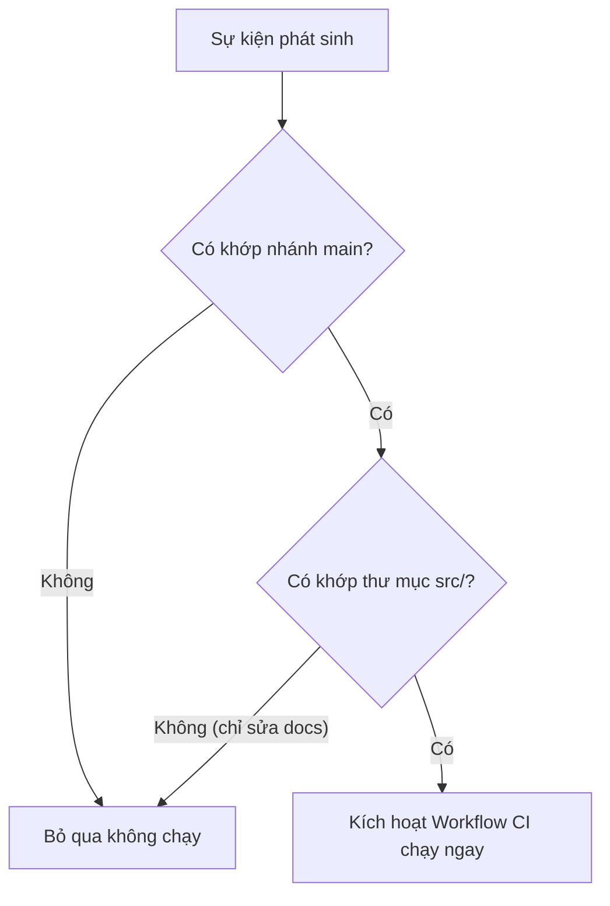

# Sự kiện kích hoạt (Events & Triggers: push, pull_request, workflow_dispatch)

## 🎯 Mục tiêu
- Làm chủ thuộc tính `on` trong workflow để cấu hình các sự kiện kích hoạt tự động.
- Sử dụng bộ lọc nhánh (`branches`) và bộ lọc đường dẫn tệp tin (`paths`) để tối ưu thời điểm kích hoạt.
- Thành thạo sự kiện kích hoạt thủ công `workflow_dispatch` và lập lịch tự động `schedule` cron.

## 🧩 Từ khóa hôm nay
### Event Trigger
- **Nói dễ hiểu**: Sự kiện cụ thể xảy ra trong kho lưu trữ kích hoạt hệ thống chạy quy trình tự động hóa.
- **Ví dụ**: Khi có ai đó push commit vào nhánh `main` hoặc mở một Pull Request mới.
- **Đừng nhầm**: Không bắt buộc chỉ có một sự kiện duy nhất; bạn có thể khai báo một danh sách nhiều sự kiện khác nhau trong `on`.

### workflow_dispatch
- **Nói dễ hiểu**: Sự kiện cho phép người có quyền chạy workflow thủ công từ giao diện GitHub, CLI hoặc API.
- **Ví dụ**: Bấm nút Run workflow trên trang web GitHub để chạy kịch bản deploy mà không cần tạo commit giả.
- **Đừng nhầm**: Phải khai báo `workflow_dispatch`; workflow cần có trên nhánh mặc định để sự kiện này được kích hoạt, còn cách chạy có thể cho phép chọn nhánh.

### Path Filter
- **Nói dễ hiểu**: Bộ lọc đường dẫn giúp chạy hoặc bỏ qua workflow dựa trên các tệp bị thay đổi trong sự kiện `push` hoặc `pull_request`.
- **Ví dụ**: Dùng `paths-ignore: ['docs/**']` để bỏ qua việc chạy test khi lập trình viên chỉ cập nhật tài liệu.
- **Đừng nhầm**: Bộ lọc này áp dụng cho sự kiện `push` và `pull_request`, không áp dụng cho kích hoạt thủ công.

## 📖 Định nghĩa
Sự kiện (Event) là hoạt động trong repository có thể kích hoạt workflow. Khóa `on` liệt kê các sự kiện như `push`, `pull_request`, `workflow_dispatch` và `schedule`. Bộ lọc nhánh/đường dẫn áp dụng tùy theo loại sự kiện; `schedule` dùng UTC và chạy theo lịch đã cấu hình trên nhánh mặc định.

## 🤔 Tại sao cần?
Nếu không cấu hình sự kiện và bộ lọc phù hợp, workflow có thể chạy nhiều hơn cần thiết. Bộ lọc giúp kiểm soát nhánh hoặc tệp thay đổi; khi dùng required checks, hãy cẩn thận vì workflow bị bỏ qua do filter có thể để check ở trạng thái pending.

## 🧠 Mental Model (Mô hình tư duy)
Hãy hình dung chiếc chuông cửa thông minh. Bạn có thể cài đặt chuông reo khi khách bấm nút trực tiếp (`workflow_dispatch`), hoặc khi cảm biến phát hiện có khách đứng trước cửa (`push` vào nhánh `main`). Bạn cũng có thể thiết lập bộ lọc thông minh: nếu chỉ là một chú mèo đi ngang qua (`docs/`), chiếc chuông tự động bỏ qua không reo để tránh làm phiền.

## 🖼 Sơ đồ


## 🌎 Ví dụ thực tế
Trong môi trường phát triển dự án thực tế: workflow chạy khi `push` vào `main` hoặc `staging` và bỏ qua nếu mọi tệp thay đổi đều nằm trong `docs/`. Nếu cùng một commit sửa cả `docs/` lẫn mã nguồn, workflow vẫn chạy. Workflow bảo mật chỉ chạy nếu sự kiện và bộ lọc của nó khớp.

## 💻 Command
```bash
# Kích hoạt thủ công workflow từ terminal bằng GitHub CLI
gh workflow run ci.yml

# Đẩy commit lên nhánh main để kích hoạt trigger tự động
git push origin main

# Xem trạng thái phản hồi của workflow vừa được kích hoạt
gh run list
```

## 🔍 Giải thích command
- `gh workflow run ci.yml`: Kích hoạt workflow có `workflow_dispatch`; cần GitHub CLI xác thực và có quyền với repo.
- `git push origin main`: Đẩy commit lên nhánh `main`; workflow chỉ chạy khi sự kiện và mọi bộ lọc khớp.
- `gh run list`: Liệt kê các lần chạy gần đây; cần quyền đọc repo khi truy cập repo riêng.

## ⚠️ Sai lầm phổ biến
- Quên lọc nhánh khiến các commit trên nhánh nháp của lập trình viên kích hoạt luôn kịch bản deploy sản xuất.
- Lịch `schedule` dùng UTC; giờ chạy có thể bị trễ khi GitHub tải cao và không nên dùng làm đồng hồ chạy chính xác.
- Quên khai báo `workflow_dispatch` khiến việc kiểm thử thủ công workflow gặp nhiều khó khăn.

## 🧪 Lab
Hãy mở terminal và cùng tôi thực hành từng bước dưới đây để làm chủ kỹ năng:

1. Khởi tạo một tệp workflow với thuộc tính `on` hỗ trợ cả `push` và `workflow_dispatch`:
   ```yaml
   name: Trigger Demo
   on:
     push:
       branches: [main]
       paths-ignore:
         - '**.md'
     workflow_dispatch:
   jobs:
     demo:
       runs-on: ubuntu-latest
       steps:
         - run: echo "Workflow triggered successfully!"
   ```
2. Đọc điều kiện filter: chỉ thay đổi tệp Markdown thì bị bỏ qua; nếu commit còn sửa tệp khác thì workflow chạy.
3. Khi có repo GitHub và quyền truy cập, đẩy tệp lên nhánh phù hợp để quan sát run; nếu không, kiểm tra điều kiện bằng ví dụ YAML.
4. Với workflow đã có trên nhánh mặc định và `workflow_dispatch`, người có quyền có thể dùng **Run workflow**; CLI cũng cần xác thực.

## 💡 Hint
- `schedule` dùng UTC; chuyển giờ Việt Nam sang UTC bằng cách trừ 7 tiếng, đồng thời nhớ rằng thời điểm thực tế có thể trễ.
- Bạn có thể thêm trường `inputs` cho `workflow_dispatch` để người dùng nhập thông số tùy chỉnh khi bấm nút chạy.

## ✅ Validation
- Workflow không bị kích hoạt khi chỉ có thay đổi trong các tệp markdown.
- Khi workflow có trên nhánh mặc định, khai báo `workflow_dispatch` và người học có quyền truy cập, có thể chạy thủ công từ GitHub.

## ❓ Quiz
Hãy hoàn thành bài trắc nghiệm bên dưới để kiểm tra mức độ nắm vững các sự kiện và bộ lọc kích hoạt trong GitHub Actions.

## 🔥 Challenge
Thiết kế biểu thức cron trong thuộc tính `schedule` để workflow tự động sao lưu dữ liệu vào lúc 3 giờ sáng mỗi ngày từ thứ Hai đến thứ Sáu theo giờ Việt Nam.

## 📚 Tổng kết
- Thuộc tính `on` định nghĩa các sự kiện kích hoạt workflow như `push`, `pull_request`, `workflow_dispatch`.
- Dùng `branches`, `paths` hoặc `paths-ignore` để kiểm soát phạm vi chạy; kiểm tra ảnh hưởng tới required checks.
- `workflow_dispatch` mang lại sự linh hoạt tối đa khi cần kích hoạt hoặc kiểm thử quy trình thủ công.
