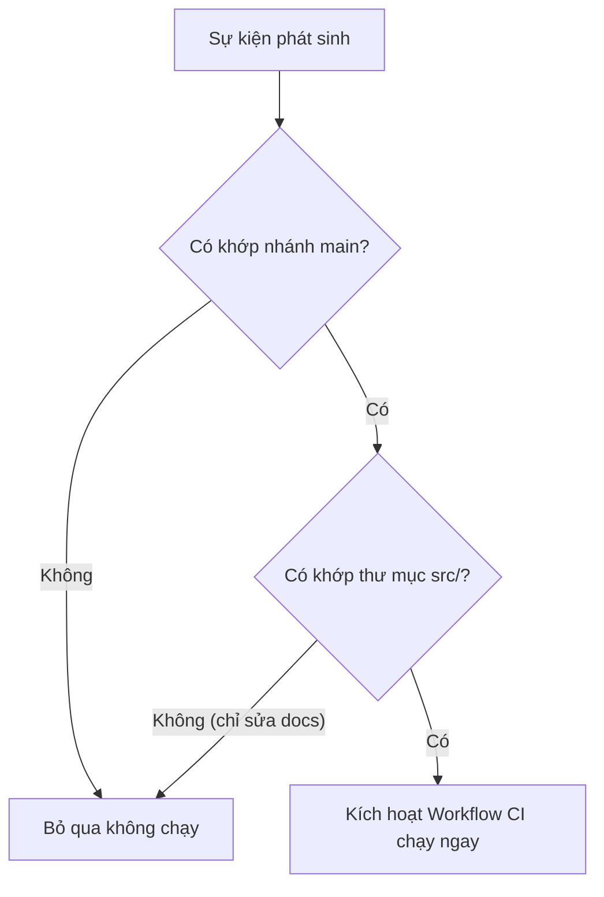

# Sự kiện kích hoạt (Events & Triggers: push, pull_request, workflow_dispatch)

## 🎯 Mục tiêu
- Làm chủ thuộc tính `on` trong workflow để cấu hình các sự kiện kích hoạt tự động.
- Sử dụng bộ lọc nhánh (`branches`) và bộ lọc đường dẫn tệp tin (`paths`) để tối ưu thời điểm kích hoạt.
- Thành thạo sự kiện kích hoạt thủ công `workflow_dispatch` và lập lịch tự động `schedule` cron.

## 🧩 Từ khóa hôm nay
### Event Trigger
- **Nói dễ hiểu**: Sự kiện cụ thể xảy ra trong kho lưu trữ kích hoạt hệ thống chạy quy trình tự động hóa.
- **Ví dụ**: Khi có ai đó push commit vào nhánh `main` hoặc mở một Pull Request mới.
- **Đừng nhầm**: Không bắt buộc chỉ có một sự kiện duy nhất; bạn có thể khai báo một danh sách nhiều sự kiện khác nhau trong `on`.

### workflow_dispatch
- **Nói dễ hiểu**: Sự kiện cho phép lập trình viên bấm nút chạy workflow thủ công trực tiếp từ giao diện GitHub hoặc CLI.
- **Ví dụ**: Bấm nút Run workflow trên trang web GitHub để chạy kịch bản deploy mà không cần tạo commit giả.
- **Đừng nhầm**: Mặc định workflow không có nút bấm này; bạn bắt buộc phải khai báo `workflow_dispatch:` trong tệp YAML.

### Path Filter
- **Nói dễ hiểu**: Bộ lọc đường dẫn giúp chỉ kích hoạt workflow khi có commit thay đổi các tệp tin trong thư mục chỉ định.
- **Ví dụ**: Dùng `paths-ignore: ['docs/**']` để bỏ qua việc chạy test khi lập trình viên chỉ cập nhật tài liệu.
- **Đừng nhầm**: Bộ lọc này áp dụng cho sự kiện `push` và `pull_request`, không áp dụng cho kích hoạt thủ công.

## 📖 Định nghĩa
Sự kiện (Event) là một hoạt động cụ thể diễn ra trong repository kích hoạt GitHub Actions thực thi workflow. Thuộc tính `on` trong tệp YAML định nghĩa các sự kiện này. Các sự kiện thông dụng nhất gồm: `push` (đẩy mã nguồn), `pull_request` (mở, cập nhật PR), `workflow_dispatch` (kích hoạt thủ công) và `schedule` (chạy định kỳ theo giờ cron).

## 💡 Tại sao cần
Nếu không cấu hình sự kiện và bộ lọc chính xác, workflow sẽ chạy tràn lan gây lãng phí tài nguyên và làm nghẽn hàng đợi CI. Ví dụ: bạn không muốn một pipeline deploy máy chủ sản xuất lại bị kích hoạt khi ai đó chỉ sửa đổi tệp `README.md` hoặc chỉ đẩy commit lên một nhánh cá nhân thử nghiệm.

## 🧠 Mental Model
Hãy hình dung chiếc chuông cửa thông minh. Bạn có thể cài đặt chuông reo khi khách bấm nút trực tiếp (`workflow_dispatch`), hoặc khi cảm biến phát hiện có khách đứng trước cửa (`push` vào nhánh `main`). Bạn cũng có thể thiết lập bộ lọc thông minh: nếu chỉ là một chú mèo đi ngang qua (`docs/`), chiếc chuông tự động bỏ qua không reo để tránh làm phiền.

## 📊 Sơ đồ minh họa


## 🏢 Ví dụ thực tế
Trong dự án cổng thông tin ngân hàng, kỹ sư cấu hình tệp `ci.yml` lắng nghe sự kiện `push` nhưng chỉ trên nhánh `main` và `staging`. Đồng thời, kỹ sư bổ sung thuộc tính `paths-ignore` để bỏ qua mọi commit chỉ thay đổi tệp markdown trong thư mục `docs/`. Khi một cộng tác viên sửa lỗi chính tả tài liệu, CI không chạy giúp tiết kiệm hàng ngàn phút máy ảo cho công ty. Khi gộp code vào `main`, toàn bộ bài test bảo mật lập tức được kích hoạt.

## 💻 Command & Cú pháp
```bash
# Kích hoạt thủ công workflow từ terminal bằng GitHub CLI
gh workflow run ci.yml

# Đẩy commit lên nhánh main để kích hoạt trigger tự động
git push origin main

# Xem trạng thái phản hồi của workflow vừa được kích hoạt
gh run list
```

## 🔍 Giải thích command
- `gh workflow run ci.yml`: Kích hoạt workflow có khai báo `workflow_dispatch` mà không cần đẩy commit mới lên remote.
- `git push origin main`: Đẩy mã nguồn lên nhánh chính để kích hoạt các workflow có bộ lọc `branches: [main]`.
- `gh run list`: Kiểm tra trạng thái hàng đợi và tiến độ thực thi của các lần chạy gần nhất.

## ⚠️ Sai lầm phổ biến
- Quên lọc nhánh khiến các commit trên nhánh nháp của lập trình viên kích hoạt luôn kịch bản deploy sản xuất.
- Sử dụng sai múi giờ quốc tế UTC trong biểu thức `schedule` cron dẫn đến việc kịch bản chạy sai lệch so với giờ Việt Nam.
- Quên khai báo `workflow_dispatch` khiến việc kiểm thử thủ công workflow gặp nhiều khó khăn.

## 🧪 Lab thực hành
Bài học này là bài tự kiểm tra: bạn thao tác cấu hình theo hướng dẫn và đối chiếu theo các bước bên dưới.

1. Khởi tạo một tệp workflow với thuộc tính `on` hỗ trợ cả `push` và `workflow_dispatch`:
   ```yaml
   name: Trigger Demo
   on:
     push:
       branches: [main]
       paths-ignore:
         - '**.md'
     workflow_dispatch:
   jobs:
     demo:
       runs-on: ubuntu-latest
       steps:
         - run: echo "Workflow triggered successfully!"
   ```
2. Đẩy file lên GitHub và thử chỉnh sửa tệp `README.md`, quan sát xem workflow có bỏ qua hay không.
3. Chỉnh sửa một file mã nguồn và đẩy lên, kiểm tra xem workflow có tự động chạy hay không.
4. Thử truy cập tab Actions trên web và bấm nút **Run workflow** để trải nghiệm sự kiện `workflow_dispatch`.

## 💡 Hint & mẹo
- Múi giờ của lịch `schedule` cron trong GitHub Actions luôn tính theo giờ UTC, hãy nhớ trừ 7 tiếng so với giờ Việt Nam (UTC+7).
- Bạn có thể thêm trường `inputs` cho `workflow_dispatch` để người dùng nhập thông số tùy chỉnh khi bấm nút chạy.

## ✅ Validation & Kết quả mong đợi
- Workflow không bị kích hoạt khi chỉ có thay đổi trong các tệp markdown.
- Nút Run workflow màu xanh xuất hiện trong giao diện web khi tệp YAML có khai báo `workflow_dispatch`.

## ❓ Quiz nhanh
Hãy hoàn thành bài trắc nghiệm bên dưới để kiểm tra mức độ nắm vững các sự kiện và bộ lọc kích hoạt trong GitHub Actions.

## 🚀 Thử thách nâng cao
Thiết kế biểu thức cron trong thuộc tính `schedule` để workflow tự động sao lưu dữ liệu vào lúc 3 giờ sáng mỗi ngày từ thứ Hai đến thứ Sáu theo giờ Việt Nam.

## 📝 Tổng kết
- Thuộc tính `on` định nghĩa các sự kiện kích hoạt workflow như `push`, `pull_request`, `workflow_dispatch`.
- Sử dụng `branches`, `paths` và `paths-ignore` để tối ưu chi phí và tránh chạy workflow vô ích.
- `workflow_dispatch` mang lại sự linh hoạt tối đa khi cần kích hoạt hoặc kiểm thử quy trình thủ công.
