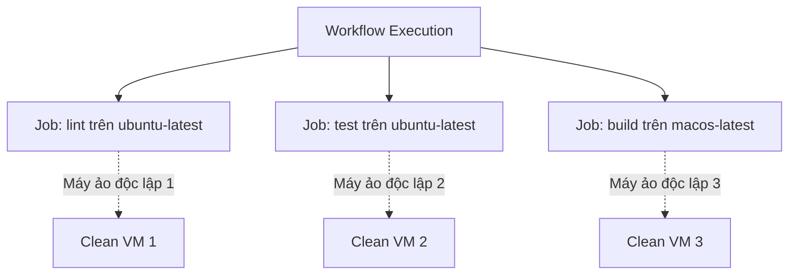

# Cấu hình Jobs: runs-on, phân tách độc lập và môi trường

## 🎯 Mục tiêu
- Nắm vững cú pháp khai báo Job và thuộc tính bắt buộc `runs-on` để chỉ định môi trường điều hành.
- Hiểu rõ nguyên lý cô lập hoàn toàn giữa các Job về hệ thống tệp tin, biến môi trường và tiến trình.
- Biết cách đặt tên định danh cho Job (`job_id`) và hiển thị tên thân thiện (`name`) trên giao diện.

## 🧩 Từ khóa hôm nay
### runs-on
- **Nói dễ hiểu**: Thuộc tính bắt buộc chỉ định loại hệ điều hành của máy ảo Runner mà GitHub sẽ cấp phát cho Job.
- **Ví dụ**: Khai báo `runs-on: ubuntu-latest` để chạy Job trên môi trường Linux Ubuntu mới nhất.
- **Đừng nhầm**: Không thể bỏ trống thuộc tính này; nếu thiếu `runs-on` workflow sẽ bị báo lỗi cú pháp ngay.

### Parallel Jobs
- **Nói dễ hiểu**: Cơ chế mặc định của GitHub Actions chạy tất cả các Job trong cùng workflow song song cùng lúc.
- **Ví dụ**: Job `lint` và Job `test` khởi động đồng thời trên hai máy ảo khác nhau để rút ngắn thời gian chờ đợi.
- **Đừng nhầm**: Nếu muốn các Job chạy nối tiếp tuần tự, bạn bắt buộc phải dùng thuộc tính phụ thuộc `needs`.

### Job Isolation
- **Nói dễ hiểu**: Nguyên lý cô lập tuyệt đối; mỗi Job chạy trên một máy ảo sạch và bị hủy sau khi hoàn thành.
- **Ví dụ**: Tệp tin tải về ở Job A không tự động xuất hiện ở Job B trừ khi được chia sẻ qua Artifacts.
- **Đừng nhầm**: Không dùng chung RAM hay ổ đĩa giữa các Job; mỗi Job là một không gian độc lập hoàn toàn.

## 📖 Định nghĩa
Một Job là một tập hợp các bước (steps) được thực thi trên cùng một máy ảo hoặc bộ chứa container riêng biệt. Thuộc tính bắt buộc hàng đầu của mỗi Job là `runs-on`, chỉ định hệ điều hành máy ảo (như `ubuntu-latest`, `windows-latest`, `macos-latest`). Mỗi Job có mã định danh duy nhất (`job_id`), chạy độc lập và không chia sẻ bộ nhớ hay tệp tin với các Job khác.

## 💡 Tại sao cần
Phân tách quy trình thành các Job riêng biệt giúp tận dụng tối đa khả năng xử lý song song, rút ngắn thời gian phản hồi của pipeline từ hàng chục phút xuống còn vài phút. Ngoài ra, việc này cho phép bạn chỉ định môi trường phù hợp cho từng loại tác vụ: chạy linter trên Linux tiết kiệm chi phí, trong khi build ứng dụng iOS chạy trên macOS.

## 🧠 Mental Model
Hãy hình dung bạn điều phối một cuộc thi nấu ăn. Bạn có 3 phòng bếp riêng: một phòng làm bánh (`Job 1` trên Ubuntu), một phòng làm món nướng (`Job 2` trên Windows), và một phòng pha chế (`Job 3` trên macOS). Mỗi người có một căn phòng sạch sẽ với đầy đủ dụng cụ riêng, làm việc đồng thời mà không sợ người này làm đổ bột mì sang chảo dầu của người kia.

## 📊 Sơ đồ minh họa


## 🏢 Ví dụ thực tế
Một công ty phần mềm tài chính cấu hình workflow gồm 3 Jobs: Job 1 chạy linter (`ubuntu-latest`, mất 30 giây); Job 2 chạy unit tests (`ubuntu-latest`, mất 3 phút); Job 3 kiểm tra giao diện Safari (`macos-latest`, mất 5 phút). Vì ba Job chạy đồng thời trên 3 máy ảo riêng, toàn bộ pipeline hoàn thành chỉ trong 5 phút thay vì phải chờ 8 phút 30 giây nếu chạy tuần tự.

## 💻 Command & Cú pháp
```bash
# Xem cấu hình các Job trong tệp workflow
cat .github/workflows/multi-job.yml

# Xem tiến độ thực thi chi tiết của các Job trong lần chạy gần nhất
gh run view
```

## 🔍 Giải thích command
- `cat .github/workflows/multi-job.yml`: Kiểm tra các khối khai báo `jobs`, `runs-on` và `steps` trong tệp cấu hình.
- `gh run view`: Hiển thị trạng thái hoàn thành và thời gian thực thi của từng Job đang chạy song song trên GitHub Actions.

## ⚠️ Sai lầm phổ biến
- Quên khai báo thuộc tính bắt buộc `runs-on` khiến GitHub từ chối biên dịch tệp workflow.
- Sử dụng máy ảo macOS hoặc Windows cho các tác vụ đơn giản chỉ cần Linux, làm tiêu tốn gấp 2 đến 10 lần định mức phút miễn phí.
- Đặt tên `job_id` chứa ký tự đặc biệt hoặc khoảng trắng (chỉ nên dùng chữ thường, số và dấu gạch ngang).

## 🧪 Lab thực hành
Bài học này là bài tự kiểm tra: bạn thao tác cấu hình theo hướng dẫn và đối chiếu theo các bước bên dưới.

1. Mở tệp `.github/workflows/multi-job.yml` và khai báo hai Job độc lập:
   ```yaml
   name: Parallel Jobs Demo
   on: [push]
   jobs:
     code-quality:
       name: Kiểm tra chuẩn mã nguồn
       runs-on: ubuntu-latest
       steps:
         - run: echo "Linting passed!"
     unit-testing:
       name: Kiểm thử đơn vị
       runs-on: ubuntu-latest
       steps:
         - run: echo "Unit tests passed!"
   ```
2. Đẩy file lên GitHub và theo dõi tiến trình chạy trong tab Actions.
3. Quan sát cả hai Job khởi chạy cùng một lúc trên hai Runner độc lập và hoàn thành song song.

## 💡 Hint & mẹo
- Luôn ưu tiên chọn `ubuntu-latest` trừ khi dự án của bạn bắt buộc phải có môi trường Windows hoặc macOS chuyên biệt.
- Sử dụng thuộc tính `timeout-minutes` trong mỗi Job để tránh trường hợp kịch bản bị treo ngốn hết quota phút miễn phí.

## ✅ Validation & Kết quả mong đợi
- Cả hai Job hiển thị tên tiếng Việt thân thiện trên bảng điều khiển giao diện web của GitHub Actions.
- Hai Job bắt đầu chạy cùng thời điểm và có biểu tượng dấu tích xanh độc lập khi hoàn tất.

## ❓ Quiz nhanh
Hãy hoàn thành bài trắc nghiệm bên dưới để kiểm tra mức độ nắm vững cấu hình Job và thuộc tính `runs-on`.

## 🚀 Thử thách nâng cao
Tìm hiểu tại sao GitHub tính phí số phút chạy trên macOS đắt gấp 10 lần so với Linux Ubuntu, và cách kỹ sư tối ưu hóa chi phí bằng cách chỉ chạy Job macOS khi cần thiết.

## 📝 Tổng kết
- Mỗi Job đại diện cho một tác vụ độc lập chạy trên một máy ảo Runner được cấp phát riêng.
- Thuộc tính `runs-on` là bắt buộc để chỉ định hệ điều hành (`ubuntu-latest`, `windows-latest`, `macos-latest`).
- Các Job mặc định chạy song song hoàn toàn, giúp tối ưu hóa tối đa thời gian thực thi của đường ống.
