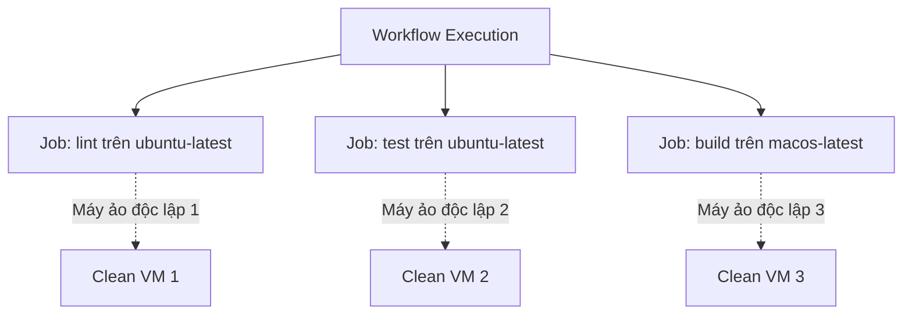

# Cấu hình Jobs: runs-on, phân tách độc lập và môi trường

## 🎯 Mục tiêu
- Nắm vững cú pháp khai báo Job và thuộc tính bắt buộc `runs-on` để chỉ định môi trường điều hành.
- Hiểu rõ nguyên lý cô lập hoàn toàn giữa các Job về hệ thống tệp tin, biến môi trường và tiến trình.
- Biết cách đặt tên định danh cho Job (`job_id`) và hiển thị tên thân thiện (`name`) trên giao diện.

## 🧩 Từ khóa hôm nay
### runs-on
- **Nói dễ hiểu**: Thuộc tính chọn runner theo nhãn hoặc nhóm; với Job chạy lệnh, giá trị thường là nhãn hệ điều hành hoặc `self-hosted`.
- **Ví dụ**: Khai báo `runs-on: ubuntu-latest` để chạy Job trên môi trường Linux Ubuntu mới nhất.
- **Đừng nhầm**: Job chạy trực tiếp trên runner cần `runs-on`; Job gọi reusable workflow dùng `uses` ở cấp Job thay thế.

### Parallel Jobs
- **Nói dễ hiểu**: Cơ chế mặc định của GitHub Actions chạy tất cả các Job trong cùng workflow song song cùng lúc.
- **Ví dụ**: Job `lint` và Job `test` khởi động đồng thời trên hai máy ảo khác nhau để rút ngắn thời gian chờ đợi.
- **Đừng nhầm**: Nếu muốn các Job chạy nối tiếp tuần tự, bạn bắt buộc phải dùng thuộc tính phụ thuộc `needs`.

### Job Isolation
- **Nói dễ hiểu**: Mỗi Job là một đơn vị thực thi riêng; GitHub-hosted thường cấp môi trường sạch, còn self-hosted có thể giữ trạng thái giữa các lần chạy.
- **Ví dụ**: Tệp tin tải về ở Job A không tự động xuất hiện ở Job B trừ khi được chia sẻ qua Artifacts.
- **Đừng nhầm**: Không dựa vào việc hai Job dùng chung ổ đĩa; hãy truyền kết quả bằng Artifact, output hoặc cơ chế lưu trữ phù hợp.

## 📖 Định nghĩa
Một Job là tập hợp các bước được thực thi trên runner được chọn. Với Job chạy steps, `runs-on` chọn runner theo nhãn, ví dụ `ubuntu-latest` hoặc `self-hosted`; có thể chạy một số Job trong container. Job có mã định danh duy nhất (`job_id`). Không nên dựa vào việc Job khác có cùng máy hay workspace; dùng cách truyền dữ liệu rõ ràng.

## 💡 Tại sao cần
Phân tách quy trình thành các Job riêng biệt giúp tận dụng tối đa khả năng xử lý song song, rút ngắn thời gian phản hồi của pipeline từ hàng chục phút xuống còn vài phút. Ngoài ra, việc này cho phép bạn chỉ định môi trường phù hợp cho từng loại tác vụ: chạy linter trên Linux tiết kiệm chi phí, trong khi build ứng dụng iOS chạy trên macOS.

## 🧠 Mental Model
Hãy hình dung bạn điều phối một cuộc thi nấu ăn. Bạn có 3 phòng bếp riêng: một phòng làm bánh (`Job 1` trên Ubuntu), một phòng làm món nướng (`Job 2` trên Windows), và một phòng pha chế (`Job 3` trên macOS). Mỗi người có một căn phòng sạch sẽ với đầy đủ dụng cụ riêng, làm việc đồng thời mà không sợ người này làm đổ bột mì sang chảo dầu của người kia.

## 📊 Sơ đồ minh họa


## 🏢 Ví dụ thực tế
Một công ty phần mềm tài chính cấu hình workflow gồm 3 Jobs: Job 1 chạy linter (`ubuntu-latest`, mất 30 giây); Job 2 chạy unit tests (`ubuntu-latest`, mất 3 phút); Job 3 kiểm tra giao diện Safari (`macos-latest`, mất 5 phút). Vì ba Job chạy đồng thời trên 3 máy ảo riêng, toàn bộ pipeline hoàn thành chỉ trong 5 phút thay vì phải chờ 8 phút 30 giây nếu chạy tuần tự.

## 💻 Command & Cú pháp
```bash
# Xem cấu hình các Job trong tệp workflow
cat .github/workflows/multi-job.yml

# Xem tiến độ thực thi chi tiết của các Job trong lần chạy gần nhất
gh run view
```

## 🔍 Giải thích command
- `cat .github/workflows/multi-job.yml`: Kiểm tra các khối khai báo `jobs`, `runs-on` và `steps` trong tệp cấu hình.
- `gh run view`: Hiển thị trạng thái hoàn thành và thời gian thực thi của từng Job đang chạy song song trên GitHub Actions.

## ⚠️ Sai lầm phổ biến
- Quên khai báo thuộc tính bắt buộc `runs-on` khiến GitHub từ chối biên dịch tệp workflow.
- Chọn hệ điều hành không cần thiết cho tác vụ; mức phí và hạn mức thay đổi theo nền tảng, loại runner và gói dịch vụ.
- Dùng khoảng trắng hoặc ký tự ngoài chữ/số/gạch nối/gạch dưới cho `job_id`; hãy dùng ID dễ đọc gồm chữ, số, `-` hoặc `_`.

## 🧪 Lab thực hành
Bài học này là bài tự kiểm tra: bạn thao tác cấu hình theo hướng dẫn và đối chiếu theo các bước bên dưới.

1. Mở tệp `.github/workflows/multi-job.yml` và khai báo hai Job độc lập:
   ```yaml
   name: Parallel Jobs Demo
   on: [push]
   jobs:
     code-quality:
       name: Kiểm tra chuẩn mã nguồn
       runs-on: ubuntu-latest
       steps:
         - run: echo "Linting passed!"
     unit-testing:
       name: Kiểm thử đơn vị
       runs-on: ubuntu-latest
       steps:
         - run: echo "Unit tests passed!"
   ```
2. Đẩy file lên GitHub và theo dõi tiến trình chạy trong tab Actions.
3. Quan sát hai Job độc lập; chúng có thể được xếp hàng và bắt đầu gần nhau nhưng không được đảm bảo khởi chạy cùng một lúc.

## 💡 Hint & mẹo
- Luôn ưu tiên chọn `ubuntu-latest` trừ khi dự án của bạn bắt buộc phải có môi trường Windows hoặc macOS chuyên biệt.
- Dùng `timeout-minutes` để giới hạn thời gian Job chạy; mức tiêu thụ và tính phí phụ thuộc chính sách hiện hành của runner/repo.

## ✅ Validation & Kết quả mong đợi
- Cả hai Job hiển thị tên tiếng Việt thân thiện trên bảng điều khiển giao diện web của GitHub Actions.
- Hai Job bắt đầu chạy cùng thời điểm và có biểu tượng dấu tích xanh độc lập khi hoàn tất.

## ❓ Quiz nhanh
Hãy hoàn thành bài trắc nghiệm bên dưới để kiểm tra mức độ nắm vững cấu hình Job và thuộc tính `runs-on`.

## 🚀 Thử thách nâng cao
Tra cứu bảng phí/hạn mức GitHub Actions hiện hành và so sánh các loại runner; ghi rõ gói repo và loại runner vì đơn giá thay đổi theo thời gian.

## 📝 Tổng kết
- Mỗi Job chạy trên runner đã chọn; trạng thái giữa các lần chạy phụ thuộc loại runner.
- `runs-on` chọn runner cho Job chạy steps; có thể dùng nhãn hệ điều hành, nhóm hoặc nhãn self-hosted.
- Các Job không có phụ thuộc có thể chạy song song, nhưng thời điểm bắt đầu còn tùy tài nguyên và giới hạn concurrency.
