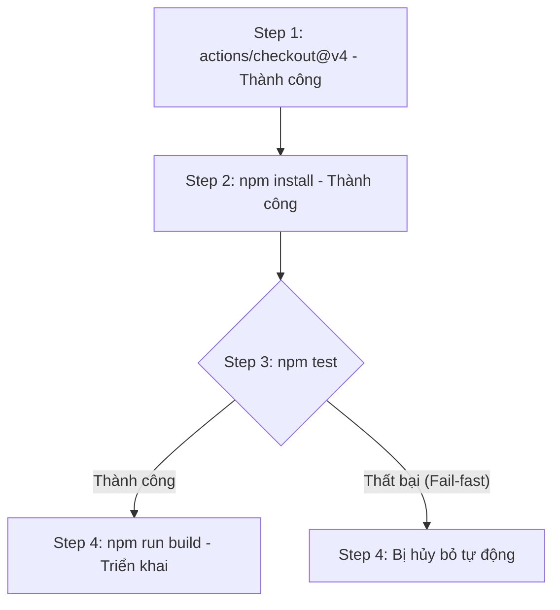

# Các bước thực thi (Steps): name, id và thứ tự tuần tự

## 🎯 Mục tiêu
- Nắm vững cấu trúc danh sách steps trong Job và tính chất thực thi tuần tự nghiêm ngặt.
- Hiểu rõ công dụng của thuộc tính `name` (mô tả trực quan) và thuộc tính `id` (định danh để tham chiếu output).
- Nắm được cơ chế dừng khẩn cấp khi một Step thất bại và cách tiếp tục với `continue-on-error`.

## 🧩 Từ khóa hôm nay
### Sequential Steps
- **Nói dễ hiểu**: Các bước bên trong cùng một Job luôn chạy tuần tự từng bước một từ trên xuống dưới trên cùng máy ảo.
- **Ví dụ**: Bước 1 tải code về đĩa, bước 2 cài thư viện, bước 3 chạy test; không thể chạy lẫn lộn.
- **Đừng nhầm**: Các Step trong cùng một Job không chạy song song; chỉ các Job khác nhau mới chạy song song.

### Fail-fast Mechanism
- **Nói dễ hiểu**: Khi một bước bị lỗi (mã thoát khác 0), toàn bộ các bước phía sau tự động dừng lại ngay lập tức.
- **Ví dụ**: Nếu lệnh `npm test` ở bước 3 bị lỗi, bước 4 `npm run build` sẽ bị bỏ qua để tránh đóng gói code lỗi.
- **Đừng nhầm**: Đây là tính năng bảo vệ an toàn chứ không phải lỗi hệ thống; có thể vượt qua bằng `continue-on-error: true`.

### Step Outputs
- **Nói dễ hiểu**: Dữ liệu do một bước tạo ra và xuất ra để các bước tiếp theo trong cùng Job có thể đọc lại.
- **Ví dụ**: Bước 1 tính ra mã hash phiên bản và gán vào output để bước 3 dùng gắn thẻ tag.
- **Đừng nhầm**: Bắt buộc phải đặt thuộc tính `id` cho bước đó thì các bước sau mới có thể tham chiếu giá trị output.

## 📖 Định nghĩa
Steps (Các bước) là mảng tuần tự các tác vụ cụ thể cần thực hiện bên trong một Job. Mỗi Step có thể là một câu lệnh terminal (`run`) hoặc một action đóng gói sẵn (`uses`). Các Step trong cùng một Job thực thi tuần tự từ trên xuống dưới trên cùng một máy ảo Runner, dùng chung hệ thống tệp tin và các biến môi trường được thiết lập trong suốt phiên làm việc.

## 💡 Tại sao cần
Hiểu rõ cơ chế của Step giúp bạn kiểm soát toàn bộ chu trình xử lý mã nguồn: từ kéo mã nguồn, cài đặt môi trường, chạy kiểm thử cho đến khi dọn dẹp. Cơ chế ngắt khẩn cấp khi một Step thất bại bảo đảm hệ thống không bao giờ tiếp tục xây dựng hoặc phát hành một sản phẩm đang bị lỗi logic.

## 🧠 Mental Model
Hãy tưởng tượng các Step như công thức làm bánh ngọt từng bước: Bước 1: Đập trứng; Bước 2: Đánh tan trứng; Bước 3: Cho đường và sữa; Bước 4: Nướng bánh trong lò. Bạn không thể nướng bánh trước khi đập trứng. Và nếu ở Bước 1 quả trứng bị hỏng (`Step 1 Failed`), bạn phải dừng lại ngay lập tức chứ không được tiếp tục đổ sữa và nướng.

## 📊 Sơ đồ minh họa


## 🏢 Ví dụ thực tế
Một kỹ sư cấu hình Job chạy kiểm thử cho ứng dụng Python: Step 1 tải mã nguồn về; Step 2 cài đặt thư viện pytest; Step 3 chạy lệnh `pytest tests/` với định danh `id: test_run`; Step 4 gửi thông báo thành công. Trong một lần chạy, Step 3 phát hiện lỗi chia cho số 0 và trả về mã lỗi 1. Toàn bộ Job lập tức chuyển sang màu đỏ và Step 4 hoàn toàn không được gọi, giúp tiết kiệm thời gian chạy vô ích.

## 💻 Command & Cú pháp
```bash
# In ra một thông báo kiểm tra trong thuộc tính run của step
echo "Hello Step"

# Xem chi tiết nhật ký log của từng step trong lần chạy gần nhất
gh run view --log
```

## 🔍 Giải thích command
- `echo "Hello Step"`: Ví dụ về một câu lệnh shell đơn giản được thực thi trực tiếp bên trong từ khóa `run` của step.
- `gh run view --log`: Hiển thị toàn bộ dữ liệu đầu ra console của từng step trong Job để phục vụ chẩn đoán lỗi.

## ⚠️ Sai lầm phổ biến
- Cho rằng mỗi Step chạy trong một thư mục riêng biệt (thực tế toàn bộ các Step dùng chung `github.workspace`).
- Thiếu thuộc tính `name` khiến giao diện hiển thị các câu lệnh shell dài dòng rất khó đọc và khó tra cứu lỗi.
- Quên đặt thuộc tính `id` khi muốn trích xuất dữ liệu đầu ra (`outputs`) của Step đó cho các bước tiếp theo sử dụng.

## 🧪 Lab thực hành
Bài học này là bài tự kiểm tra: bạn thao tác cấu hình theo hướng dẫn và đối chiếu theo các bước bên dưới.

1. Khai báo danh sách `steps` gồm ít nhất 3 bước với tên mô tả `name` rõ ràng:
   ```yaml
   name: Steps Sequence Demo
   on: [push]
   jobs:
     demo:
       runs-on: ubuntu-latest
       steps:
         - name: Bước 1 - Kiểm tra môi trường
           run: uname -a
         - name: Bước 2 - Thiết lập biến
           id: setup
           run: echo "status=ready" >> $GITHUB_OUTPUT
         - name: Bước 3 - Đọc biến đầu ra
           run: echo "Trạng thái là ${{ steps.setup.outputs.status }}"
   ```
2. Đẩy file lên GitHub và theo dõi tab Actions để xem các bước chạy tuần tự lần lượt.
3. Thử cố tình chèn lệnh `exit 1` vào bước 2 để quan sát bước 3 tự động bị chuyển sang trạng thái Skipped.

## 💡 Hint & mẹo
- Luôn đặt tên `name` mô tả rõ hành động (ví dụ: "Cài đặt dependencies", "Chạy unit test") thay vì để trống.
- Nếu muốn một bước dọn dẹp luôn luôn chạy kể cả khi test bị lỗi, hãy dùng điều kiện `if: always()`.

## ✅ Validation & Kết quả mong đợi
- Các Step thực thi đúng theo thứ tự khai báo từ trên xuống dưới trên cùng một Runner.
- Cơ chế Fail-fast ngăn chặn các bước sau thực thi khi bước trước đó trả về mã lỗi.

## ❓ Quiz nhanh
Hãy làm bài trắc nghiệm bên dưới để kiểm tra mức độ hiểu biết của bạn về cơ chế thực thi của các Step trong Job.

## 🚀 Thử thách nâng cao
Tìm hiểu cách sử dụng hàm điều kiện `if: failure()` để chỉ kích hoạt một bước gửi thông báo cảnh báo lỗi tới Discord hoặc Slack khi có bước trước đó bị thất bại.

## 📝 Tổng kết
- Các Step trong Job luôn thực thi tuần tự từ trên xuống dưới trên cùng một Runner.
- Nếu một Step gặp lỗi (exit code khác 0), mặc định các Step tiếp theo sẽ bị hủy bỏ ngay lập tức.
- Đặt `id` cho Step cho phép chia sẻ dữ liệu đầu ra giữa các bước một cách mạch lạc.
