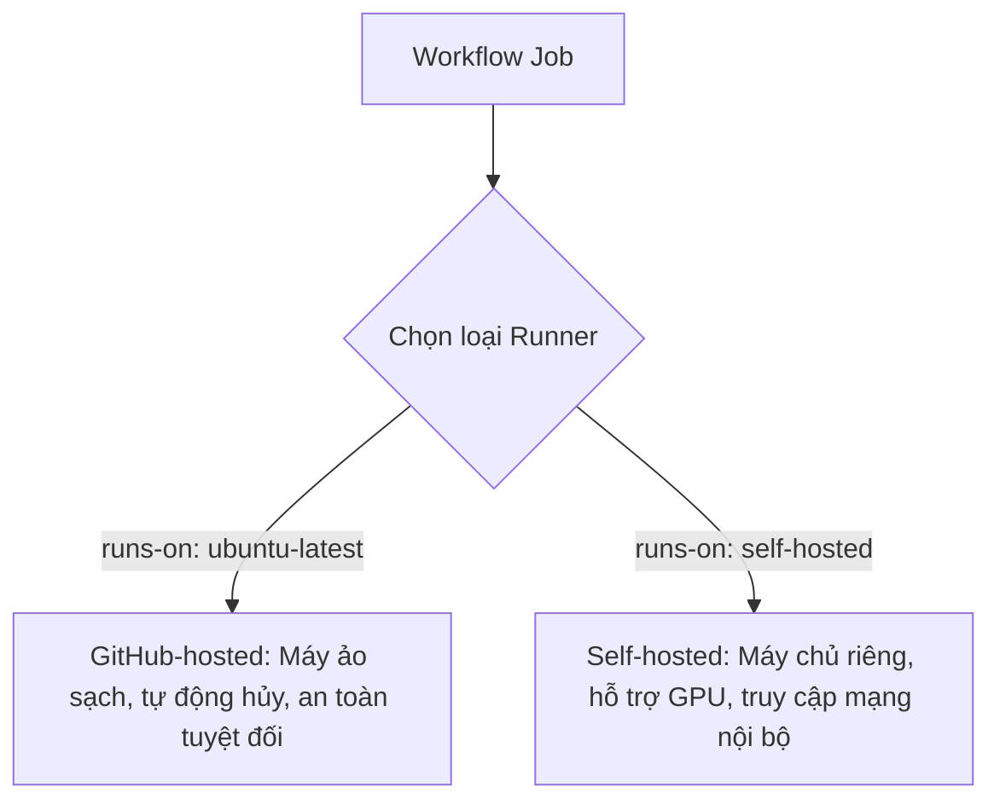

# Môi trường thực thi Runners: GitHub-hosted vs Self-hosted

## 🎯 Mục tiêu
- Phân biệt rõ ràng giữa hai mô hình: GitHub-hosted Runners và Self-hosted Runners.
- Nắm được các ưu điểm và hạn chế về tài nguyên, chi phí, tốc độ và tính bảo mật của từng loại.
- Hiểu rõ các rủi ro bảo mật nghiêm trọng khi sử dụng Self-hosted Runners trên các kho lưu trữ công khai.

## 🧩 Từ khóa hôm nay
### GitHub-hosted Runner
- **Nói dễ hiểu**: Máy ảo do chính GitHub quản lý, tự động cấp phát sạch sẽ và tự hủy ngay sau khi Job kết thúc.
- **Ví dụ**: Dùng `runs-on: ubuntu-latest` để nhận một máy ảo Linux được cài sẵn Docker, Node.js và Git.
- **Đừng nhầm**: Không lưu giữ trạng thái giữa các lần chạy; mỗi lần chạy mới bạn lại có một máy ảo hoàn toàn trắng tinh.

### Self-hosted Runner
- **Nói dễ hiểu**: Máy chủ riêng do bạn hoặc công ty tự cắm điện, cài đặt ứng dụng Runner và kết nối với GitHub.
- **Ví dụ**: Máy chủ có gắn 2 card GPU đặt tại văn phòng để huấn luyện mô hình trí tuệ nhân tạo.
- **Đừng nhầm**: Bạn phải tự bảo trì, cập nhật hệ điều hành và dọn dẹp ổ đĩa; GitHub không quản lý phần cứng này cho bạn.

### Ephemeral Environment
- **Nói dễ hiểu**: Môi trường tạm thời, sinh ra tức thời theo yêu cầu và biến mất hoàn toàn sau khi làm xong nhiệm vụ.
- **Ví dụ**: Máy ảo GitHub-hosted tự xóa mọi tệp tin và tiến trình sau khi bước cuối cùng của Job hoàn tất.
- **Đừng nhầm**: Không thể tìm lại file trên ổ đĩa sau khi Job kết thúc trừ khi bạn đã upload file đó lên Artifacts.

## 📖 Định nghĩa
Runner là ứng dụng dịch vụ chạy trên máy chủ chịu trách nhiệm thực thi các bước trong Job. GitHub cung cấp hai loại chính: GitHub-hosted Runners (máy ảo tạm thời do GitHub tự động cấp phát, cài sẵn công cụ và hủy sau mỗi phiên) và Self-hosted Runners (máy chủ vật lý, máy ảo hoặc container do bạn tự quản lý và kết nối) đem lại khả năng kiểm soát hạ tầng và mạng nội bộ tối đa.

## 💡 Tại sao cần
Lựa chọn đúng loại Runner là quyết định chiến lược về chi phí và hiệu năng. GitHub-hosted tiện lợi tuyệt đối, không tốn công quản trị hạ tầng. Trong khi đó, Self-hosted Runners cho phép khai thác phần cứng đặc thù như card đồ họa GPU hoặc truy cập trực tiếp vào cơ sở dữ liệu nội bộ công ty mà không cần mở cổng ra Internet.

## 🧠 Mental Model
Hãy so sánh việc đi xe taxi công nghệ (`GitHub-hosted`) với việc sở hữu xe tải riêng (`Self-hosted`). Với taxi, bạn chỉ cần mở ứng dụng bấm gọi xe; xe luôn sạch sẽ, đi xong bạn bước xuống xe và không cần bận tâm thay dầu hay rửa xe. Còn xe tải riêng đòi hỏi bạn tự đổ xăng, bảo dưỡng, nhưng bạn có thể độ thùng xe siêu trường siêu trọng để chở hàng quá khổ mà không hãng taxi nào đáp ứng được.

## 📊 Sơ đồ minh họa


## 🏢 Ví dụ thực tế
Một công ty công nghệ phát triển mô hình trí tuệ nhân tạo nhận thấy các GitHub-hosted Runners thông thường chỉ có 2 đến 4 CPU ảo, khiến quá trình kiểm thử mô hình học sâu mất hơn hai tiếng. Nhóm quyết định lắp đặt một máy chủ Self-hosted có 64 nhân CPU và 2 card GPU NVIDIA tại văn phòng, sau đó cài đặt ứng dụng Runner. Kể từ đó, thời gian kiểm thử mô hình giảm xuống chỉ còn 6 phút trên kho lưu trữ nội bộ.

## 💻 Command & Cú pháp
```bash
# Kiểm tra thông tin kiến trúc hạt nhân của máy ảo Runner
uname -a

# Xem thông tin phiên bản hệ điều hành Linux đang cấp phát
cat /etc/os-release

# Kiểm tra dung lượng bộ nhớ RAM khả dụng trong môi trường
free -m
```

## 🔍 Giải thích command
- `uname -a`: Trả về tên kiến trúc phần cứng, phiên bản kernel Linux đang chạy trên máy ảo của GitHub.
- `cat /etc/os-release`: Hiển thị chi tiết bản phân phối Linux (ví dụ Ubuntu 22.04 LTS hoặc 24.04 LTS).
- `free -m`: Kiểm tra thông số bộ nhớ RAM khả dụng và dung lượng swap của Runner tính bằng megabytes.

## ⚠️ Sai lầm phổ biến
- Gắn Self-hosted Runner vào một kho lưu trữ công khai (Public Repo), tạo cơ hội cho kẻ xấu mở Pull Request chạy mã độc chiếm quyền máy chủ.
- Không dọn dẹp các tệp tin tạm thời trên Self-hosted Runner khiến ổ cứng bị đầy sau một thời gian vận hành.
- Kỳ vọng GitHub-hosted Runner lưu lại tệp tin đã tải về giữa hai lần kích hoạt workflow khác nhau.

## 🧪 Lab thực hành
Bài học này là bài tự kiểm tra: bạn thao tác cấu hình theo hướng dẫn và đối chiếu theo các bước bên dưới.

1. Tạo một workflow kiểm tra thông số máy chủ GitHub-hosted:
   ```yaml
   name: Runner Specs Demo
   on: [workflow_dispatch]
   jobs:
     specs:
       runs-on: ubuntu-latest
       steps:
         - name: Kiểm tra thông tin hệ điều hành
           run: uname -a && cat /etc/os-release
         - name: Kiểm tra bộ nhớ và ổ đĩa
           run: free -m && df -h
   ```
2. Đẩy file lên GitHub và kích hoạt thủ công qua nút Run workflow.
3. Mở log của các bước để xem dung lượng RAM, dung lượng ổ đĩa và cấu hình CPU được cấp phát.

## 💡 Hint & mẹo
- Trên GitHub-hosted Linux, bạn có toàn quyền thực thi lệnh với quyền quản trị viên `sudo` mà không cần nhập mật khẩu.
- Đối với kho lưu trữ mã nguồn mở (Public Repo), hãy luôn gắn bó với GitHub-hosted Runners để bảo đảm an toàn.

## ✅ Validation & Kết quả mong đợi
- Log hiển thị chi tiết thông số môi trường Linux Ubuntu được cấp phát sạch sẽ.
- Nắm rõ sự khác biệt giữa mô hình tạm thời (ephemeral) của GitHub và mô hình lưu trạng thái (stateful) của Self-hosted.

## ❓ Quiz nhanh
Hãy hoàn thành bài trắc nghiệm bên dưới để kiểm tra mức độ phân biệt giữa GitHub-hosted và Self-hosted Runners.

## 🚀 Thử thách nâng cao
Tìm hiểu cơ chế Ephemeral Self-hosted Runners kết hợp với Docker hoặc Kubernetes để tự động tạo mới và xóa bỏ pod Runner sau mỗi Job giống hệt như GitHub-hosted.

## 📝 Tổng kết
- GitHub-hosted Runners là máy ảo do GitHub quản lý, bảo đảm môi trường sạch sẽ và cách ly an toàn.
- Self-hosted Runners do bạn tự vận hành, phù hợp cho phần cứng chuyên biệt (GPU) và truy cập mạng nội bộ.
- Tuyệt đối không dùng Self-hosted Runners trên Public Repositories để phòng tránh rủi ro thực thi mã độc.
