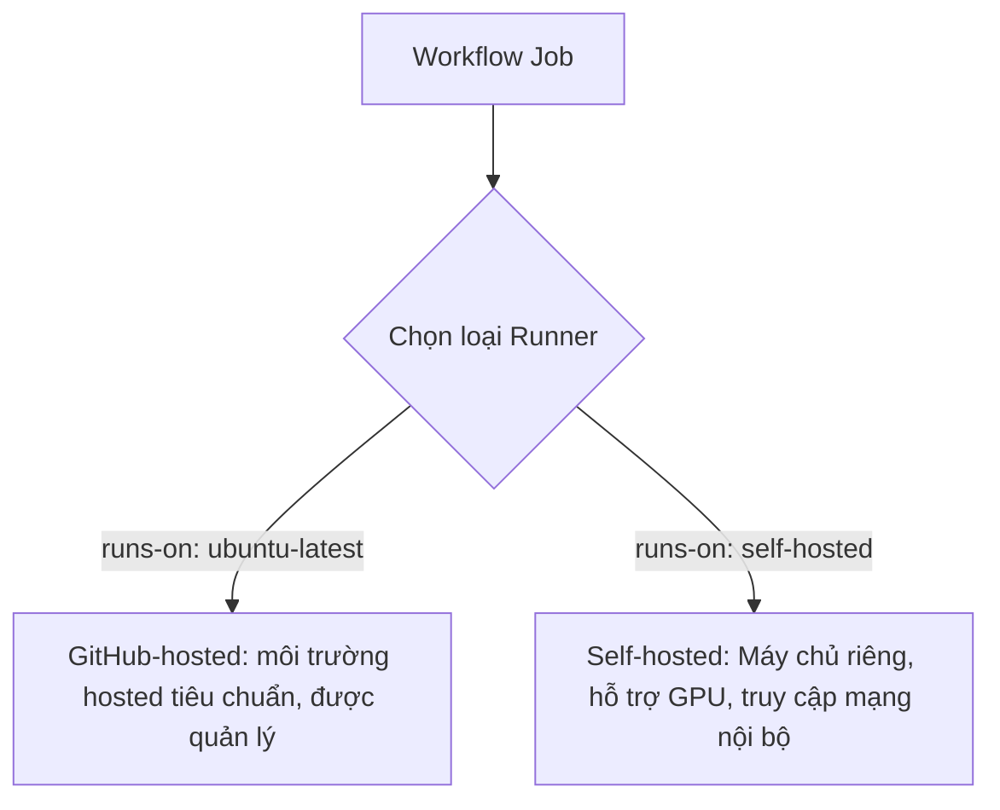

# Môi trường thực thi Runners: GitHub-hosted vs Self-hosted

## 🎯 Mục tiêu
- Phân biệt rõ ràng giữa hai mô hình: GitHub-hosted Runners và Self-hosted Runners.
- Nắm được các ưu điểm và hạn chế về tài nguyên, chi phí, tốc độ và tính bảo mật của từng loại.
- Hiểu rõ các rủi ro bảo mật nghiêm trọng khi sử dụng Self-hosted Runners trên các kho lưu trữ công khai.

## 🧩 Từ khóa hôm nay
### GitHub-hosted Runner
- **Nói dễ hiểu**: Runner do GitHub quản lý; runner hosted tiêu chuẩn dùng môi trường sạch cho Job và được thu hồi sau đó.
- **Ví dụ**: Dùng `runs-on: ubuntu-latest` để nhận một máy ảo Linux được cài sẵn Docker, Node.js và Git.
- **Đừng nhầm**: Không nên dựa vào trạng thái cục bộ giữa các Job/run; runner lớn hơn hoặc cấu hình đặc biệt có thể khác runner tiêu chuẩn.

### Self-hosted Runner
- **Nói dễ hiểu**: Máy chủ riêng do bạn hoặc công ty tự cắm điện, cài đặt ứng dụng Runner và kết nối với GitHub.
- **Ví dụ**: Máy chủ có gắn 2 card GPU đặt tại văn phòng để huấn luyện mô hình trí tuệ nhân tạo.
- **Đừng nhầm**: Bạn phải tự bảo trì, cập nhật hệ điều hành và dọn dẹp ổ đĩa; GitHub không quản lý phần cứng này cho bạn.

### Ephemeral Runner
- **Nói dễ hiểu**: Runner chỉ nhận một Job rồi bị gỡ khỏi dịch vụ; với self-hosted, người vận hành vẫn phải tự xóa hoặc làm sạch máy.
- **Ví dụ**: Hệ thống autoscaling đăng ký self-hosted runner ở chế độ ephemeral, chuyển log ra kho riêng và hủy máy sau Job.
- **Đừng nhầm**: Đây là cấu hình self-hosted có quy trình quản lý; không phải mọi self-hosted runner đều ephemeral.

## 📖 Định nghĩa
Runner là ứng dụng thực thi Job. GitHub-hosted runners do GitHub vận hành; self-hosted runners chạy trên máy hoặc môi trường do tổ chức quản lý. Runner hosted tiêu chuẩn thường được cấp môi trường sạch cho mỗi Job; self-hosted có thể giữ trạng thái và cần quy trình cập nhật, làm sạch, giới hạn quyền truy cập.

## 🤔 Tại sao cần?
Lựa chọn runner ảnh hưởng đến quyền truy cập, bảo trì, tài nguyên và chi phí. GitHub-hosted giảm việc tự quản trị máy; self-hosted có thể cần GPU hoặc mạng nội bộ nhưng tăng trách nhiệm vận hành và rủi ro bảo mật.

## 🧠 Mental Model (Mô hình tư duy)
Hãy so sánh việc đi xe taxi công nghệ (`GitHub-hosted`) với việc sở hữu xe tải riêng (`Self-hosted`). Với taxi, bạn chỉ cần mở ứng dụng bấm gọi xe; xe luôn sạch sẽ, đi xong bạn bước xuống xe và không cần bận tâm thay dầu hay rửa xe. Còn xe tải riêng đòi hỏi bạn tự đổ xăng, bảo dưỡng, nhưng bạn có thể độ thùng xe siêu trường siêu trọng để chở hàng quá khổ mà không hãng taxi nào đáp ứng được.

## 🖼 Sơ đồ


## 🌎 Ví dụ thực tế
Trong môi trường phát triển dự án thực tế: một nhóm cần chạy workload GPU hoặc truy cập mạng nội bộ có thể cân nhắc self-hosted runner. Trước khi chọn, nhóm đo tài nguyên, thời gian chạy và tổng chi phí; con số benchmark phải được đo trên hạ tầng thực tế.

## 💻 Command
```bash
# Kiểm tra thông tin kiến trúc hạt nhân của máy ảo Runner
uname -a

# Xem thông tin phiên bản hệ điều hành Linux đang cấp phát
cat /etc/os-release

# Kiểm tra dung lượng bộ nhớ RAM khả dụng trong môi trường
free -m
```

## 🔍 Giải thích command
- `uname -a`: Trả về tên kiến trúc phần cứng, phiên bản kernel Linux đang chạy trên máy ảo của GitHub.
- `cat /etc/os-release`: Hiển thị chi tiết bản phân phối Linux (ví dụ Ubuntu 22.04 LTS hoặc 24.04 LTS).
- `free -m`: Kiểm tra thông số bộ nhớ RAM khả dụng và dung lượng swap của Runner tính bằng megabytes.

## ⚠️ Sai lầm phổ biến
- Cho mã không đáng tin cậy chạy trên self-hosted runner có dữ liệu/quyền nhạy cảm; GitHub khuyến nghị hầu như không dùng loại runner này cho repo công khai.
- Không dọn dẹp các tệp tin tạm thời trên Self-hosted Runner khiến ổ cứng bị đầy sau một thời gian vận hành.
- Kỳ vọng GitHub-hosted Runner lưu lại tệp tin đã tải về giữa hai lần kích hoạt workflow khác nhau.

## 🧪 Lab
Hãy mở terminal và cùng tôi thực hành từng bước dưới đây để làm chủ kỹ năng:

1. Tạo một workflow kiểm tra thông số máy chủ GitHub-hosted:
   ```yaml
   name: Runner Specs Demo
   on: [workflow_dispatch]
   jobs:
     specs:
       runs-on: ubuntu-latest
       steps:
         - name: Kiểm tra thông tin hệ điều hành
           run: uname -a && cat /etc/os-release
         - name: Kiểm tra bộ nhớ và ổ đĩa
           run: free -m && df -h
   ```
2. Đẩy file lên GitHub và kích hoạt thủ công qua nút Run workflow.
3. Mở log của các bước để xem dung lượng RAM, dung lượng ổ đĩa và cấu hình CPU được cấp phát.

## 💡 Hint
- Trên GitHub-hosted Linux, bạn có toàn quyền thực thi lệnh với quyền quản trị viên `sudo` mà không cần nhập mật khẩu.
- Với repo công khai, ưu tiên GitHub-hosted runner; nếu có ngoại lệ self-hosted, cần đánh giá cách ly mã không tin cậy và bảo vệ hạ tầng.

## ✅ Validation
- Log hiển thị thông tin hệ điều hành của runner; con số phần cứng có thể thay đổi theo image/loại runner.
- Phân biệt runner hosted tiêu chuẩn với self-hosted; self-hosted có thể được cấu hình ephemeral nhưng cần tự vận hành việc làm sạch.

## ❓ Quiz
Hãy hoàn thành bài trắc nghiệm bên dưới để kiểm tra mức độ phân biệt giữa GitHub-hosted và Self-hosted Runners.

## 🔥 Challenge
Tìm hiểu cơ chế Ephemeral Self-hosted Runners kết hợp với Docker hoặc Kubernetes để tự động tạo mới và xóa bỏ pod Runner sau mỗi Job giống hệt như GitHub-hosted.

## 📚 Tổng kết
- GitHub-hosted runners do GitHub quản lý; runner tiêu chuẩn thường cấp môi trường sạch cho từng Job.
- Self-hosted Runners do bạn tự vận hành, phù hợp cho phần cứng chuyên biệt (GPU) và truy cập mạng nội bộ.
- Tránh self-hosted runners trên repo công khai vì PR không tin cậy có thể thực thi mã; xem hướng dẫn bảo mật trước khi có ngoại lệ.
