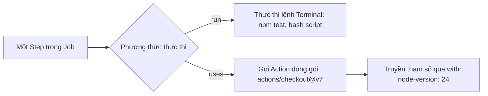

# Phân biệt run (shell command) vs uses (prebuilt action)

## 🎯 Mục tiêu
- Phân biệt rõ ràng mục đích sử dụng giữa lệnh shell tự do (`run`) và hành động đóng gói sẵn (`uses`).
- Hiểu cú pháp tham chiếu Action: `owner/repo@ref` (ví dụ: `actions/checkout@v7`) và phân biệt tag với commit SHA đầy đủ.
- Biết cách truyền tham số cấu hình cho Action thông qua từ khóa `with`.

## 🧩 Từ khóa hôm nay
### run Command
- **Nói dễ hiểu**: Từ khóa để gõ và chạy trực tiếp các câu lệnh dòng lệnh terminal trong hệ điều hành của máy ảo Runner.
- **Ví dụ**: Dùng `run: npm test` để chạy bộ bài kiểm thử hoặc `run: ls -la` để xem thư mục.
- **Đừng nhầm**: Chạy với shell mặc định của máy ảo (Bash trên Linux/macOS, PowerShell trên Windows).

### uses Action
- **Nói dễ hiểu**: Từ khóa để gọi và tái sử dụng một Action có sẵn do cộng đồng hoặc GitHub đóng gói trên Marketplace.
- **Ví dụ**: Dùng `uses: actions/checkout@v7` để kéo mã nguồn về máy ảo mà không cần tự viết lệnh clone.
- **Đừng nhầm**: Cần có một ref sau `@`; tag như `@v7` dễ đọc nhưng có thể thay đổi, còn full commit SHA là cách ghim bất biến.

### with Parameters
- **Nói dễ hiểu**: Khối dữ liệu khai báo các tham số đầu vào (inputs) truyền vào cho một Action được gọi bằng `uses`.
- **Ví dụ**: Dùng `with: { node-version: '24' }` để thông báo cho `actions/setup-node` biết cần cài Node.js bản nào.
- **Đừng nhầm**: Chỉ dùng với `uses`; không thể dùng `with` với câu lệnh `run`.

## 📖 Định nghĩa
Trong định nghĩa của một Step, bạn có hai phương thức chính để thực thi công việc: `run` và `uses`. Từ khóa `run` dùng để chạy trực tiếp các câu lệnh shell trên hệ điều hành của Runner. Trong khi đó, `uses` dùng để gọi và thực thi một Action đã được đóng gói sẵn từ GitHub Marketplace hoặc từ nội bộ dự án theo định dạng chuẩn `owner/repo@ref`.

## 🤔 Tại sao cần?
Nếu không có Action đóng gói sẵn (`uses`), bạn phải tự viết hàng chục dòng lệnh shell phức tạp: tự clone mã nguồn có xác thực token, tự giải nén runtime, tự xử lý khác biệt giữa Linux và Windows. Sử dụng `uses` giúp kịch bản ngắn gọn, đạt chuẩn thực hành tốt nhất của ngành và dễ dàng nâng cấp bảo trì.

## 🧠 Mental Model (Mô hình tư duy)
Hãy so sánh việc tự tay nấu ăn tại nhà (`run`) với việc mua một gói thực phẩm chế biến sẵn (`uses`). Với `run`, bạn tự nhào bột, nêm gia vị và nướng bằng lò (toàn quyền kiểm soát từng chi tiết nhưng tốn nhiều công sức). Với `uses`, bạn bóc gói và làm theo hướng dẫn in trên bao bì (`with`) của các chuyên gia ẩm thực quốc tế mà không lo bị cháy.

## 🖼 Sơ đồ


## 🌎 Ví dụ thực tế
Ví dụ: một dự án TypeScript dùng `actions/checkout@v7` trước các bước cần mã nguồn, rồi dùng `actions/setup-node@v7` với `node-version: '24'`. Bước tiếp theo chạy `npm test` nếu script này có trong `package.json`. Trong repo nhạy cảm, nhóm cân nhắc ghim Action bằng full commit SHA và kiểm tra nhà phát hành, quyền, mã nguồn.

## 💻 Command
```bash
# Minh họa lệnh shell chạy trong run
node --version
npm test

# Kiểm tra mã nguồn đã được tải về bởi actions/checkout chưa
ls -la
```

## 🔍 Giải thích command
- `node --version`: Lệnh kiểm tra phiên bản môi trường thực thi đã được cài đặt thành công bởi action setup-node.
- `npm test`: Lệnh thực thi bài kiểm thử ứng dụng thông qua từ khóa `run` của step.
- `ls -la`: Xác nhận toàn bộ tệp tin trong repository đã được kéo về thư mục làm việc của máy ảo.

## ⚠️ Sai lầm phổ biến
- Nghĩ rằng tag phiên bản (`@v7`) là bất biến; tag có thể được di chuyển, còn full commit SHA ghim đúng revision.
- Dùng `run` để tự viết lại những tác vụ phức tạp đã có sẵn action chuẩn mực như checkout hay upload-artifact.
- Đặt nhầm các tham số cấu hình của Action ngang hàng với `uses` thay vì đặt thụt dòng bên trong khối `with`.

## 🧪 Lab
Hãy mở terminal và cùng tôi thực hành từng bước dưới đây để làm chủ kỹ năng:

1. Khởi tạo một tệp workflow kết hợp cả `uses` và `run`:
   ```yaml
   name: Run vs Uses Demo
   on: [push]
   jobs:
     build:
       runs-on: ubuntu-latest
       steps:
         - name: Tải mã nguồn
           uses: actions/checkout@v7
         - name: Cài đặt môi trường Node.js
           uses: actions/setup-node@v7
           with:
           node-version: '24'
         - name: Chạy lệnh kiểm tra phiên bản
           run: |
             echo "Phiên bản Node hiện tại:"
             node -v
             npm -v
   ```
2. Đẩy commit lên GitHub và vào tab Actions để kiểm tra.
3. Quan sát log xem `setup-node` cài Node 24 và bước `run` in ra phiên bản tương ứng.

## 💡 Hint
- Đặt `actions/checkout` trước những bước cần đọc mã nguồn; Job không cần repository có thể không cần checkout.
- Sử dụng ký tự thanh dọc `|` sau `run:` để viết nhiều câu lệnh shell liên tiếp một cách rõ ràng.

## ✅ Validation
- Tệp tin của repository xuất hiện trong thư mục làm việc của Runner sau bước checkout.
- Lệnh `node -v` in ra phiên bản v24.x trong console log của GitHub Actions.

## ❓ Quiz
Hãy hoàn thành bài trắc nghiệm bên dưới để kiểm tra mức độ phân biệt giữa `run` và `uses`.

## 🔥 Challenge
So sánh tag phiên bản dễ đọc với full commit SHA trong workflow cần kiểm soát chuỗi cung ứng chặt; không dùng SHA rút gọn làm ví dụ ghim.

## 📚 Tổng kết
- `run` dùng để thực thi trực tiếp các câu lệnh shell trên hệ điều hành của Runner.
- `uses` dùng để gọi các Action đóng gói sẵn từ Marketplace theo cú pháp `owner/repo@version`.
- Sử dụng khối `with:` để truyền các tham số cấu hình đầu vào cho Action.
