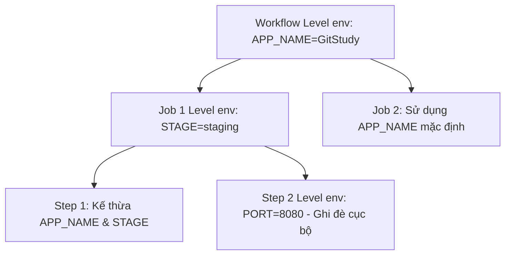

# Biến môi trường (Environment Variables) cấp workflow, job và step

## 🎯 Mục tiêu
- Làm chủ từ khóa `env` và cơ chế kế thừa phạm vi (scope): cấp Workflow, cấp Job và cấp Step.
- Sử dụng các biến môi trường mặc định có sẵn của GitHub: `GITHUB_SHA`, `GITHUB_REF`, `GITHUB_REPOSITORY`.
- Biết cách đọc biến môi trường trong câu lệnh shell (`$ENV_VAR`) và truyền biến động giữa các bước qua `$GITHUB_ENV`.

## 🧩 Từ khóa hôm nay
### Environment Scope
- **Nói dễ hiểu**: Phạm vi hiệu lực của biến môi trường, có thể áp dụng cho toàn bộ Workflow, riêng một Job, hay chỉ riêng một Step.
- **Ví dụ**: Đặt `env: { APP_NAME: "Shop" }` ở đầu file để mọi Job và Step đều đọc được.
- **Đừng nhầm**: Khai báo ở cấp con (Step) sẽ ghi đè lên giá trị cùng tên của cấp cha (Job hoặc Workflow).

### Default Variables
- **Nói dễ hiểu**: Các biến môi trường có sẵn do GitHub tự động tiêm vào máy ảo Runner mà không cần bạn khai báo.
- **Ví dụ**: Biến `$GITHUB_SHA` chứa mã băm 40 ký tự của commit vừa kích hoạt workflow.
- **Đừng nhầm**: Đây là các biến chỉ đọc (read-only); bạn không thể thay đổi giá trị của chúng trong khi chạy.

### $GITHUB_ENV File
- **Nói dễ hiểu**: Tệp tin đặc biệt dùng để lưu biến môi trường động do một bước tính toán ra để các bước sau dùng lại.
- **Ví dụ**: Chạy `echo "VERSION=1.2.0" >> $GITHUB_ENV` để các bước tiếp theo đọc được `$VERSION`.
- **Đừng nhầm**: Lệnh `export VERSION=1.2.0` thông thường sẽ biến mất ngay khi bước đó kết thúc.

## 📖 Định nghĩa
Biến môi trường (Environment Variables) trong GitHub Actions cho phép bạn lưu trữ và truyền các thông tin cấu hình vào các tiến trình thực thi của Runner. Bạn có thể định nghĩa biến bằng từ khóa `env` ở ba cấp độ: toàn bộ Workflow (áp dụng cho mọi Job), một Job cụ thể (kế thừa cho các Step của Job đó), hoặc chỉ riêng một Step cá lẻ với tính phân tầng và cục bộ cao.

## 💡 Tại sao cần
Sử dụng biến môi trường giúp tách bạch giữa mã nguồn logic và các giá trị cấu hình theo môi trường (như `NODE_ENV`, `PORT`, `API_URL`). Điều này tuân thủ nguyên tắc 12-Factor App, giúp kịch bản CI/CD linh hoạt, dễ dàng chuyển đổi giữa các môi trường phát triển, kiểm thử và sản xuất mà không cần sửa code.

## 🧠 Mental Model
Hãy tưởng tượng hệ thống điều hòa trong một tòa chung cư: Biến cấp Workflow như hệ thống điều hòa tổng của toàn tòa nhà (mọi căn hộ đều nhận chung mức nhiệt độ). Biến cấp Job như chiếc điều hòa riêng trong phòng khách căn hộ (chỉ người trong căn hộ đó hưởng). Và biến cấp Step như chiếc quạt cầm tay mini chỉ thổi mát riêng cho một người trong tích tắc.

## 📊 Sơ đồ minh họa


## 🏢 Ví dụ thực tế
Một kỹ sư cấu hình đường ống phát hành cho ứng dụng web đa môi trường. Ở cấp cao nhất của workflow, kỹ sư khai báo `env: { APP_ENV: 'test', REGION: 'ap-southeast-1' }`. Mọi câu lệnh shell trong các Step đều truy cập được hai biến này. Ở một Step chạy kiểm thử đặc thù, kỹ sư thêm biến cục bộ `env: { DEBUG: 'true', RETRIES: '3' }`. Nhờ phân tầng phạm vi thông minh, bài kiểm thử nhận đúng cấu hình debug chi tiết mà không làm ảnh hưởng đến các tác vụ đóng gói khác.

## 💻 Command & Cú pháp
```bash
# In ra mã băm commit SHA mặc định
echo $GITHUB_SHA

# In ra biến môi trường cấu hình tùy biến
echo $NODE_ENV

# Lưu biến môi trường động cho các bước tiếp theo sử dụng
echo "RELEASE_TAG=v1.2.0" >> $GITHUB_ENV
```

## 🔍 Giải thích command
- `echo $GITHUB_SHA`: Đọc biến môi trường mặc định chứa mã định danh duy nhất của commit đang được chạy.
- `echo $NODE_ENV`: Đọc giá trị biến môi trường tùy chỉnh được khai báo trong khối `env`.
- `echo "KEY=val" >> $GITHUB_ENV`: Ghi thêm cặp khóa giá trị vào tệp biến môi trường của GitHub Actions để truyền sang các step sau.

## ⚠️ Sai lầm phổ biến
- Nhầm lẫn việc ghi đè tên biến ở cấp Step khiến các giá trị quan trọng ở cấp Job bị mất hiệu lực.
- Lưu trữ mật khẩu, API key hoặc token bí mật trong khối `env` thay vì dùng GitHub Secrets.
- Nhầm lẫn cú pháp truy cập biến môi trường trong shell (`$MY_VAR`) với cú pháp ngữ cảnh của GitHub Actions (`${{ env.MY_VAR }}`).

## 🧪 Lab thực hành
Bài học này là bài tự kiểm tra: bạn thao tác cấu hình theo hướng dẫn và đối chiếu theo các bước bên dưới.

1. Tạo tệp workflow minh họa kế thừa biến môi trường:
   ```yaml
   name: Env Scope Demo
   on: [workflow_dispatch]
   env:
     GLOBAL_APP: "Git Academy"
   jobs:
     test:
       runs-on: ubuntu-latest
       env:
         JOB_LEVEL: "Testing Stage"
       steps:
         - name: Đọc biến kế thừa
           run: |
             echo "Global: $GLOBAL_APP"
             echo "Job: $JOB_LEVEL"
             echo "Repo: $GITHUB_REPOSITORY"
         - name: Thiết lập biến động
           run: echo "DYNAMIC_STATUS=Completed" >> $GITHUB_ENV
         - name: Đọc biến động từ bước trước
           run: echo "Status: $DYNAMIC_STATUS"
   ```
2. Đẩy file lên GitHub và kích hoạt thủ công qua nút Run workflow.
3. Quan sát log xem các biến được in ra đầy đủ và biến động được truyền thành công giữa hai bước.

## 💡 Hint & mẹo
- Biến khai báo ở cấp con (Step) luôn ghi đè lên biến cùng tên được khai báo ở cấp cha (Job hoặc Workflow).
- Khi chạy trên Windows Runner (PowerShell), cú pháp đọc biến môi trường là `$env:MY_VAR` thay vì `$MY_VAR`.

## ✅ Validation & Kết quả mong đợi
- Console log hiển thị chính xác giá trị của các biến môi trường ở cả ba cấp độ Workflow, Job và Step.
- Biến được ghi vào `$GITHUB_ENV` ở bước trước được đọc chính xác ở các bước tiếp theo.

## ❓ Quiz nhanh
Hãy làm bài trắc nghiệm bên dưới để kiểm tra mức độ nắm vững phạm vi và quy tắc phân tầng biến môi trường trong GitHub Actions.

## 🚀 Thử thách nâng cao
Tìm hiểu sự khác biệt giữa biến môi trường (`env`) và ngữ cảnh (`contexts`), giải thích khi nào bắt buộc phải dùng cú pháp `${{ env.MY_VAR }}` thay vì `$MY_VAR`.

## 📝 Tổng kết
- Từ khóa `env` cho phép khai báo biến môi trường ở 3 cấp độ: Workflow, Job và Step.
- Cấp con tự động kế thừa các biến từ cấp cha và có quyền ghi đè giá trị nếu cần.
- Sử dụng tệp `$GITHUB_ENV` để truyền các giá trị được tính toán động giữa các bước trong cùng một Job.
