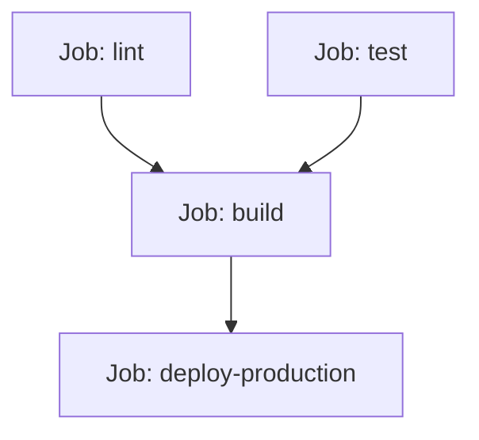

# Quan hệ phụ thuộc giữa các Job với thuộc tính needs

## 🎯 Mục tiêu
- Làm chủ thuộc tính `needs` để thiết lập mối quan hệ phụ thuộc có thứ tự giữa các Job.
- Hiểu cách GitHub Actions xây dựng Đồ thị có hướng không chu trình (DAG) từ các khai báo `needs`.
- Biết cách truyền và sử dụng kết quả (`needs.<job_id>.result`) hoặc dữ liệu đầu ra giữa các Job.

## 🧩 Từ khóa hôm nay
### needs Property
- **Nói dễ hiểu**: Thuộc tính yêu cầu Job này phải đợi một hoặc nhiều Job khác chạy thành công xong mới được bắt đầu.
- **Ví dụ**: Khai báo `needs: [test, lint]` trong Job `deploy` để bảo đảm code sạch và pass test rồi mới deploy.
- **Đừng nhầm**: Mặc định các Job không đợi nhau mà chạy song song; bạn bắt buộc phải chỉ định `needs` nếu muốn chạy tuần tự.

### Directed Acyclic Graph
- **Nói dễ hiểu**: Đồ thị có hướng không chu trình (DAG), mô hình luồng công việc đi một chiều từ gốc tới ngọn không bị lặp vòng.
- **Ví dụ**: Sơ đồ Lint và Test cùng trỏ mũi tên vào Build, và Build trỏ mũi tên vào Deploy.
- **Đừng nhầm**: Đây là cấu trúc đồ thị toán học; không được phép có mũi tên quay ngược tạo thành vòng lặp luẩn quẩn.

### Circular Dependency
- **Nói dễ hiểu**: Lỗi vòng lặp luẩn quẩn khi Job A đợi Job B và Job B lại khai báo đợi Job A.
- **Ví dụ**: Hệ thống bị bế tắc và GitHub Actions sẽ từ chối biên dịch tệp workflow ngay lập tức.
- **Đừng nhầm**: Không có Job nào được chạy trong trường hợp này; toàn bộ workflow sẽ bị báo lỗi xác thực cú pháp.

## 📖 Định nghĩa
Mặc định, các Job độc lập trong cùng một workflow sẽ chạy hoàn toàn song song nhằm tiết kiệm thời gian. Tuy nhiên, thuộc tính `needs` cho phép bạn định nghĩa các mối quan hệ phụ thuộc có hướng giữa các Job, biến các tác vụ rời rạc thành một chuỗi đường ống (Pipeline) có trật tự chặt chẽ. Một Job có khai báo `needs: [job_a, job_b]` sẽ chỉ bắt đầu khi cả hai Job A và B đều đã hoàn thành thành công.

## 💡 Tại sao cần
Trong quy trình phát hành chuyên nghiệp, bạn không bao giờ muốn triển khai lên máy chủ sản xuất (`deploy`) khi bài kiểm tra chất lượng mã nguồn (`lint`) hoặc kiểm thử chức năng (`test`) vẫn chưa chạy hoặc đã bị thất bại. Thuộc tính `needs` tạo ra chốt chặn an toàn đa tầng: chỉ khi nền móng kiểm thử vững chắc thì tầng đóng gói và phát hành mới được kích hoạt.

## 🧠 Mental Model
Hãy tưởng tượng quá trình xây nhà nhiều tầng. Job 1 là đổ móng; Job 2 là dựng cột; Job 3 là lợp mái; Job 4 là sơn tường. Bạn không thể lợp mái khi chưa dựng cột (`lợp mái needs dựng cột`), và không thể dựng cột khi chưa đổ móng (`dựng cột needs đổ móng`). Sự phụ thuộc này tạo nên chuỗi tiến độ vững vàng theo đúng quy luật xây dựng.

## 📊 Sơ đồ minh họa


## 🏢 Ví dụ thực tế
Một công ty tài chính thiết lập pipeline phát hành cổng thanh toán gồm 4 Jobs: `security-scan` (quét lỗ hổng), `unit-test` (kiểm tra hàm tính lãi), `build-image` (đóng gói Docker) và `deploy-cloud` (triển khai máy chủ). Job `build-image` có khai báo `needs: [security-scan, unit-test]`. Nếu quá trình quét mã nguồn phát hiện lỗ hổng bảo mật, bước quét báo đỏ, hệ thống lập tức hủy bỏ Job đóng gói và Job triển khai, ngăn chặn triệt để mã nguồn lỗi tiếp cận máy chủ người dùng.

## 💻 Command & Cú pháp
```bash
# Xem tóm tắt một lần chạy trong terminal (cần GitHub CLI đã đăng nhập)
gh run view

# Mở lần chạy trong trình duyệt để xem đồ thị Job
gh run view --web

# Kiểm tra cú pháp pipeline phụ thuộc trong file workflow
cat .github/workflows/pipeline.yml
```

## 🔍 Giải thích command
- `gh run view`: Hiển thị tóm tắt lần chạy workflow; có thể thêm `--web` để mở trang run và xem đồ thị Job.
- `cat .github/workflows/pipeline.yml`: Đọc nội dung tệp để kiểm tra các danh sách mảng `needs` có khớp đúng tên `job_id` hay không.

## ⚠️ Sai lầm phổ biến
- Tạo ra vòng lặp phụ thuộc (Circular Dependency) ví dụ A cần B và B cần A khiến workflow bị khóa và báo lỗi xác thực.
- Khai báo sai tên định danh `job_id` trong mảng `needs` (gõ sai chữ hoa, chữ thường hoặc nhầm với thuộc tính `name`).
- Kỳ vọng Job phụ thuộc tự chạy sau khi Job trước thất bại; mặc định các Job phụ thuộc sẽ bị bỏ qua nếu dependency không thành công. Chỉ thêm điều kiện trạng thái khi có lý do rõ ràng.

## 🧪 Lab thực hành
Bài học này là bài tự kiểm tra: bạn thao tác cấu hình theo hướng dẫn và đối chiếu theo các bước bên dưới.

1. Tạo tệp `.github/workflows/pipeline.yml` gồm 3 Job liên kết tuần tự:
   ```yaml
   name: Pipeline DAG Demo
   on: [workflow_dispatch]
   jobs:
     setup:
       runs-on: ubuntu-latest
       steps:
         - run: echo "Setup completed!"
     test:
       needs: setup
       runs-on: ubuntu-latest
       steps:
         - run: echo "Tests passed!"
     deploy:
       needs: [setup, test]
       runs-on: ubuntu-latest
       steps:
         - run: echo "Deploy succeeded!"
   ```
2. Đẩy file lên GitHub và kích hoạt thủ công qua nút Run workflow.
3. Truy cập tab Actions và chiêm ngưỡng đồ thị các đường nối mũi tên trực quan giữa `setup` -> `test` -> `deploy`.

## 💡 Hint & mẹo
- Nếu một Job phụ thuộc vào nhiều Job tiên quyết cùng lúc, hãy truyền danh sách: `needs: [job1, job2]`.
- Bạn có thể đọc kết quả của Job trước thông qua biểu thức `needs.<job_id>.result` để xử lý logic rẽ nhánh.

## ✅ Validation & Kết quả mong đợi
- Trên giao diện đồ thị web của GitHub Actions, các Job được nối với nhau bằng các mũi tên có hướng rõ ràng.
- Job `deploy` chỉ bắt đầu chạy khi cả hai Job `setup` và `test` đã báo dấu tích xanh thành công.

## ❓ Quiz nhanh
Hãy hoàn thành bài trắc nghiệm bên dưới để kiểm tra khả năng thiết kế quan hệ phụ thuộc giữa các Job bằng thuộc tính `needs`.

## 🚀 Thử thách nâng cao
Thiết kế một Job dọn dẹp tài nguyên có `needs: [test, build]` và điều kiện `if: ${{ !cancelled() }}` để chạy sau khi dependency thành công hoặc thất bại, nhưng không bắt đầu khi toàn bộ workflow đã bị hủy. Dùng `always()` chỉ khi cần chạy cả sau khi hủy và cân nhắc khả năng bước cleanup bị treo.

## 📝 Tổng kết
- Thuộc tính `needs` dùng để xác định các Job tiên quyết phải chạy xong trước khi Job hiện tại bắt đầu.
- Có thể truyền một Job đơn lẻ (`needs: setup`) hoặc một mảng nhiều Jobs (`needs: [lint, test]`).
- Kết hợp `needs` giúp xây dựng các pipeline kiểm thử và phát hành chuyên nghiệp, giảm thiểu rủi ro lỗi sản phẩm.
