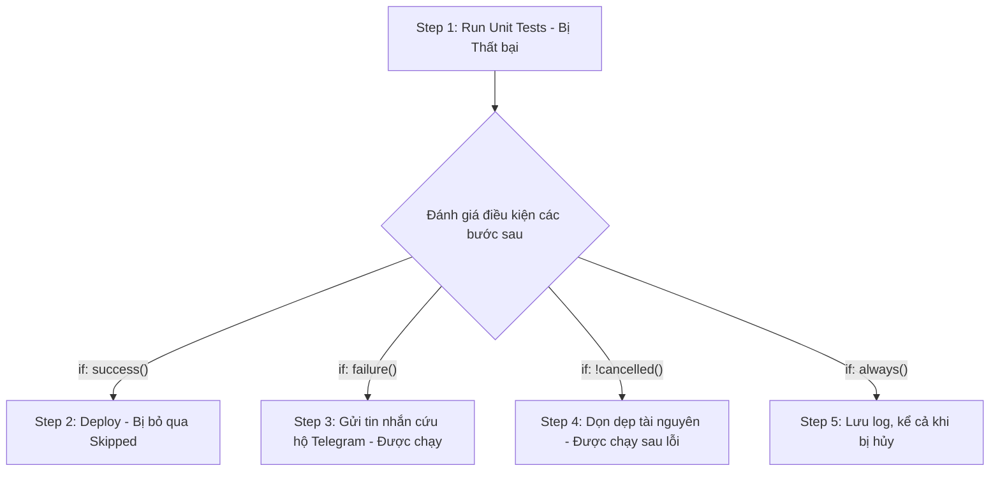

# Thực thi có điều kiện với if: always(), success(), failure()

## 🎯 Mục tiêu
- Nắm vững cách sử dụng từ khóa `if` ở cả cấp độ Job và cấp độ Step để kiểm soát luồng chạy.
- Làm chủ 4 hàm kiểm tra trạng thái cốt lõi: `success()`, `failure()`, `always()`, và `cancelled()`.
- Hiểu rõ cơ chế mặc định ngầm định: nếu không khai báo hàm trạng thái, GitHub Actions luôn tự động áp dụng `success()`.

## 🧩 Từ khóa hôm nay
### if Condition
- **Nói dễ hiểu**: Thuộc tính điều kiện quyết định xem một Job hoặc Step có được phép chạy hay bị bỏ qua.
- **Ví dụ**: Dùng `if: github.ref == 'refs/heads/main'` để chỉ chạy bước deploy khi đang ở nhánh chính.
- **Đừng nhầm**: Không bắt buộc phải bao bọc bằng cặp dấu ngoặc `${{ }}` bên trong từ khóa `if:`.

### success() vs failure()
- **Nói dễ hiểu**: Hai hàm kiểm tra trạng thái; `success()` chỉ chạy khi các bước trước đều tốt, còn `failure()` chỉ chạy khi có ít nhất một bước bị lỗi.
- **Ví dụ**: Bước gửi thông báo lỗi tới Telegram chỉ kích hoạt khi `if: failure()`.
- **Đừng nhầm**: Mặc định mọi bước đều ngầm định mang `success()`; nếu không ghi gì thì có lỗi là các bước sau dừng lại.

### always() Function
- **Nói dễ hiểu**: Hàm trạng thái trả về `true` kể cả khi workflow đã bị hủy, nên dùng cho tác vụ cần thử chạy trong cả tình huống đó.
- **Ví dụ**: Có thể dùng `if: always()` để cố gắng lưu log chẩn đoán sau khi các bước trước lỗi hoặc workflow bị hủy.
- **Đừng nhầm**: Nó không bảo đảm runner còn hoạt động đủ lâu để tác vụ hoàn tất. Tránh dùng cho thao tác thiết yếu có thể treo; nếu muốn chạy khi thành công hoặc thất bại nhưng bỏ qua khi bị hủy, dùng `if: ${{ !cancelled() }}`.

## 📖 Định nghĩa
Thuộc tính `if` cho phép bạn điều khiển một Job hoặc Step có được chạy hay không. Có thể kết hợp biểu thức ngữ cảnh với các hàm trạng thái: `success()` trả về true khi các bước trước thành công; `failure()` khi bước trước hoặc Job tổ tiên thất bại; `cancelled()` khi workflow bị hủy; `always()` trả về true kể cả sau khi workflow bị hủy. `always()` không bảo đảm tác vụ sẽ hoàn tất nếu runner bị dừng.

## 🤔 Tại sao cần?
Trong thực tế, bạn có thể gửi thông báo khi kiểm thử lỗi (`if: failure()`), dọn tài nguyên khi bước trước thành công hoặc thất bại nhưng workflow chưa bị hủy (`if: ${{ !cancelled() }}`), hoặc lưu thông tin chẩn đoán ngay cả khi bị hủy (`if: always()`). Chọn điều kiện theo hành động mong muốn; `always()` có rủi ro giữ Job chạy đến hết thời hạn nếu tác vụ gặp lỗi nghiêm trọng.

## 🧠 Mental Model (Mô hình tư duy)
`success()` giữ bước sau ở trạng thái bỏ qua khi bước trước thất bại; `failure()` chọn xử lý lỗi; `!cancelled()` cho phép chạy sau thành công hoặc thất bại nhưng bỏ qua khi run bị hủy. `always()` vẫn đúng khi run bị hủy, nên phù hợp với bước ngắn như lưu log chẩn đoán; nó không thể bảo đảm runner còn sống để hoàn tất.

## 🖼 Sơ đồ


## 🌎 Ví dụ thực tế
Một kỹ sư thiết lập đường ống kiểm thử cho ứng dụng web. Job chỉ phát hành gói nếu kiểm thử thành công (`success()`). Khi kiểm thử thất bại, một Step thu thập log để chẩn đoán (`failure()`). Một Step khác dọn cơ sở dữ liệu tạm nếu workflow chưa bị hủy (`!cancelled()`). Nếu cần thử lưu log khi run bị hủy, có thể dùng `always()`, nhưng phải thiết kế Step ngắn và chịu lỗi.

## 💻 Command
```bash
# Minh họa lệnh thông báo trong bước có điều kiện failure()
echo "Đã phát hiện lỗi kiểm thử, đang gửi cảnh báo!"

# Minh họa lệnh dọn dẹp trong bước có điều kiện always()
echo "Đang dọn dẹp tài nguyên tạm thời!"
```

## 🔍 Giải thích command
- Lệnh đầu tiên mô phỏng hành động cứu hộ chỉ chạy khi điều kiện `if: failure()` được kích hoạt bởi lỗi từ các bước trước.
- Lệnh thứ hai mô phỏng hành động cleanup khi dùng điều kiện `if: ${{ !cancelled() }}`.

## ⚠️ Sai lầm phổ biến
- Nghĩ `failure()` là điều kiện để xử lý việc hủy workflow; dùng `cancelled()` để nhận biết run bị hủy, hoặc `always()` nếu cần một tác vụ chạy cả sau khi hủy.
- Quên rằng mặc định mọi Step đều có ngầm định `if: success()` nên viết lặp lại thừa thãi.
- Dùng `always()` cho công việc dài hoặc thiết yếu: run bị hủy có thể vẫn chờ job/bước này, và runner có thể dừng trước khi nó xong.
- Sử dụng biến môi trường không tồn tại trong mệnh đề điều kiện dẫn đến việc biểu thức luôn bị đánh giá là false.

## 🧪 Lab
Hãy mở terminal và cùng tôi thực hành từng bước dưới đây để làm chủ kỹ năng:

1. Khởi tạo một tệp workflow thử nghiệm các hàm điều kiện:
   ```yaml
   name: Conditional If Demo
   on: [workflow_dispatch]
   jobs:
     demo:
       runs-on: ubuntu-latest
       steps:
         - name: Bước 1 - Cố tình gây lỗi
           run: exit 1
         - name: Bước 2 - Chỉ chạy khi có lỗi
           if: failure()
           run: echo "Bước 1 đã thất bại, bước 2 được cứu hộ!"
         - name: Bước 3 - Bị bỏ qua vì có lỗi
           if: success()
           run: echo "Bước này sẽ không bao giờ được in ra!"
         - name: Bước 4 - Ghi log ngay cả khi run bị hủy
           if: always()
           run: echo "Thử ghi log chẩn đoán sau lỗi hoặc khi workflow bị hủy."
   ```
2. Đẩy file lên GitHub và kích hoạt thủ công qua nút Run workflow.
3. Quan sát log của một run không bị hủy: Bước 1 đỏ, Bước 2 chạy nhờ `failure()`, Bước 3 bị bỏ qua do `success()` không thỏa, Bước 4 được thử chạy nhờ `always()`. Hủy run riêng để quan sát khác biệt; tác vụ vẫn có thể bị dừng nếu runner kết thúc.

## 💡 Hint
- `always()` vẫn trả về true khi workflow bị hủy. Với bước cần chạy sau thành công/thất bại nhưng không chạy sau khi hủy, ưu tiên `if: ${{ !cancelled() }}`.
- Bạn có thể kết hợp toán tử logic: `if: always() && github.ref == 'refs/heads/main'`.

## ✅ Validation
- Trong run không bị hủy, bước gắn `failure()` và `always()` được chạy sau khi bước đầu tiên gặp sự cố; điều kiện của chúng khác nhau khi workflow bị hủy.
- Bước mang điều kiện `success()` tự động chuyển sang trạng thái Skipped màu xám.

## ❓ Quiz
Hãy hoàn thành bài trắc nghiệm bên dưới để kiểm tra mức độ nắm vững các hàm điều kiện trạng thái trong GitHub Actions.

## 🔥 Challenge
Thiết kế bước thông báo lỗi chỉ gửi tin nhắn cảnh báo khi sự kiện là `push` lên nhánh `main` và bài kiểm thử bị thất bại (`if: failure() && github.ref == 'refs/heads/main'`).

## 📚 Tổng kết
- Từ khóa `if` dùng để quyết định xem một Job hoặc Step có được phép chạy hay không.
- Các hàm trạng thái cốt lõi gồm `success()`, `failure()`, `always()` và `cancelled()`; dùng `!cancelled()` khi muốn tiếp tục sau lỗi nhưng tôn trọng thao tác hủy.
- Mặc định nếu không chỉ định, GitHub Actions luôn áp dụng điều kiện ngầm định là `success()`.
