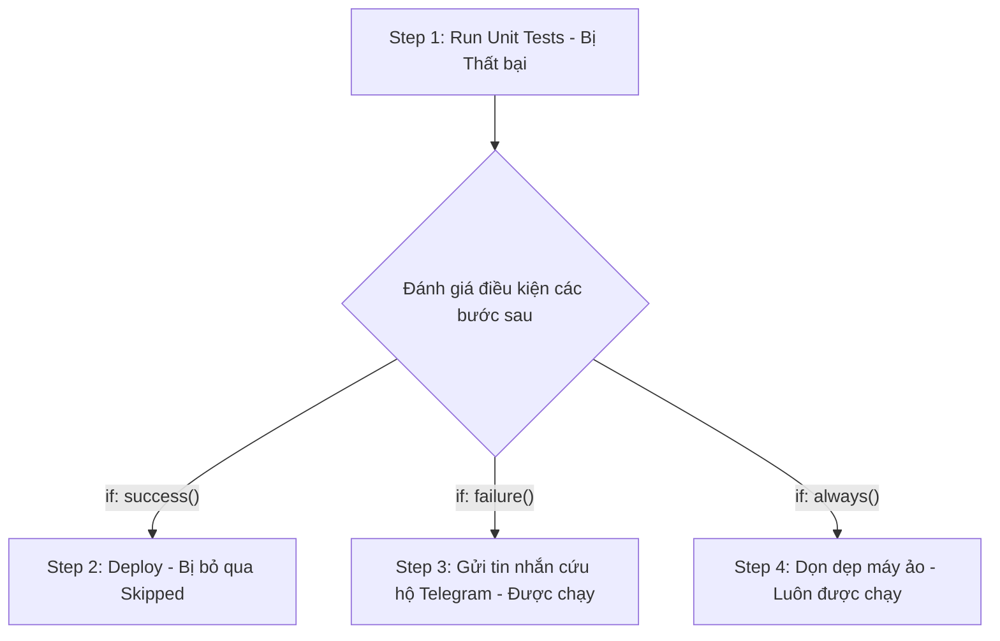

# Thực thi có điều kiện với if: always(), success(), failure()

## 🎯 Mục tiêu
- Nắm vững cách sử dụng từ khóa `if` ở cả cấp độ Job và cấp độ Step để kiểm soát luồng chạy.
- Làm chủ 4 hàm kiểm tra trạng thái cốt lõi: `success()`, `failure()`, `always()`, và `cancelled()`.
- Hiểu rõ cơ chế mặc định ngầm định: nếu không khai báo hàm trạng thái, GitHub Actions luôn tự động áp dụng `success()`.

## 🧩 Từ khóa hôm nay
### if Condition
- **Nói dễ hiểu**: Thuộc tính điều kiện quyết định xem một Job hoặc Step có được phép chạy hay bị bỏ qua.
- **Ví dụ**: Dùng `if: github.ref == 'refs/heads/main'` để chỉ chạy bước deploy khi đang ở nhánh chính.
- **Đừng nhầm**: Không bắt buộc phải bao bọc bằng cặp dấu ngoặc `${{ }}` bên trong từ khóa `if:`.

### success() vs failure()
- **Nói dễ hiểu**: Hai hàm kiểm tra trạng thái; `success()` chỉ chạy khi các bước trước đều tốt, còn `failure()` chỉ chạy khi có ít nhất một bước bị lỗi.
- **Ví dụ**: Bước gửi thông báo lỗi tới Telegram chỉ kích hoạt khi `if: failure()`.
- **Đừng nhầm**: Mặc định mọi bước đều ngầm định mang `success()`; nếu không ghi gì thì có lỗi là các bước sau dừng lại.

### always() Function
- **Nói dễ hiểu**: Hàm điều kiện ép buộc bước đó luôn luôn được thực thi trong mọi tình huống, kể cả khi các bước trước bị hỏng hay bị hủy.
- **Ví dụ**: Bước xóa các tệp nháp và giải phóng container cơ sở dữ liệu tạm thời dùng `if: always()`.
- **Đừng nhầm**: Cần cẩn trọng khi dùng `always()` cho thông báo để tránh gửi nhầm thông điệp thành công khi build bị lỗi.

## 📖 Định nghĩa
Thuộc tính `if` cho phép bạn ngăn chặn một Job hoặc Step thực thi trừ khi một điều kiện logic cụ thể được thỏa mãn. Bạn có thể sử dụng bất kỳ biểu thức ngữ cảnh nào kết hợp với các hàm kiểm tra trạng thái đặc biệt: `success()` (thành công), `failure()` (có lỗi trước đó), `always()` (luôn luôn chạy) và `cancelled()` (bị hủy bỏ giữa chừng).

## 💡 Tại sao cần
Trong thực tế, bạn thường xuyên cần các hành động cứu hộ hoặc dọn dẹp khi sự cố xảy ra: gửi thông báo khẩn cấp lên Slack khi kiểm thử hỏng (`if: failure()`), hoặc dọn dẹp cụm máy chủ thử nghiệm kể cả khi ứng dụng bị sập (`if: always()`). Thiếu mệnh đề điều kiện, pipeline sẽ không có khả năng tự xử lý tình huống linh hoạt.

## 🧠 Mental Model
Hãy hình dung hệ thống an toàn trên xe cứu hỏa. Hệ thống phun nước dập lửa chỉ hoạt động khi xe đã đến hiện trường an toàn (`if: success()`). Nhưng còi báo động khẩn cấp và túi khí chỉ bung ra khi xe gặp sự cố va chạm mạnh (`if: failure()`). Và thiết bị ghi dữ liệu hộp đen hành trình thì luôn luôn ghi âm liên tục trong mọi hoàn cảnh kể cả khi xe bị nổ lốp (`if: always()`).

## 📊 Sơ đồ minh họa


## 🏢 Ví dụ thực tế
Một kỹ sư thiết lập đường ống kiểm thử cho ngân hàng trực tuyến. Khi Job kiểm thử chạy: Step 1 xuất bản gói ứng dụng chỉ khi toàn bộ bài test vượt qua (`if: success()`). Step 2 tự động chụp ảnh màn hình lỗi, thu thập log debug và tải lên kênh hỗ trợ chỉ khi có test thất bại (`if: failure()`). Step 3 gửi lệnh tắt cơ sở dữ liệu tạm thời để tránh tốn tiền đám mây (`if: always()`). Nhờ các hàm điều kiện chính xác, hệ thống vừa tiết kiệm chi phí vừa cung cấp đầy đủ thông tin gỡ lỗi.

## 💻 Command & Cú pháp
```bash
# Minh họa lệnh thông báo trong bước có điều kiện failure()
echo "Đã phát hiện lỗi kiểm thử, đang gửi cảnh báo!"

# Minh họa lệnh dọn dẹp trong bước có điều kiện always()
echo "Đang dọn dẹp tài nguyên tạm thời!"
```

## 🔍 Giải thích command
- Lệnh đầu tiên mô phỏng hành động cứu hộ chỉ chạy khi điều kiện `if: failure()` được kích hoạt bởi lỗi từ các bước trước.
- Lệnh thứ hai mô phỏng hành động dọn dẹp môi trường luôn luôn được chạy nhờ điều kiện `if: always()`.

## ⚠️ Sai lầm phổ biến
- Nghĩ rằng `if: failure()` sẽ chạy ngay cả khi workflow bị bấm Cancel (trường hợp bị hủy phải dùng `always()` hoặc `cancelled()`).
- Quên rằng mặc định mọi Step đều có ngầm định `if: success()` nên viết lặp lại thừa thãi.
- Sử dụng biến môi trường không tồn tại trong mệnh đề điều kiện dẫn đến việc biểu thức luôn bị đánh giá là false.

## 🧪 Lab thực hành
Bài học này là bài tự kiểm tra: bạn thao tác cấu hình theo hướng dẫn và đối chiếu theo các bước bên dưới.

1. Khởi tạo một tệp workflow thử nghiệm các hàm điều kiện:
   ```yaml
   name: Conditional If Demo
   on: [workflow_dispatch]
   jobs:
     demo:
       runs-on: ubuntu-latest
       steps:
         - name: Bước 1 - Cố tình gây lỗi
           run: exit 1
         - name: Bước 2 - Chỉ chạy khi có lỗi
           if: failure()
           run: echo "Bước 1 đã thất bại, bước 2 được cứu hộ!"
         - name: Bước 3 - Bị bỏ qua vì có lỗi
           if: success()
           run: echo "Bước này sẽ không bao giờ được in ra!"
         - name: Bước 4 - Luôn luôn chạy
           if: always()
           run: echo "Bước 4 hoàn tất dọn dẹp an toàn!"
   ```
2. Đẩy file lên GitHub và kích hoạt thủ công qua nút Run workflow.
3. Quan sát log: Bước 1 đỏ, Bước 2 xanh, Bước 3 xám (Skipped), Bước 4 xanh.

## 💡 Hint & mẹo
- Khi viết `if: always()`, bước đó sẽ kiên cường thực thi bất kể các bước trước đó thành công, thất bại hay bị hủy bỏ.
- Bạn có thể kết hợp toán tử logic: `if: always() && github.ref == 'refs/heads/main'`.

## ✅ Validation & Kết quả mong đợi
- Bước gắn `failure()` và bước gắn `always()` đều được thực thi sau khi bước đầu tiên gặp sự cố.
- Bước mang điều kiện `success()` tự động chuyển sang trạng thái Skipped màu xám.

## ❓ Quiz nhanh
Hãy hoàn thành bài trắc nghiệm bên dưới để kiểm tra mức độ nắm vững các hàm điều kiện trạng thái trong GitHub Actions.

## 🚀 Thử thách nâng cao
Thiết kế bước thông báo lỗi chỉ gửi tin nhắn cảnh báo khi sự kiện là `push` lên nhánh `main` và bài kiểm thử bị thất bại (`if: failure() && github.ref == 'refs/heads/main'`).

## 📝 Tổng kết
- Từ khóa `if` dùng để quyết định xem một Job hoặc Step có được phép chạy hay không.
- Các hàm trạng thái cốt lõi gồm: `success()`, `failure()`, `always()`, và `cancelled()`.
- Mặc định nếu không chỉ định, GitHub Actions luôn áp dụng điều kiện ngầm định là `success()`.
