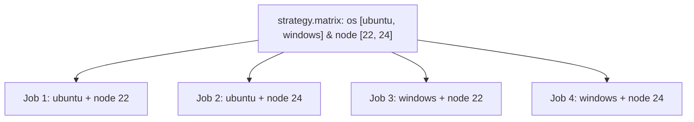

# Chiến lược ma trận kiểm thử đa môi trường (Matrix Strategy)

## 🎯 Mục tiêu
- Hiểu rõ khái niệm và sức mạnh của Matrix Strategy trong việc mở rộng kiểm thử đa cấu hình tự động.
- Biết cách khai báo ma trận đa chiều: kết hợp nhiều phiên bản ngôn ngữ và nhiều hệ điều hành.
- Sử dụng các thuộc tính nâng cao: `include` (bổ sung trường hợp đặc biệt), `exclude` (loại trừ tổ hợp không mong muốn) và `max-parallel`.

## 🧩 Từ khóa hôm nay
### Matrix Strategy
- **Nói dễ hiểu**: Chiến lược cấu hình cho phép tự động nhân bản một Job thành nhiều Job con chạy trên các môi trường khác nhau.
- **Ví dụ**: Khai báo `node: [22, 24]` để chạy test trên hai phiên bản Node.js còn được hỗ trợ.
- **Đừng nhầm**: Bạn chỉ cần viết một Job duy nhất, GitHub Actions sẽ tự động sinh ra các phiên bản tương ứng.

### Cartesian Product
- **Nói dễ hiểu**: Tích Đề-các toán học giữa các chiều ma trận; số Job con sinh ra bằng tích số phần tử của các danh sách.
- **Ví dụ**: Ma trận có 2 hệ điều hành và 3 phiên bản Node sẽ tự động tạo ra 6 Job con chạy song song (2 x 3 = 6).
- **Đừng nhầm**: Không phải phép cộng (2 + 3 = 5); thêm một chiều ma trận sẽ làm số lượng Job tăng theo cấp số nhân.

### fail-fast Property
- **Nói dễ hiểu**: Thuộc tính kiểm soát việc có hủy bỏ các Job con còn lại hay không khi phát hiện một Job con bị lỗi.
- **Ví dụ**: Đặt `fail-fast: false` để nếu một tổ hợp lỗi thì các tổ hợp khác vẫn tiếp tục, giúp thu đủ kết quả.
- **Đừng nhầm**: Mặc định `fail-fast: true` hủy các Job con đang chạy hoặc còn chờ khi một Job con lỗi; không tự sửa lỗi.

## 📖 Định nghĩa
Chiến lược ma trận (Matrix Strategy) là cơ chế cao cấp trong GitHub Actions cho phép bạn sử dụng các biến cấu hình để tự động tạo ra một tập hợp nhiều Job con chạy song song từ một định nghĩa Job duy nhất. Bằng cách khai báo khối `strategy: matrix:`, GitHub Actions sẽ tự động tính toán tích Đề-các của tất cả các mảng giá trị đầu vào để sinh ra toàn bộ các tổ hợp môi trường cần kiểm thử.

## 💡 Tại sao cần
Khi phát triển phần mềm hoặc thư viện đa nền tảng, việc chỉ kiểm thử trên một phiên bản duy nhất là rất rủi ro. Có những tính năng chạy tốt trên Linux nhưng lại bị lỗi trên Windows do khác biệt dấu gạch chéo đường dẫn. Matrix Strategy giúp bạn kiểm tra toàn diện mọi môi trường mà không cần sao chép tệp YAML ra hàng chục Job giống hệt nhau.

## 🧠 Mental Model
Hãy hình dung xưởng may áo sơ mi thử nghiệm một mẫu thiết kế mới. Thay vì may thủ công từng chiếc, người quản lý lập bảng ma trận gồm 3 Kích cỡ (S, M, L) và 3 Màu sắc (Đỏ, Xanh, Trắng). Bằng một chỉ thị duy nhất, hệ thống tự động sinh ra 9 tổ hợp sản phẩm (3 x 3 = 9) và giao cho 9 thợ may thực hiện cùng một lúc để kiểm tra độ vừa vặn của từng màu trên từng kích cỡ.

## 📊 Sơ đồ minh họa


## 🏢 Ví dụ thực tế
Ví dụ giả định: một công cụ dòng lệnh kiểm tra trên ba hệ điều hành và hai bản Node được hỗ trợ, tạo ra sáu tổ hợp. Các Job có thể bị giới hạn đồng thời hoặc xếp hàng; lỗi trên Windows gợi ý cần kiểm tra cách xử lý đường dẫn nhưng không tự chứng minh đó là nguyên nhân.

## 💻 Command & Cú pháp
```bash
# Kiểm tra phiên bản node được cài đặt trong job con hiện tại
node -v

# Chạy kiểm thử ứng dụng trong môi trường ma trận
npm test
```

## 🔍 Giải thích command
- `node -v`: Xác minh phiên bản Node.js của Runner con đang thực thi đúng giá trị `${{ matrix.node }}`.
- `npm test`: Thực thi bài kiểm thử ứng dụng trên môi trường ma trận được cấp phát riêng biệt.

## ⚠️ Sai lầm phổ biến
- Tạo ma trận quá lớn (ví dụ 5 hệ điều hành kết hợp 5 trình duyệt kết hợp 5 phiên bản Node = 125 Jobs) làm cạn kiệt định mức phút miễn phí của tài khoản.
- Không đặt `fail-fast: false` khi muốn xem kết quả kiểm thử trên toàn bộ các môi trường còn lại.
- Dùng sai cú pháp của `include` hoặc `exclude` khiến các tổ hợp không được lọc theo đúng mong muốn.

## 🧪 Lab thực hành
Bài học này là bài tự kiểm tra: bạn thao tác cấu hình theo hướng dẫn và đối chiếu theo các bước bên dưới.

1. Khởi tạo một tệp workflow sử dụng Matrix Strategy:
   ```yaml
   name: Matrix Strategy Demo
   on: [workflow_dispatch]
   jobs:
     test:
       runs-on: ${{ matrix.os }}
       strategy:
         fail-fast: false
         matrix:
           os: [ubuntu-latest, windows-latest]
           node: [22, 24]
       steps:
         - name: Cài đặt Node.js
           uses: actions/setup-node@v7
           with:
             node-version: ${{ matrix.node }}
         - name: Kiểm tra môi trường
           run: |
             echo "Đang chạy trên OS: ${{ matrix.os }} với Node: ${{ matrix.node }}"
             node -v
   ```
2. Đẩy commit lên GitHub và kích hoạt bằng nút Run workflow.
3. Quan sát tab Actions hiển thị 4 tổ hợp Job; thời điểm chúng chạy còn tùy concurrency và runner sẵn có.

## 💡 Hint & mẹo
- Đặt `fail-fast: false` bên trong `strategy:` nếu bạn muốn các phiên bản khác vẫn tiếp tục chạy khi có một phiên bản bị lỗi sớm.
- Bạn có thể dùng `max-parallel: 2` để giới hạn số lượng Job con chạy đồng thời nếu lo ngại quá tải tài nguyên mạng.

## ✅ Validation & Kết quả mong đợi
- Bảng điều khiển GitHub Actions mở rộng hiển thị đầy đủ danh sách 4 Job con độc lập.
- Mỗi Job con hiển thị đúng cặp giá trị hệ điều hành và phiên bản Node trong tiêu đề thực thi.

## ❓ Quiz nhanh
Hãy hoàn thành bài trắc nghiệm bên dưới để kiểm tra khả năng tư duy và thiết lập ma trận kiểm thử trong GitHub Actions.

## 🚀 Thử thách nâng cao
Sử dụng `exclude` trong ma trận ba hệ điều hành và hai phiên bản Node để loại tổ hợp không được dự án hỗ trợ; chọn tổ hợp dựa trên yêu cầu thực tế.

## 📝 Tổng kết
- `strategy: matrix:` tự động tạo ra nhiều Job con bằng tích Đề-các của các danh sách giá trị.
- Giúp kiểm thử tương thích đa môi trường (hệ điều hành, phiên bản runtime, cơ sở dữ liệu) chỉ với một định nghĩa duy nhất.
- Kiểm soát tiến trình ma trận linh hoạt thông qua các thuộc tính `fail-fast`, `include`, và `exclude`.
