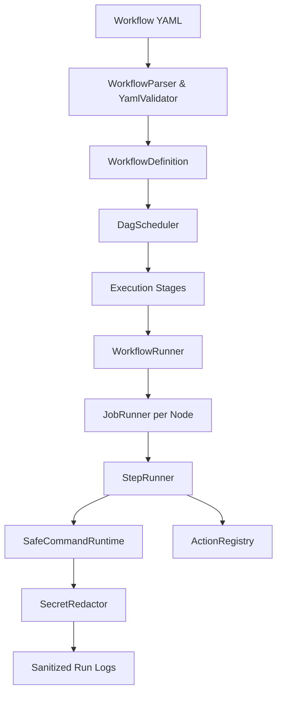

# GitHub Actions Simulator (`@git-academy/actions-simulator`)

## 1. Overview & Architectural Goals
`@git-academy/actions-simulator` is a sandboxed, educational GitHub Actions execution engine designed for interactive learning in the Git Academy Vietnam curriculum.

### Key Tenets
1. **Zero Host Command Execution**: Never spawns host child processes, never calls `eval()`, never accesses host networks.
2. **Deterministic Simulation**: Workflows execute entirely in-memory against a virtual repository filesystem and simulated environment.
3. **Spec-Compliant Expressions**: Fully parses and evaluates `${{ ... }}` expressions, status check functions (`always()`, `success()`, `failure()`), and workflow contexts.
4. **Interactive DAG Visualization**: Provides stage-based execution plans and job dependencies for visual feedback in the UI studio.

---

## 2. Component Architecture



### Module Layout
| Path | Component | Responsibility |
|---|---|---|
| `src/parser/` | `WorkflowParser`, `YamlWorkflowValidator` | Parses YAML, validates structure (`name`, `on`, `jobs`, `runs-on`, `steps`), detects cycles. |
| `src/execution/` | `WorkflowRunner`, `JobRunner`, `StepRunner`, `DagScheduler` | Schedules DAG dependencies, dispatches jobs, tracks step statuses. |
| `src/expressions/` | `ExpressionEvaluator`, `WorkflowContexts` | Evaluates tokens, expressions, and status functions in string templates. |
| `src/security/` | `SafeCommandRuntime`, `SecretRedactor` | Safe educational sandboxing and automatic token masking (`***`). |
| `src/actions/` | `ActionRegistry` | Built-in implementations for `actions/checkout@v4`, `actions/upload-artifact@v4`, `actions/download-artifact@v4`, `actions/cache@v4`. |
| `src/artifacts/` | `ArtifactStore` | In-memory artifact storage and download catalog. |
| `src/cache/` | `CacheStore` | Cache entry storage with exact and fallback prefix key restoration. |
| `src/environments/` | `EnvironmentManager` | Multi-environment deployment gates with manual approval tracking. |

---

## 3. Workflow Triggers & Event Filtering
The simulator supports GitHub Actions event triggers:
- **`push`**:
  - `branches`: Filters by branch names (e.g., `main`, `master`, `release/*`). Non-matching branches cleanly cancel the run without failure.
  - `tags`: Filters by tag patterns (e.g., `v*`).
  - `paths` / `paths-ignore`: Filters runs by changed file paths.
- **`pull_request`**:
  - `types`: Supports `opened`, `synchronize`, `reopened`.
  - `branches`: Filters target branches for PR merges.
- **`workflow_dispatch`**: Manual triggers with parameter inputs (`string`, `boolean`, `choice`).
- **`schedule`**: Cron expression triggering.

---

## 4. DAG Scheduling & Job Dependencies
Jobs in GitHub Actions declare dependencies via `needs`:
```yaml
jobs:
  lint:
    runs-on: ubuntu-latest
  test:
    needs: [lint]
    runs-on: ubuntu-latest
  build:
    needs: [test]
    runs-on: ubuntu-latest
  deploy:
    needs: [build]
    runs-on: ubuntu-latest
```

The `DagScheduler`:
1. Constructs an in-memory dependency graph.
2. Detects circular dependencies (e.g. `A -> B -> A`) and returns a validation error.
3. Groups independent jobs into parallel stages (`DagNode[][]`).
4. Propagates failures: if `test` fails, downstream `build` and `deploy` are marked as `skipped` unless guarded by `if: always()`.

---

## 5. Expression Evaluation & Contexts
The expression evaluator processes expressions wrapped in `${{ <expression> }}`:

### Supported Contexts
- **`github`**: `repository`, `ref`, `ref_name`, `sha`, `actor`, `event_name`, `workspace`.
- **`matrix`**: Values injected per matrix combination (e.g., `node: 18`, `os: ubuntu-latest`).
- **`env`**: Hierarchical environment variables (Workflow-level -> Job-level -> Step-level).
- **`secrets`**: Repository and environment secrets (e.g., `secrets.API_TOKEN`).
- **`needs`**: Results (`success`, `failure`, `skipped`) and outputs of upstream jobs.
- **`steps`**: Outputs and conclusion statuses of completed steps within the same job.

### Built-in Functions & Operators
- **String utilities**: `contains(haystack, needle)`, `startsWith(str, prefix)`, `endsWith(str, suffix)`.
- **Status checks**: `always()`, `success()`, `failure()`, `cancelled()`.
- **Logical operators**: `&&`, `||`, `!`, `==`, `!=`.

---

## 6. Matrix Build Strategy
Jobs configured with `strategy.matrix` expand into a Cartesian product of simulated runner instances:
```yaml
strategy:
  matrix:
    node: [18, 20]
    os: [ubuntu-latest, macos-latest]
```
Generates 4 discrete job executions:
1. `(node: 18, os: ubuntu-latest)`
2. `(node: 18, os: macos-latest)`
3. `(node: 20, os: ubuntu-latest)`
4. `(node: 20, os: macos-latest)`

Each instance executes with isolated contexts and logs.

---

## 7. Artifacts, Caching & Environments
- **`ArtifactStore`**: Stores named file maps produced by `actions/upload-artifact@v4`. Accessible by subsequent jobs using `actions/download-artifact@v4`.
- **`CacheStore`**: Implements key matching with prefix fallbacks (`restoreKeys`). Emulates package manager dependencies caching without writing to host disk.
- **`EnvironmentManager`**: Implements protection rules for environments (e.g., `production`). If `requiredApproval` is `true`, execution pauses until explicit approval is granted via `approve(runId, jobId, approvedBy)`.

---

## 8. Security & Secret Redaction
- All outputs produced by steps pass through `SecretRedactor`.
- Any value registered in `secrets` or marked confidential is replaced with `***`.
- Exact string matches, multi-line secrets, and secrets inside JSON/URL formats are reliably redacted.
