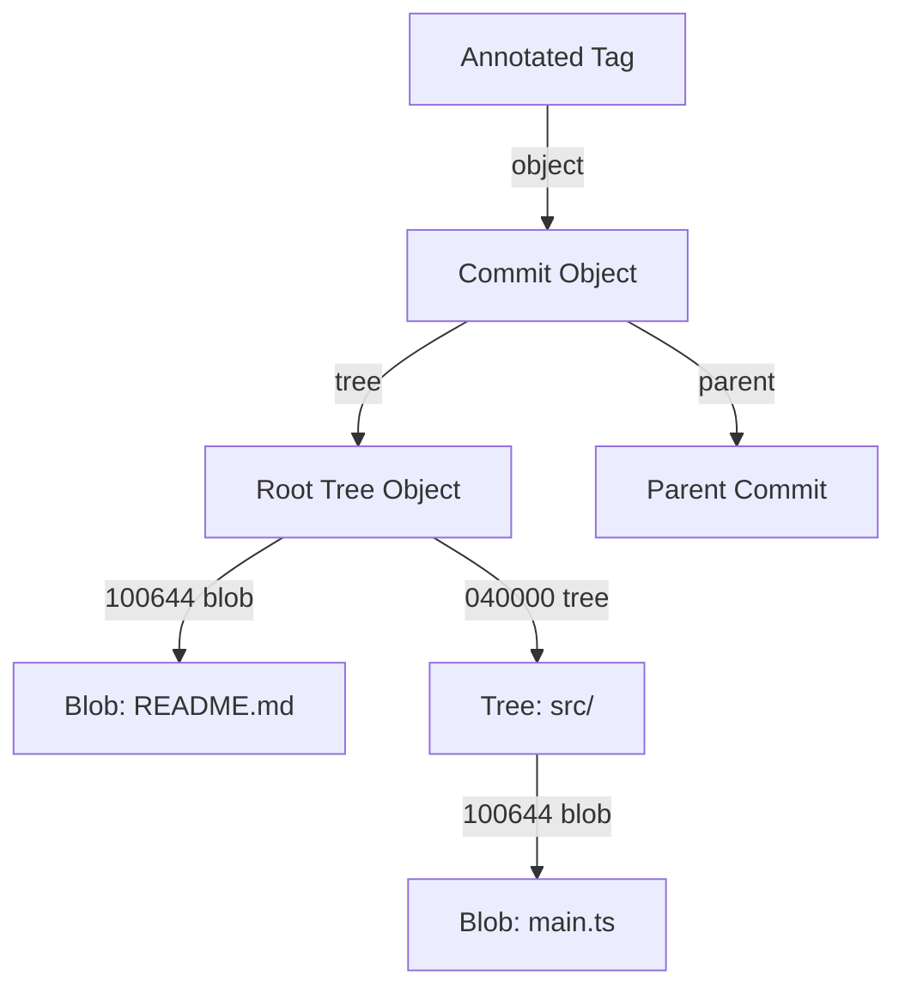

# Git Internals & Plumbing (`@git-academy/git-internals`)

## 1. Introduction & Mission
`@git-academy/git-internals` exposes the raw, lower-level primitives of Git (Plumbing) to demystify how Git works under the hood. While typical users interact with porcelain commands (`git add`, `git commit`), Level 8 of Git Academy Vietnam guides students to construct commits from scratch using atomic plumbing commands.

---

## 2. The Git Object Model

All data in Git is stored in a content-addressable database as one of four object types:

### 1. Blob (`blob`)
Stores arbitrary raw file content. File names, modes, and timestamps are **not** stored in the blob; they are stored in the parent tree.
- Format: `blob <size>\0<content>`
- Example: `blob 12\0Hello World\n`

### 2. Tree (`tree`)
Represents directory structure. Contains a list of entries sorted alphabetically by name.
- Entry Format: `<mode> <type> <hash>\t<filename>`
- Modes:
  - `100644`: Normal non-executable file
  - `100755`: Executable script/binary
  - `040000`: Subdirectory (tree object)
  - `120000`: Symbolic link

### 3. Commit (`commit`)
Points to the top-level root tree and records historical metadata:
- Header fields: `tree <hash>`, `parent <hash>` (0, 1, or multiple for merge commits), `author <name> <email> <timestamp>`, `committer <name> <email> <timestamp>`.
- Body: Commit log message separated by a blank line (`\n\n`).

### 4. Tag (`tag`)
Annotated tag object referencing a target commit (or tree/blob) with a cryptographic or human signature:
- Header fields: `object <hash>`, `type <commit|tree|blob>`, `tag <tagname>`, `tagger <name> <email> <timestamp>`.
- Body: Tag annotation message.

---

## 3. Loose Object Storage & Filesystem Sharding
Loose objects are stored under `.git/objects/`:
- Directory: First 2 characters of the 40-character SHA-1 (e.g., `4b`).
- Filename: Remaining 38 characters of the SHA-1 (e.g., `825dc642cb6eb9a060e54bf8d69288fbee4904`).
- Path: `.git/objects/4b/825dc642cb6eb9a060e54bf8d69288fbee4904`.

This sharding prevents filesystems from degrading when directories contain tens of thousands of objects.

---

## 4. The Staging Area (`.git/index`)
The Index is a binary cache holding staged files before they are committed.
- Fields: `path`, `mode`, `hash` (blob SHA-1), `stage`, `size`.
- Conflict Stages during Merges:
  - `0`: Normal staged entry
  - `1`: Common ancestor version (merge base)
  - `2`: Target branch version (`HEAD` / ours)
  - `3`: Incoming branch version (theirs)

The `GitIndex.writeTree()` method recursively traverses flat index paths (e.g., `src/components/Button.tsx`) and builds the full hierarchy of nested `Tree` objects.

---

## 5. References & Symbolic Refs (`GitRefStore`)
References are human-readable pointers to 40-character commit hashes:
- **Local Branches**: `refs/heads/main`, `refs/heads/feature`
- **Tags**: `refs/tags/v1.0.0`
- **Remote Tracking**: `refs/remotes/origin/main`
- **Symbolic References**: Pointers to other references. The most prominent is `HEAD`, which typically contains `ref: refs/heads/main`.

### Revision Resolution (`RevisionResolver`)
Resolves human shorthand to commit hashes:
- `HEAD`: Resolves through symbolic ref to current branch tip.
- `HEAD~1` / `HEAD^`: Resolves to first parent.
- `HEAD~N`: Recursively traverses first parent chain $N$ times.
- `HEAD^2`: Resolves to second parent of a merge commit.

---

## 6. Plumbing Commands Reference
| Plumbing Command | Function |
|---|---|
| `git hash-object -w <file>` | Computes SHA-1 hash of a file and writes raw blob object into `.git/objects/`. |
| `git cat-file -p <hash>` | Pretty-prints the contents of an object. |
| `git cat-file -t <hash>` | Prints the object type (`blob`, `tree`, `commit`, `tag`). |
| `git cat-file -s <hash>` | Prints the byte size of an object. |
| `git update-index --add <file>` | Registers a file into the staging index. |
| `git update-index --cacheinfo <mode> <hash> <path>` | Injects an existing object hash into the index directly without a working copy. |
| `git write-tree` | Serializes current index state into tree objects and returns root tree hash. |
| `git commit-tree <treeHash> -p <parentHash> -m "<msg>"` | Mints a new commit object pointing to `<treeHash>`. |
| `git update-ref <ref> <commitHash>` | Atomically updates a reference pointer (e.g. `refs/heads/main`). |
| `git rev-parse <rev>` | Resolves symbolic expression (e.g. `HEAD~2`) to 40-character hash. |
| `git symbolic-ref <name> [target]` | Reads or modifies symbolic references like `HEAD`. |
| `git gc` | Traverses reachability DAG, packs reachable objects, and removes dangling garbage. |

---

## 7. Packfiles & Garbage Collection (`GitGarbageCollector`)
Over time, loose objects consume disk space and file descriptors.
1. **Reachability Traversal**: Starts from all ref tips (`refs/heads/*`, `refs/tags/*`, `HEAD`) and follows commit parents and tree entries.
2. **Dangling Objects**: Loose objects not reachable from any ref are flagged as dangling.
3. **Delta Compression**: Similar blobs are delta-compressed against base objects.
4. **Packfile Generation**: Stores objects in a consolidated `.pack` file with a corresponding `.idx` index for $O(1)$ binary search offsets.
