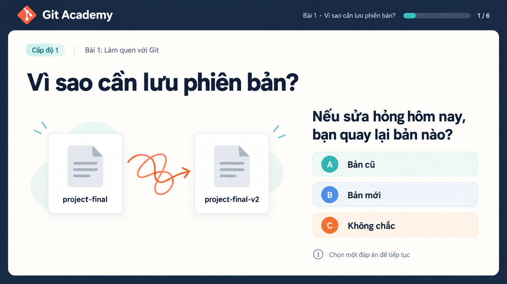
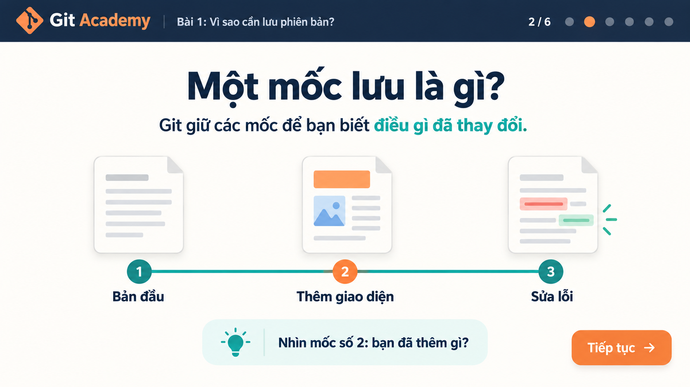
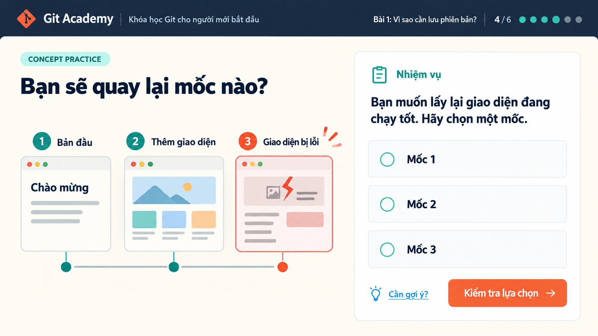
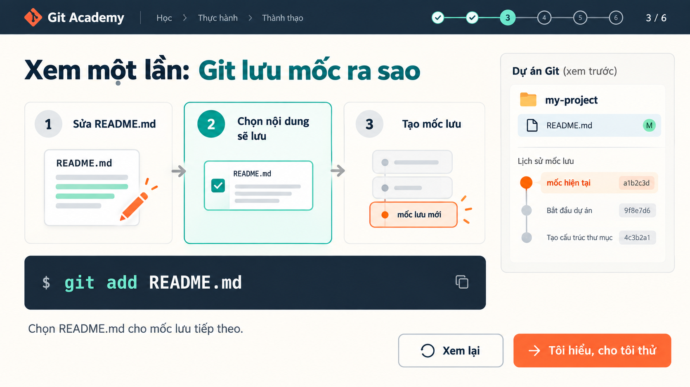
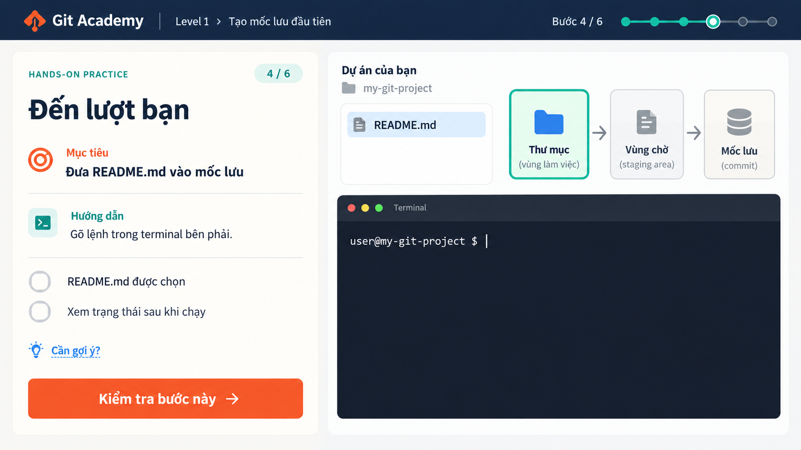
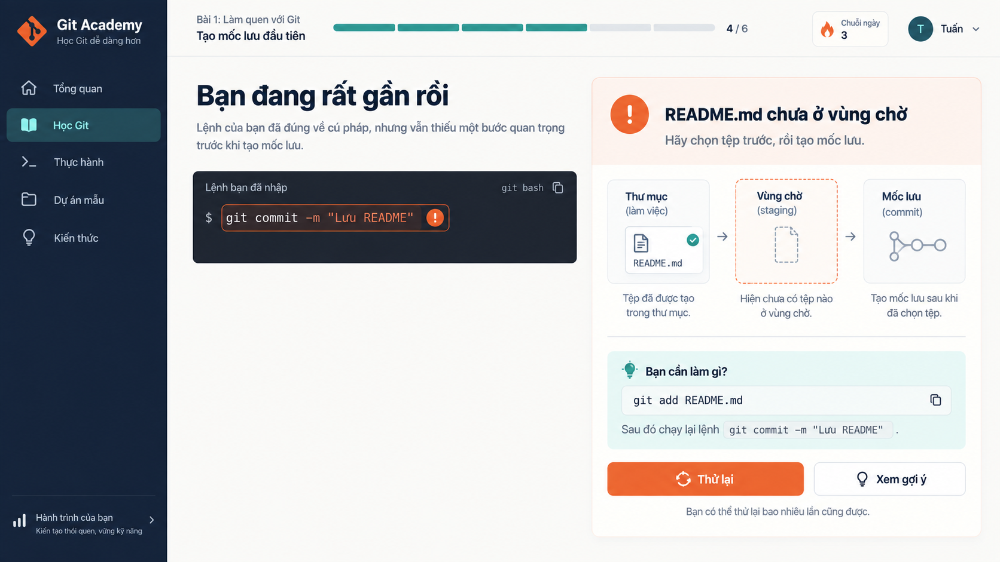
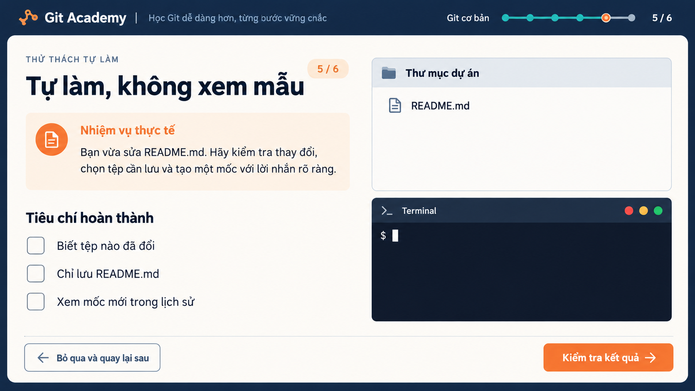
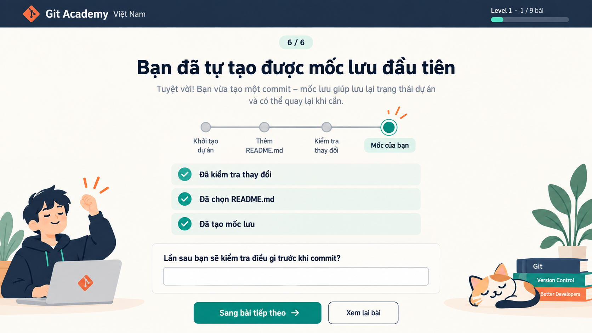

# Bộ ảnh demo luồng học Git

Các ảnh là mockup để duyệt cách học và bố cục, chưa phải ảnh chụp sản phẩm đã chạy. [Đọc nghiên cứu và kịch bản học](README.md).

## 1. Bản đồ 8 level

## 2. Bên trong một level

## 3. Mở bài bằng một tình huống

## 4. Giải thích một khái niệm bằng hình

## 5. Tự chọn đáp án trong bài khái niệm

## 6. Xem mẫu một thao tác Git ở bài sau

## 7. Tự gõ lệnh trong lab

## 8. Nhận phản hồi khi sai

## 9. Tự giải quyết tình huống mới

## 10. Thấy bằng chứng đã làm được

